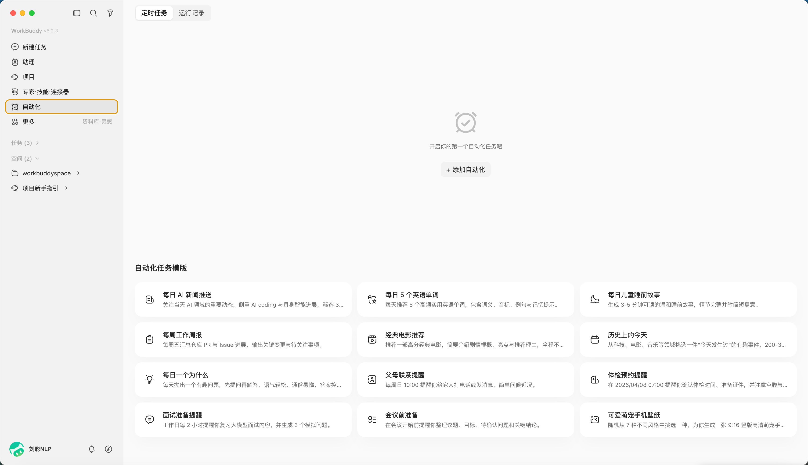
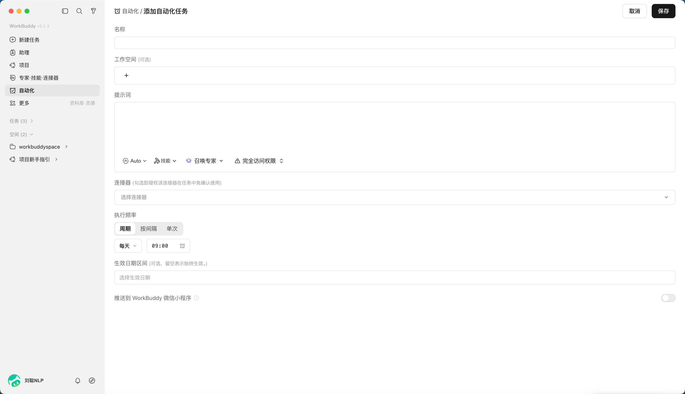
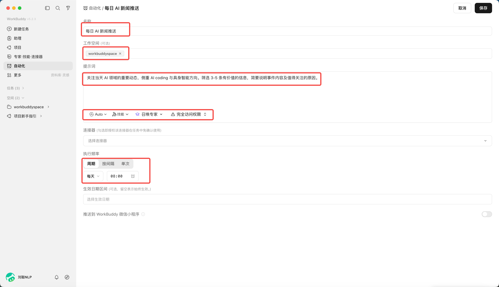

# 第 10 章 WorkBuddy 自動化任務

真正消耗人的，往往不是那些需要創造力的大任務，而是每天都要開啟同樣的頁面、收集相似的資訊、整理成同一種格式，再把結果發給同一批人。WorkBuddy 自動化的價值，就是把這些“時間固定、步驟相似、結果可檢查”的工作變成可重複執行的 Agent 任務。

## 為什麼 WorkBuddy 可以自動化

傳統自動化通常要求人先把每一個步驟寫成程式碼：開啟哪個系統、點選哪個按鈕、讀取哪一列、遇到異常怎麼分支。

WorkBuddy 的不同之處，是把“定時排程”與 Agent 的理解、工具呼叫和檔案處理能力組合起來。你不必把所有細節都寫成程式，但需要把目標、輸入、邊界和結果說清楚。

自動化配置儲存在本地客戶端，包括任務名稱、提示詞、排程規則、工作目錄和執行狀態。到達設定時間後，WorkBuddy 會沿用當前登入身份發起 Agent 任務，並按提示詞呼叫模型、Skill、MCP 或聯結器，在指定工作目錄完成查詢、彙總和檔案處理。

真正讓任務穩定執行的是五個要素：明確的觸發時間、可重複的輸入來源、足夠具體的 Prompt、固定且受控的工作目錄，以及能夠判斷成功或失敗的驗收條件。

## 自動化能用來做什麼

最直觀的用途是把每天、每週、每月都要重複的工作交給 WorkBuddy。價值不只在於少點幾次滑鼠，而在於任務不會因為忙碌而被遺忘，執行方法也不會隨著不同的人臨時變化。

| 場景 | 可以自動完成 | 典型產物 |
|-|-|-|
| 資訊與情報 | 定時搜尋行業新聞、政策、競品動態，去重後摘要 | 每日簡報、風險提示、來源清單 |
| 日報與週報 | 彙總任務、日曆、文件和資料變化，按固定結構生成報告 | 日報、週報、專案進度表 |
| 資料與表格 | 收集檔案、合併表格、清洗欄位、檢查缺失和異常 | 對賬表、異常清單、趨勢圖 |
| 檔案管理 | 按日期和專案歸檔、批次重新命名、抽取 PDF 或圖片文字 | 歸檔目錄、索引、處理日誌 |
| 內容運營 | 收集選題、生成標題候選、整理素材、製作釋出草稿 | 選題庫、內容草稿、封面需求單 |
| 知識管理 | 定時整理收藏、會議紀要和靈感，補標籤與來源 | 知識卡片、每週回顧、待消化列表 |
| 產品與研發 | 巡檢日誌、彙總 issue、檢查依賴和構建結果 | 巡檢報告、缺陷摘要、升級建議 |
| 個人事務 | 生成學習計劃、階段覆盤、預約或提醒類任務 | 學習清單、提醒、執行記錄 |


## 什麼樣的任務適合先自動化

可以用下面六個問題做判斷。回答“是”越多，越適合作為第一批自動化任務：

1. **會重複嗎**：至少每週發生一次，而不是一次性需求；
2. **輸入穩定嗎**：資料夾、網頁、表格或聯結器來源相對固定；
3. **步驟相似嗎**：雖然內容變化，但處理方式基本一致；
4. **結果可驗收嗎**：能檢查條數、欄位、時間範圍、來源或檔案是否生成；
5. **失敗可恢復嗎**：失敗後可以重跑，不會立即造成不可逆損失；
6. **許可權可控制嗎**：可以限定工作目錄、賬號和允許呼叫的工具。

最適合的起點，通常不是“替我運營整個公司”，而是“每天 8 點收集 10 條 AI 行業新聞，去重、保留連結，生成 Markdown 簡報到指定目錄”。範圍越清楚，越容易發現問題並逐步改進。


## 從一句想法到可執行任務

建立自動化前，先把口頭需求改寫成一份小型任務說明。一個可靠的 Prompt 至少要回答：何時執行、讀取什麼、怎樣處理、輸出到哪裡、怎樣算完成、失敗後怎麼辦、哪些動作禁止執行。

```text
任務名稱：每日 AI 行業簡報
觸發時間：每天 08:00，時區 Asia/Shanghai
工作目錄：automation/ai-daily

輸入：
- 檢索過去 24 小時的 AI 產品、模型和行業新聞
- 僅使用可以訪問並保留連結的公開來源

處理規則：
1. 合併重複事件，按產品、技術、商業三類整理
2. 每條包含標題、100 字摘要、來源、釋出時間和連結
3. 無法確認釋出時間或來源的內容放入“待核驗”，不要編造

輸出：
- 儲存為 YYYY-MM-DD-ai-daily.md
- 正文最多 10 條，最後附來源清單
```

## 建立一項自動化任務

在 WorkBuddy 開啟“自動化”頁面，可以檢視已安排任務和歷史執行記錄。點選“新增”後，需要配置任務名稱、工作空間、提示詞、模型與技能、定時規則，以及是否把完成結果推送到 WorkBuddy 小程式。

| 配置項 | 作用 | 填寫建議 |
|-|-|-|
| 名稱 | 區分不同自動化任務 | 寫清物件和頻率，如“每日 AI 簡報” |
| 工作空間 | 限定執行目錄和檔案儲存位置 | 為每項自動化使用獨立目錄，避免互相覆蓋 |
| 提示詞 | 描述目標、步驟、輸出和邊界 | 使用上面的任務模板，不只寫一句口號 |
| 模型和技能 | 決定可用的理解與執行能力 | 只選擇任務真正需要的 Skill 和聯結器 |
| 定時規則 | 設定頻率和生效日期 | 先低頻試執行，再逐步提高頻率 |
| 推送到小程式 | 完成後在手機檢視結果 | 開啟前確認哪些結果會通過安全鏈路同步到雲端 |

點選“自動化”，



“新增自動化”，就可以自定義你的任務



比如，每日AI資訊新聞推送，定時8點發送




## 不想從零寫 Prompt，可以先用模板

官方任務模板覆蓋新聞推送、週報生成、體檢預約和學習計劃等常見場景。模板的價值是提供基本欄位和任務結構，但它不是最終答案。選用後仍應修改資料來源、時間範圍、輸出位置、驗收標準和禁止動作。


## 更多值得嘗試的自動化場景

| 任務 | 觸發方式 | 建議保留的人工檢查 |
|-|-|-|
| 週報彙總 | 每週五讀取本週任務、日曆和交付檔案 | 確認進度和風險表述後再發送 |
| 銷售日報 | 每天彙總 CRM 或表格中的新增客戶與跟進記錄 | 核對金額、客戶狀態和負責人 |
| 費用與發票整理 | 每月讀取指定目錄中的票據和報銷表 | 財務提交前核對稅額、重複票據和歸屬 |
| 自媒體選題雷達 | 每天收集熱點、行業話題和評論區問題 | 人工判斷品牌立場和是否追熱點 |
| 知識庫週迴顧 | 每週整理新增筆記、收藏和會議紀要 | 確認分類、來源和是否值得長期保留 |
| 專案風險巡檢 | 每天檢查延期任務、構建結果和錯誤日誌 | 嚴重告警交由負責人確認處置 |
| 競品價格監控 | 定時讀取公開頁面或授權 API | 頁面結構變化時暫停並修復解析規則 |
| 學習計劃覆盤 | 每天提醒，週末彙總完成情況 | 根據真實精力調整下週計劃 |