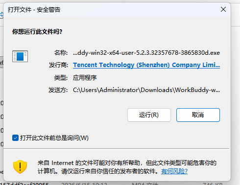
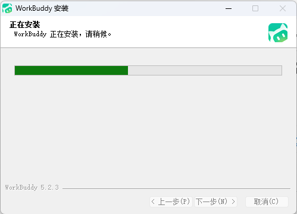
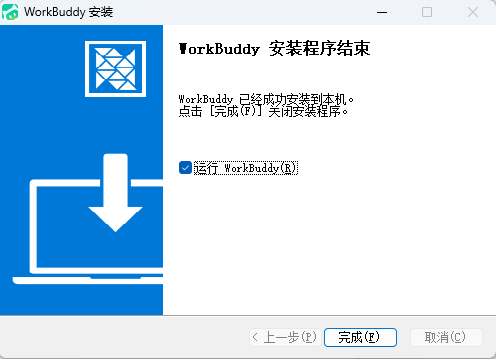
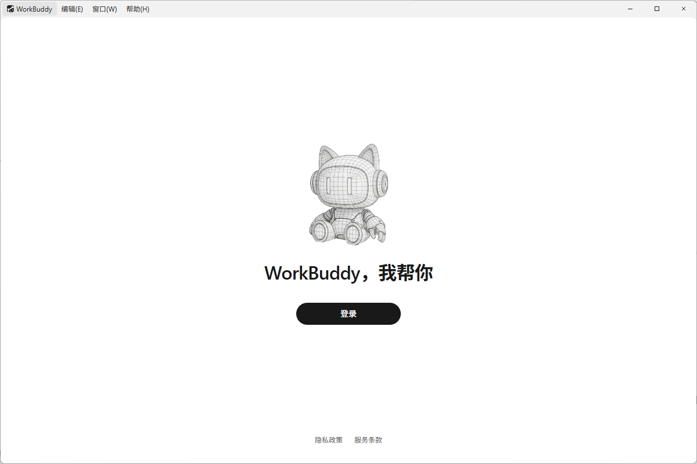
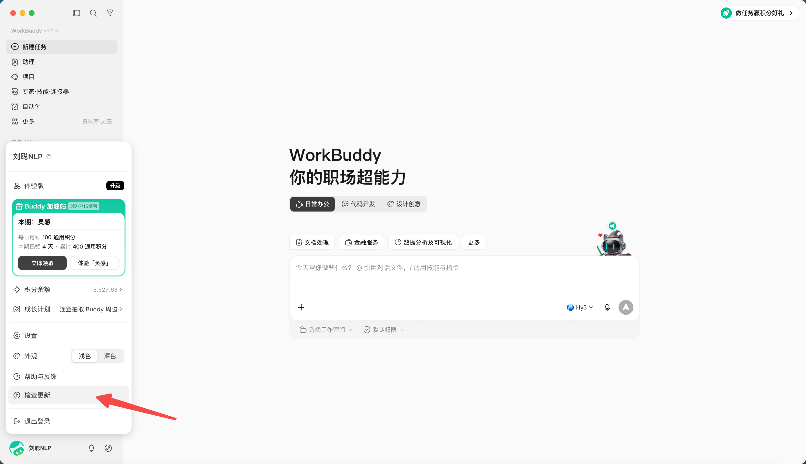

# 第 2 章 WorkBuddy的下載、安裝、登入與更新

## WorkBuddy下載

下載WorkBuddy，點選官方地址（https://www.codebuddy.cn/work/），選擇WorkBuddy，點選“下載WorkBuddy”即可下載。

網站會自動檢查你當前裝置，判斷你是什麼版本，Mac ARM64、Mac x64或者Windows x64。

***切記：從官方入口進入下載，不從網盤或不明映象獲取安裝包。***

## Windows 安裝

1. 下載完成後雙擊安裝檔案。

1. 如系統彈出安全提示，先核對釋出者與下載來源，再決定是否繼續。

2. 按安裝嚮導完成安裝並啟動 WorkBuddy。

3. 進入準備執行環境

## macOS 安裝

1. 開啟安裝檔案，將 WorkBuddy 拖入“應用程式”；

2. 從“應用程式”啟動；

## 登入

點選登入按鈕

自動跳轉網頁登入

選擇微信掃碼登入，也可以手機號登入

完成後，即可使用WorkBuddy進行工作

*PS：若公司電腦禁止安裝軟體，不要繞過終端安全策略，應聯絡 IT 管理員確認白名單或企業部署方式。*

## 更新

點選左下角個人中心，選擇“檢查更新”，檢查是否有新版本，若有新版本，可更新

## 常見問題

### 安裝包打不開或提示損壞

先刪除安裝包並從官網重新下載，核對系統和晶片版本。仍失敗時記錄系統版本、安裝包名和報錯截圖，通過官方反饋渠道處理，不要隨意關閉系統安全功能。

### 登入後沒有反應

檢查預設瀏覽器是否攔截登入回跳、網路代理是否影響認證、系統時間是否準確。退出應用後重試，並保留日誌與截圖。

### 無法讀取或寫入檔案

確認任務選擇的工作目錄是否正確、系統是否授予對應目錄許可權、檔案是否被其他程式鎖定。先用一個空白文本檔案測試，不要直接拿重要檔案反覆試錯。

### 更新前要不要備份

應用更新一般不應修改工作檔案，但長期專案仍應把輸入、產物、配置和自定義 Skill 納入版本管理或定期備份。