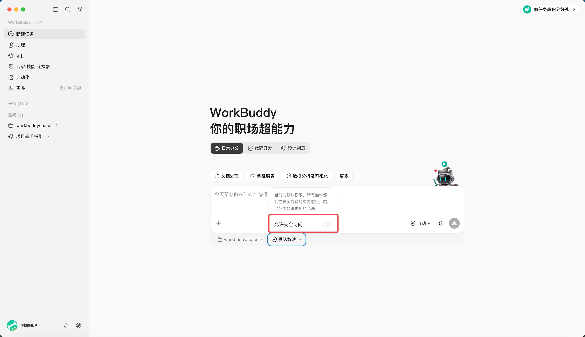
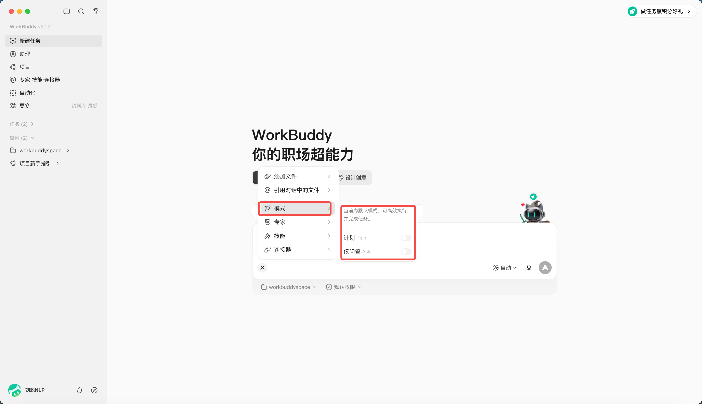

# 第 3 章 WorkBuddy 的主介面、任務與工作區

WorkBuddy 主介面可以理解為三個區域：左側（側邊欄）管理任務，中間（對話區）下達和追蹤任務，右側（結果區）檢視檔案、變更、預覽和最終產物。

## 三個區域分別做什麼

| 區域 | 主要用途 | 使用時重點檢查 |
|-|-|-|
| 側邊欄 | 新建、搜尋、切換和管理任務 | 是否進入了正確任務 |
| 對話區 | 描述需求、補充資訊、確認計劃 | 目標和約束是否完整 |
| 結果區 | 檢視產物、全部檔案、變更與預覽 | 檔名、路徑和改動是否符合預期 |

側邊欄的“任務”和“工作空間”的區別，在於你是否設定了“工作空間”目錄。

“工作空間”是 WorkBuddy 為了管理任務而設定的目錄，每個任務都有一個對應的目錄空間，任務可以在目錄空間內進行操作。

若未設定，會在預設安裝的目錄下執行任務，對話儲存在“任務”目錄下。

## 為什麼要隔離工作目錄

工作目錄既是效率設定，也是安全邊界。把發票、週報、客戶材料混在同一個大目錄裡，會增加誤讀、誤改和資訊串用的風險。

推薦按任務建目錄空間。

同時，可以對目錄空間的許可權進行設定，當開啟“允許完全訪問”（開啟完全訪問後智慧體可讀寫授權目錄外檔案，請謹慎使用並優先按任務限定目錄。）

## 三種工作模式

WorkBuddy 提供三種工作模式：

| 模式 | 中文介面 | 能做什麼 | 適合場景 |
|-|-|-|-|
| Ask | 問一問 | 問答、理解和檢視，不修改檔案 | 先了解資料、確認需求 |
| Craft | 做一做 | 可直接操作本地檔案、執行程式碼及系統指令 | 路徑清楚、風險較低的任務 |
| Plan | 想一想 | 先生成計劃，確認後再執行 | 多步驟、跨系統、重要檔案任務 |

## 選擇不同的模型

預設為自動模式，可以指定你想使用的模型，不同模型積分消耗不同。

| 任務特徵 | 優先關注 |
|-|-|
| 大量文本與長資料 | 上下文長度，比如 100 萬 tokens（1M） |
| 圖片與截圖 | 需要有視覺理解能力 |
| 高頻簡單任務 | 優先選擇響應速度快、成本較低的模型 |
