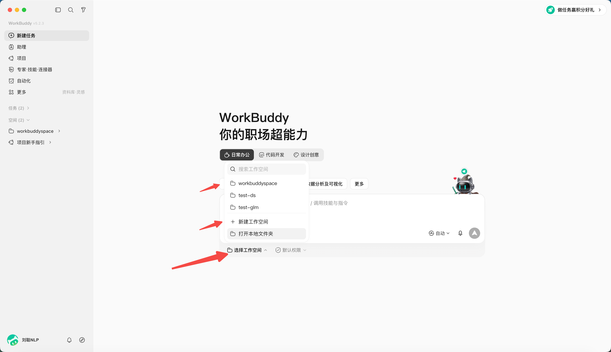
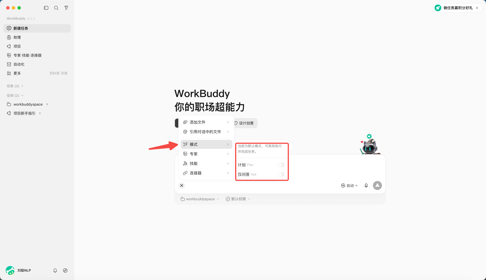
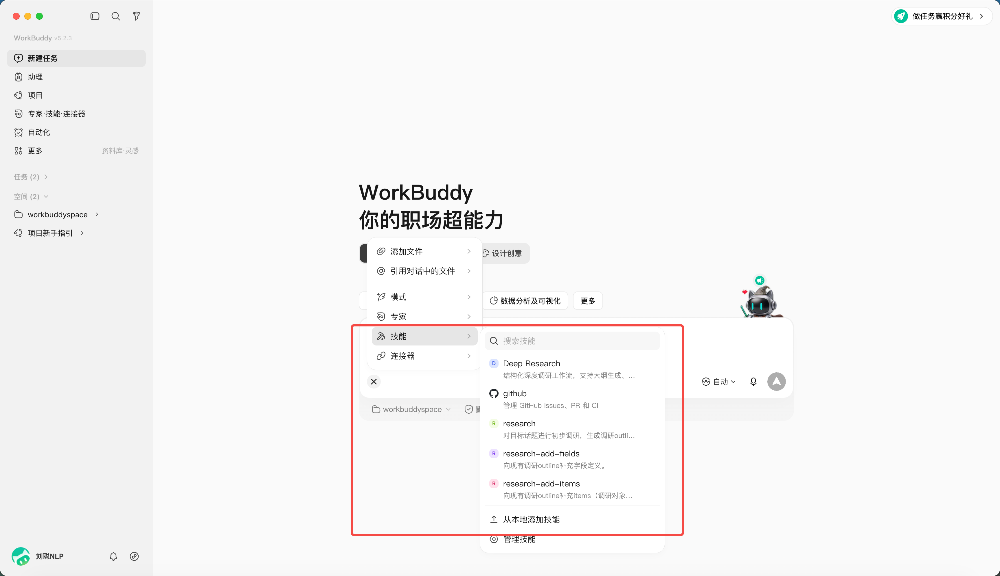
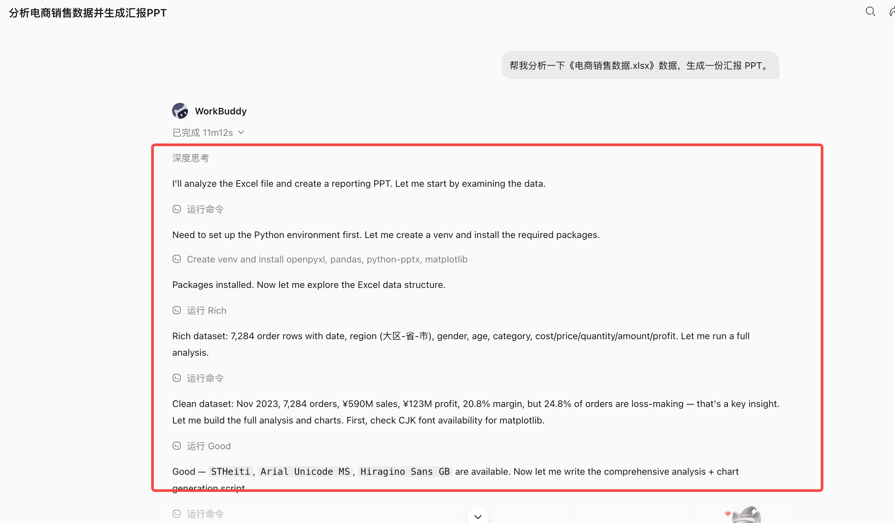
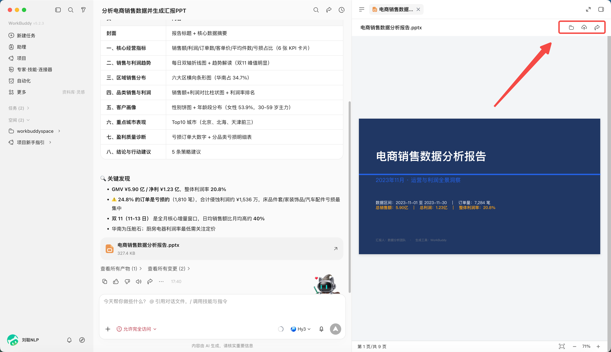

# 第 4 章 快速完成第一個 WorkBuddy 任務

## 快速建立一個 WorkBuddy 任務

1. 點選“新建任務”；


2. 選擇或建立獨立工作目錄；

*PS：WorkBuddy 採用資料夾級授權與高危攔截，首次操作請先在演練目錄進行、留意授權範圍，處理真實業務資料前謹慎確認*



3. 判斷應該使用模式，預設為Craft，還可以設定成Ask或Plan；



4. 選擇模型，可以指定你想使用的模型，不同模型積分消耗不同。


5. 輸入任務說明，“幫我分析一下《電商銷售資料.xlsx》資料，生成一份彙報 PPT。”


6. 如有必要，指定 Skill、專家、聯結器或資料庫，這裡暫時忽略



7. 傳送後觀察計劃、工具呼叫和檔案變更；



8. 在結果區預覽產物並驗收。

檔案可以本地開啟、上傳雲端、或分享，注意分享前先確認產物不含敏感或涉密資訊，按公司規範選擇共享範圍。




## 如何寫一個任務說明

| 要素 | 要回答的問題 |
|-|-|
| 目標 | 最終要解決什麼問題 |
| 輸入 | 使用哪些檔案、目錄或連結 |
| 動作 | 需要分析、整理、轉換還是生成 |
| 約束 | 哪些不能改，採用什麼規範 |
| 輸出 | 交付什麼檔案，放到哪裡 |
| 驗收 | 用什麼標準判斷合格 |

### 入門任務 A：整理檔案

```text
目標：整理 input 目錄中的練習檔案，便於按型別查詢。
輸入：僅處理當前工作區的 input 目錄。
動作：識別檔案型別，提出分類和重新命名方案。
約束：不刪除、不覆蓋原檔案；重名時保留兩份並標記序號。
輸出：先生成 inventory.xlsx 和 proposed-actions.md。
驗收：清單檔案數與 input 實際檔案數一致，所有動作可追溯。
在我確認 proposed-actions.md 前，不移動檔案。
```

### 入門任務 B：生成會議紀要

```text
請把 input/meeting.txt 整理為結構化會議紀要。
必須包含：會議結論、待辦事項、負責人、截止日期、待確認問題。
不能從原文確認的負責人或日期寫“待確認”，不要自行補全。
輸出 output/會議紀要.md 和 output/待辦清單.xlsx。
驗收：每一項結論可以在原文找到依據；待辦不遺漏負責人和時間狀態。
```

### 入門任務 C：Word 轉 PPT

```text
把 input/專案彙報.docx 轉成 10 頁以內的內部彙報 PPT。
受眾：部門負責人；彙報時長：8 分鐘。
保持原文事實和數字，不新增未經證實的資料。
結構：背景、現狀、問題、方案、計劃、需要決策。
使用 reference/brand-guide.pdf 中的顏色與字型規範。
輸出 output/專案彙報_v1.pptx，同時提供逐頁內容清單。
驗收：每頁只有一個核心觀點，數字與原文一致，正文在投影狀態可讀。
```