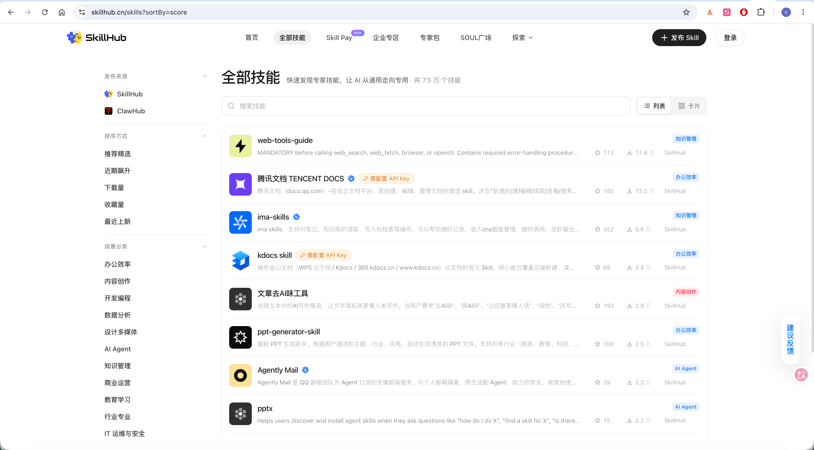
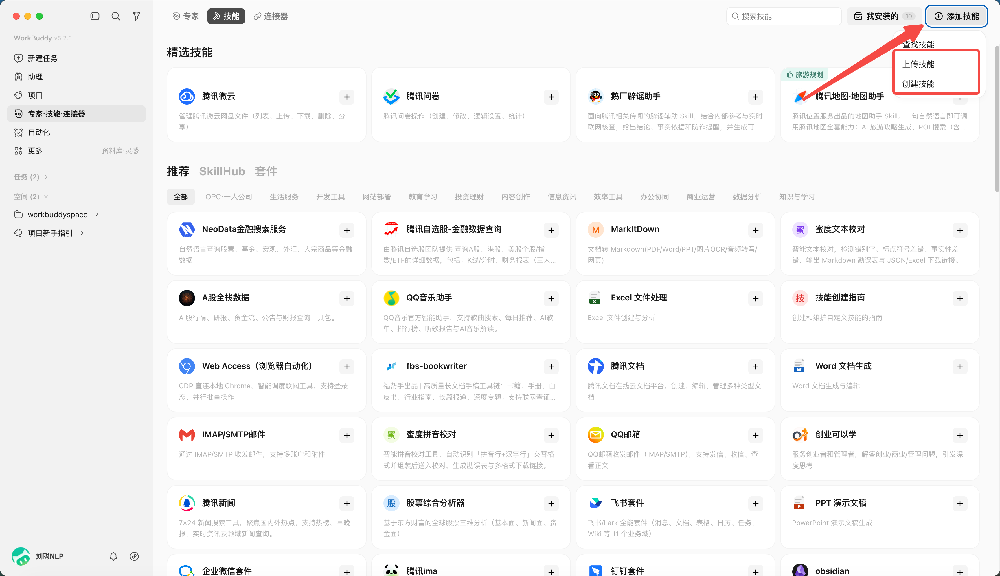
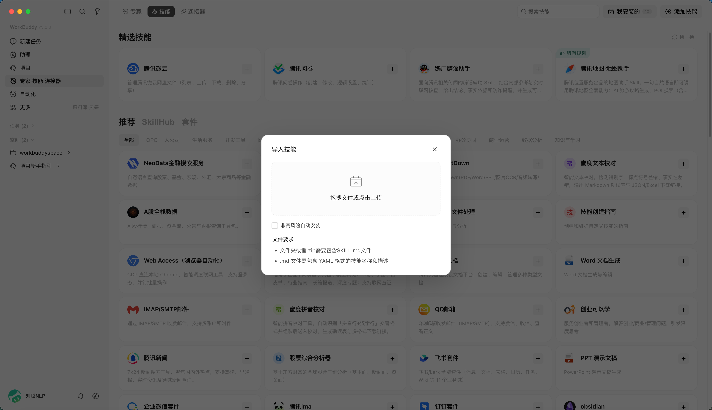
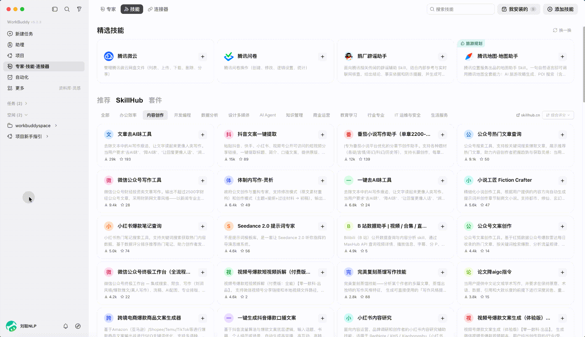
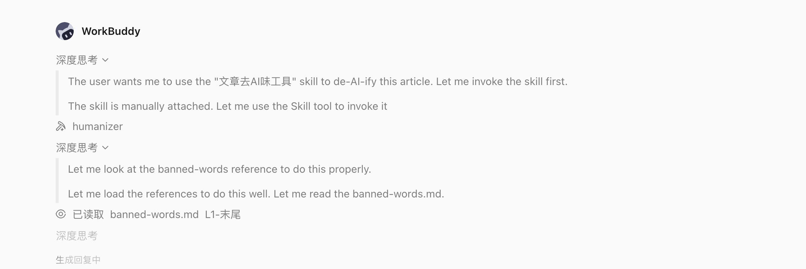
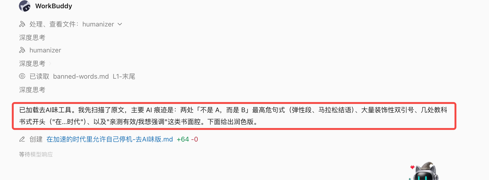
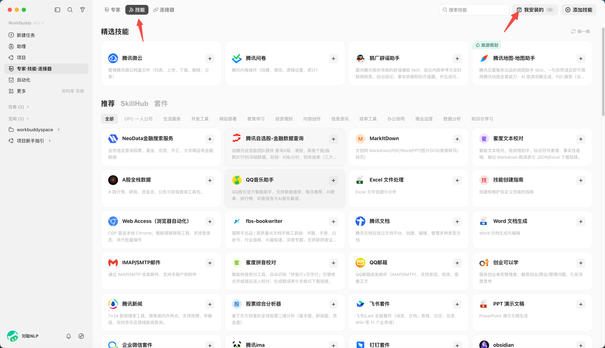
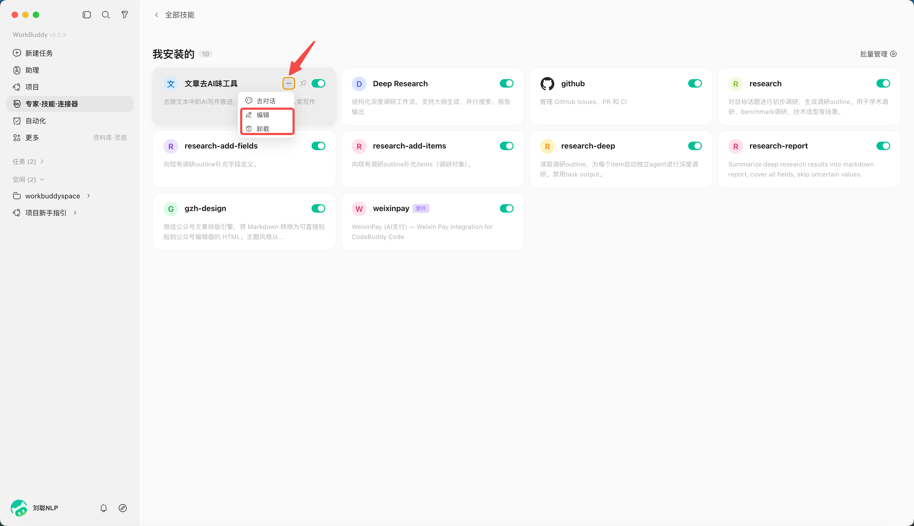

# 第 5 章 WorkBuddy載入一個真正用得上的 Skill

## Skill 是什麼

WorkBuddy 本身負責理解任務和組織執行；Skill 則是一組可複用的說明、指令碼、參考資料和資源，告訴 Agent 某類任務應該怎樣做、呼叫什麼工具、交付什麼格式。


Anthropic 在 2025 年 10 月正式推出 Agent Skills，2025 年 12 月將其釋出為開放標準。

一個最標準的 Skill，大概長這樣：

```Plain Text
my-skill/
├── SKILL.md
├── scripts/
│   └── check.py
├── references/
│   └── guide.md
└── assets/
    └── template.pptx
```

其中只有 `SKILL.md` 是必須的。

```Markdown
---
name: tech-article-writing
description: 用於撰寫 AI 產品、模型評測和科技行業相關文章
---

收到寫作任務後：

1. 先確認文章核心角度
2. 查詢一手資料
3. 對核心事實交叉驗證
4. 根據使用者寫作風格完成初稿
5. 檢查停用句式和 AI 味表達
```

還可以帶上：

```Plain Text
references/style.md
```


## Skill 是怎麼工作的

Skill 最關鍵的設計，其實不是 SKILL.md，而是 Progressive Disclosure，漸進式披露。

假設你的 Agent 裝了 100 個 Skill。

它不會一上來把 100 個 Skill 的完整內容全部塞進上下文。這樣不僅浪費 Token，還會讓模型被大量無關指令干擾。

標準做法分三層。

第一層，Agent 啟動時只看所有 Skill 的名稱和 description。

比如：

```Plain Text
pptx
處理 PowerPoint 建立、編輯、讀取任務

pdf
處理 PDF 提取、合併、編輯、填寫任務

tech-article-writing
撰寫 AI 和科技行業文章
```

第二層，當用戶說：

```Plain Text
幫我寫一篇 WorkBuddy 的公眾號文章
```

Agent 根據 description 判斷 `tech-article-writing` 可能相關，這時才載入完整的 `SKILL.md`。

第三層，執行過程中發現需要模仿你的寫作風格，才繼續讀取：

```Plain Text
references/style.md
```

需要檢查 AI 味，才執行：

```Plain Text
scripts/check-ai-phrases.py
```

標準規範建議，所有 Skill 啟動時只加載數十至上百Token的後設資料，Skill 啟用後再載入完整說明，其他資料和指令碼繼續按需讀取。OpenAI Codex 也採用類似機制，先向模型暴露 Skill 的名稱、描述和路徑，再在模型決定使用時讀取完整內容。

所以 Skill 解決了一個長期困擾 Agent 的問題：

**怎麼給 Agent 很多知識和工作方法，又不把所有東西永遠塞在 Prompt 裡。**


## Skill 跟 Prompt 到底有什麼區別

這是最核心的問題。

| 維度 | Prompt | Skill |
| --- | --- | --- |
| 核心作用 | 描述當前任務 | 定義一類任務怎麼做 |
| 生命週期 | 通常針對一次請求 | 長期複用 |
| 觸發方式 | 使用者主動輸入 | Agent 自動選擇或使用者顯式呼叫 |
| 載體 | 主要是文本 | 資料夾 |
| 內容 | 指令、上下文、示例 | 指令、指令碼、資料、模板、資源 |
| 上下文佔用 | 通常直接進入上下文 | 按需載入 |
| 複用 | 經常複製貼上 | 原生可複用 |
| 分享 | Prompt 文本 | 完整能力包 |
| 執行 | 本身只是指令 | 可以呼叫附帶指令碼和工具 |
| 模型引數 | 不改變 | 同樣不改變 |

最簡單的理解是：

```Plain Text
Prompt = 任務
Skill = 做法
```


## Skill 有哪些作用

**第一個作用，是給模型補充程式性知識。**大模型往往知道大量知識，但未必知道你的事情具體應該怎麼做，比如它知道 SQL，但它不知道你公司的：

```Plain Text
canonical user_id 在哪張表
subscriptions 表是 append-only
查詢退款時必須排除某個狀態
Grafana 對應 dashboard ID 是多少
```

這些知識非常適合做 Skill，Anthropic 在內部使用了數百個 Skill，最終發現主要集中在 API 和內部庫使用、產品驗證、資料分析、業務流程自動化、程式碼腳手架、程式碼審查、CI/CD、故障 Runbook 和基礎設施運維九類場景。


**第二個作用，是固定複雜工作流，**比如做一次行業調研。

普通 Prompt 可能是：

```Plain Text
詳細調研一下 WorkBuddy
```

模型每一次都會重新思考：

```Plain Text
去哪裡找資料
先查什麼
怎麼驗證
跟誰對比
輸出什麼結構
```

Skill 可以把流程固定下來：

```Plain Text
1. 官方網站
2. 官方公眾號和釋出會
3. 產品文件
4. 實際產品測試
5. 同類產品對比
6. 核心觀點提煉
7. 事實核驗
```

這種能力稱為 Encoded Preference Skill。模型本來能完成每一個單獨步驟，但 Skill 把這些步驟按照團隊或個人的工作方式組織起來。

另一類是 Capability Uplift Skill，給模型補充它原本做不好或不穩定的能力，例如複雜文件、PDF 和 PPT 處理。


**第三個作用，是減少重複 Prompt。**

你現在跟 AI 合作，其實有大量內容是在重複說，比如你經常告訴我：

```Plain Text
不要寫得太 AI
長短句結合
不要過度點列
要有自己的判斷
技術內容要剋制
不要編造例子
```

這些其實已經天然適合做成一個 `writing-style` Skill。

以後你的 Prompt 只需要：

```Plain Text
寫一篇 WorkBuddy 文章
```

寫作習慣、資料標準、停用表達、文章流程，都由 Skill 提供。


**第四個作用，是把個人經驗和組織經驗資產化。**

傳統 Prompt 最大的問題是容易散落在：

```Plain Text
聊天記錄
飛書文件
Notion
個人腦子裡
```

Skill 是檔案，所以它可以：

```Plain Text
Git 管理
版本回滾
團隊共享
A/B 測試
自動評測
持續更新
```

這件事情很關鍵。


## WorkBuddy裡找到合適的Skill

開啟左側“專家·技能·聯結器”，可以從技能市場搜尋，也可以用“查詢技能”描述需求。


也可以在SkillHub技能市場裡找到合適的Skill




除了從推薦列表裡直接安裝，還可以**匯入自己下載的技能**。

比如你在網上看到一個好用的技能包，下載下來是一個 zip 壓縮檔案，操作流程是這樣的：點選"上傳技能"，把 zip 檔案載入即可





## 使用Skill解決一個任務

比如，你讓AI寫了一篇文章，需要去除AI味，你可以找到“文章去AI味工具 ”Skill，安裝之後，使用時，直接 “/” 可以換出。



你只需要引用Skill內容，把文章給到即可，


WorkBuddy 會先載入skill的內容，




根據skill中的規則，來執行，比如要去除不是而是、雙引號等內容，



修改之後，可以得到結果，確實去除了AI味。


## Skill的關閉和解除安裝

從全部技能中，點選我安裝的



按鈕關閉（則關閉該Skill）


點選“···”，可以選擇刪除或編輯該Skill


