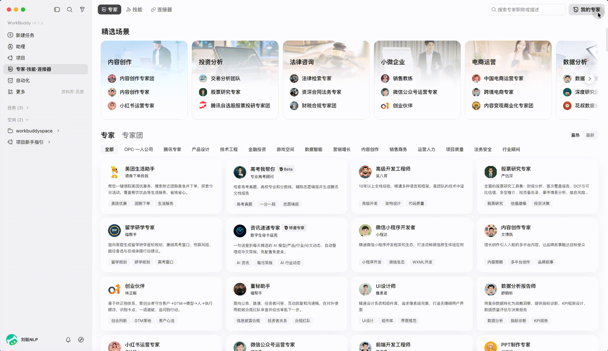
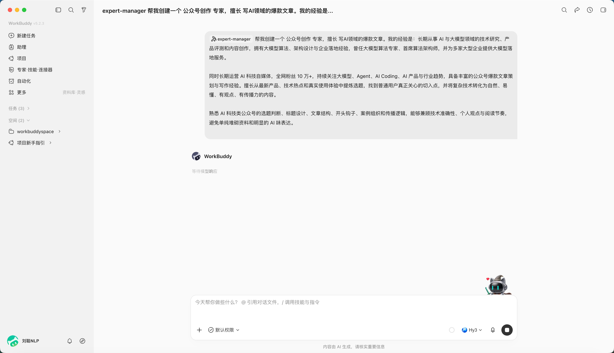
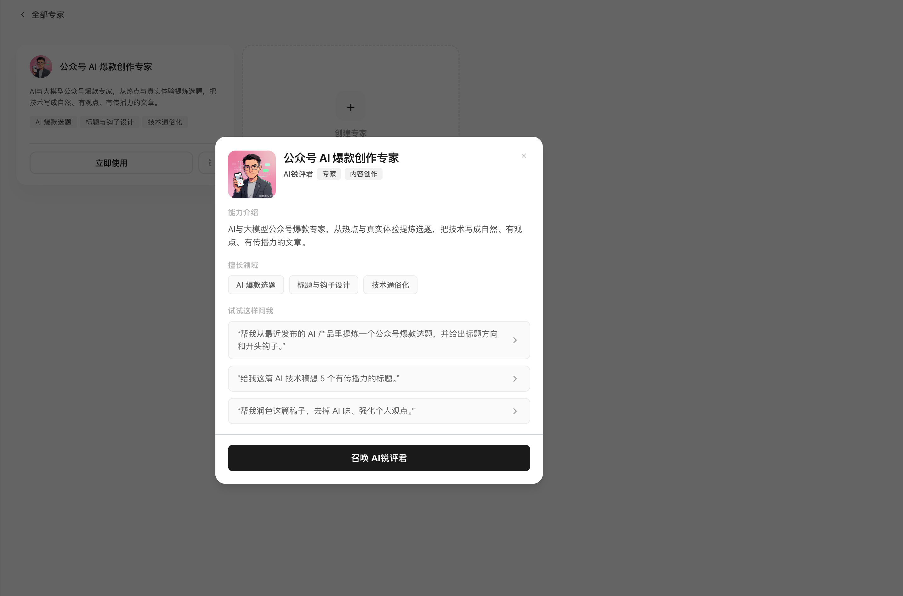
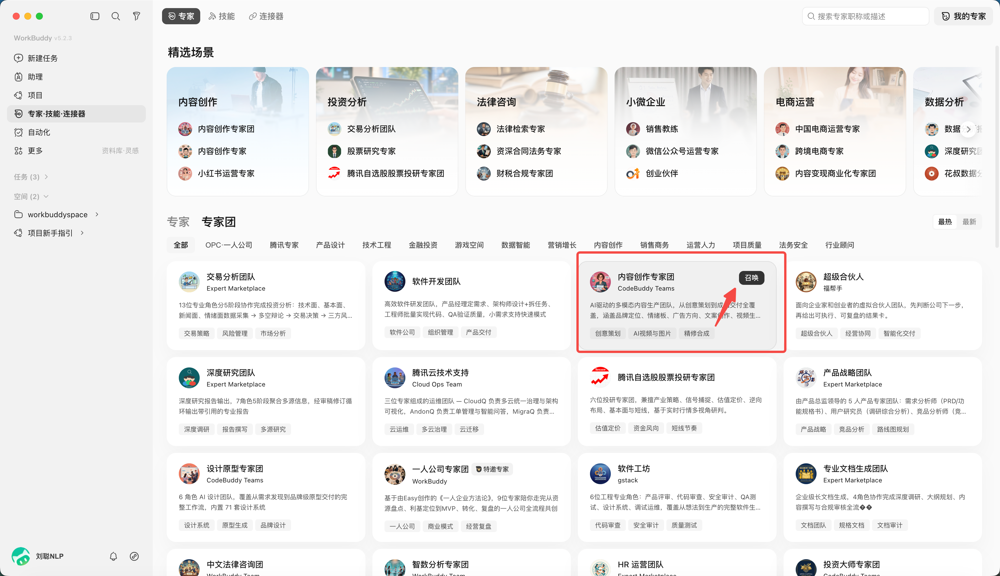

# 第 6 章 WorkBuddy的專家和專家團

## 專家和專家團與Skill的區別

WorkBuddy 本身是一個通用 Agent，什麼任務都能接。但通用不意味著每個領域都應該用同一種方式處理。

比如，

同樣是分析一份銷售資料，普通 Agent 可能會讀取資料、生成圖表、總結趨勢。資料分析專家會先理解業務目標，再確定核心指標，檢查資料質量，尋找異常變化，分析可能原因，最後給出可以執行的業務建議。

同樣是寫一篇小紅書文案，普通 Agent 可能更關注內容本身。小紅書運營專家還會考慮選題、標題、開頭留存、種草邏輯、平臺內容生態和互動設計。

專家定義為一種角色切換機制，通過人設、方法論和工具鏈，讓 WorkBuddy 以特定領域專家的身份執行任務。

最簡單的理解是：

普通 WorkBuddy = 通用 AI 同事

專家 = 有明確崗位和專業經驗的 AI 同事

而專家團定義為一種協作執行機制。一個專家團由多位專家組成，由團長自動拆解任務、分配工作、並行執行，最後整合交付。

使用者只需要告訴團長客戶背景、最新需求和預期成果，不需要自己挑選團員，也不需要自己拆分任務。團長會安排內容、活動、分析等成員協作，最後彙總完整方案。

| 方式 | 本質 | 適合的問題 |
|-|-|-|
| 普通任務 | 通用理解與執行 | 一次性的清楚任務 |
| Skill | 特定工具能力 | 需要穩定執行某個動作 |
| 專家 | 人設 + 方法論 + 工具鏈 | 明確領域的單點專業問題 |
| 專家團 | 多位專家 + 協作流程 | 需要拆解、並行、彙總的複雜專案 |

## 召喚一位專家

1. 開啟“專家·技能·聯結器”，選擇“專家”；

2. 點選“召喚專家”；以“高考我幫你”專家舉例

3. 提供任務內容，比如“幫我查一下2026年高考數學真題”

4. 等待結果

## 建立一位專家

點選我的專家，建立專家，即可

比如建立一個公眾號創作專家，

生成結束，可以測試

在我的專家中，也可以找到。

## 召喚一個專家團

專家團由團長負責拆解和彙總，成員按角色並行或序列執行。任務開始前先確認：成員分工是否覆蓋完整、哪些步驟依賴前一步、什麼時候需要人來拍板、最終由誰整合。

開啟“專家·技能·聯結器”，選擇“專家團”，點選召喚

