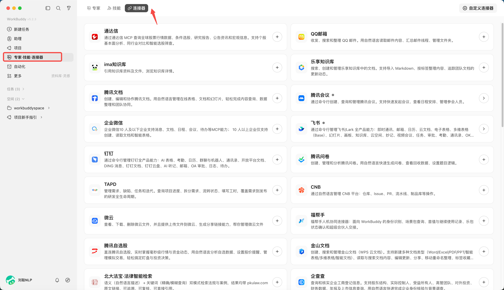
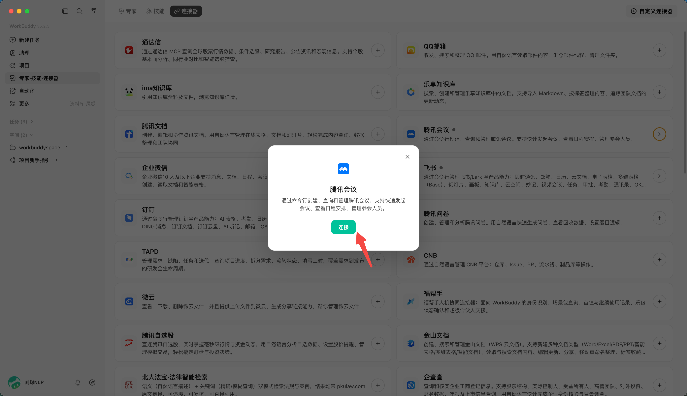
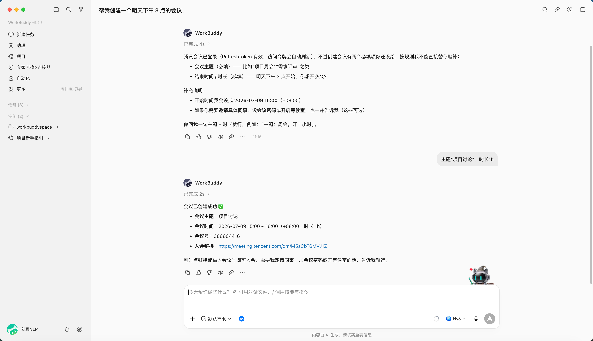
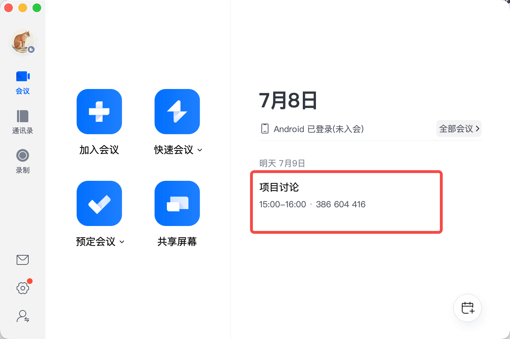

# 第 7 章 WorkBuddy 使用聯結器

**MCP**指的是 **Model Context Protocol（模型上下文協議），**是由 Anthropic 於 2024 年底推出並開源的一個開放標準協議，目前已經成為 AI 領域最熱門的基礎設施之一。

用一個通俗的比喻：**MCP 就是 AI 世界的“USB-C 介面”。**

## 為什麼需要 MCP？

在過去，如果你想讓一個 AI 助手（Agent）連線外部工具（比如 GitHub、本地檔案系統、PostgreSQL 資料庫、Slack 等），開發者必須為“每一個 AI 應用”和“每一個工具”編寫專門的對接程式碼。如果有 10 個 AI 應用和 10 個工具，就需要寫 100 個介面（N × M 的整合噩夢）。

有了 MCP，工具開發者只需要按照 MCP 標準開發一個“MCP Server”（相當於 USB-C 裝置），而任何支援 MCP 的 AI 應用（如 Cursor、各類 Agent 框架）只需內建“MCP Client”（相當於 USB-C 介面），就能**即插即用**。這就把 N × M 的複雜開發工作，簡化成了 N + M。

## MCP 的核心特點

- 統一的標準化協議（告別重複造輪子）

MCP 提供了一套通用的規範（基於 JSON-RPC）。無論是讀取本地檔案、查詢資料庫，還是呼叫第三方 SaaS API，AI 都能通過同一套協議邏輯去理解和呼叫。這大幅降低了 Agent 開發中工具整合的門檻，讓開發者可以把精力集中在 Agent 的核心邏輯上，而不是寫繁瑣的 API 對接程式碼。

- 支援三大核心能力

MCP 不僅能讓 AI “做事”，還能讓 AI “看資料”和“按套路出牌”，它標準化了三種核心原語：

- **Tools（工具）**：允許 AI 執行操作。例如：執行一段程式碼、在 Jira 建立一個任務、向資料庫寫入資料。
- **Resources（資源/上下文）**：允許 AI 讀取外部資料。例如：獲取 Git 倉庫的檔案列表、查詢向量資料庫中的特定片段，作為回答問題的上下文。
- **Prompts（提示詞模板）**：提供預定義的互動模板，讓使用者或 AI 能以標準化的方式觸發特定的複雜工作流。

- C/S 架構與高度解耦，MCP 採用客戶端-服務端（Client-Server）架構：

  - **MCP Host**：你使用的 AI 宿主應用（如 IDE、Agent 平臺）。
  - **MCP Client**：Host 內部負責與 Server 保持 1:1 連線的元件。
  - **MCP Server**：輕量級的獨立程式，專門負責暴露特定工具或資料的能力。

這種解耦意味著你可以隨時替換底層的大模型，或者隨時增加新的資料來源，而無需重構整個 Agent 系統。

- 本地優先與安全性（隱私友好）

MCP 支援通過本地標準輸入輸出（stdio）或本地 HTTP 進行通訊。這意味著你的 MCP Server 可以完全執行在本地電腦上。敏感資料（如原生代碼、私有資料庫內容、電商後臺資料）不需要上傳到雲端第三方伺服器，AI 模型只在需要推理時獲取必要的上下文，極大提升了企業級應用的資料安全性。

## 載入一個聯結器

**當前已支援 QQ 郵箱、騰訊文件、騰訊樂享、騰訊會議、TAPD 等聯結器。**

比如載入騰訊會議聯結器，

## 建立一個任務

幫我建立一個明天下午 3 點的會議，

主題“專案討論”，時長1h

建立成功

## 新建聯結器

聯結器管理頁右上角點“自定義聯結器”，按引導配置 MCP（含服務地址、鑑權方式），並提示自定義聯結器的訪問範圍由使用者配置

