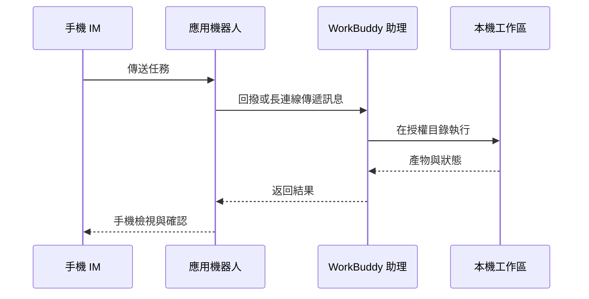

# 第 8 章 WorkBuddy 接入小程式與 IM 助理

## 小程式的兩種模式

| 模式 | 任務在哪裡執行 | 是否依賴電腦線上 | 適合任務 |
|-|-|-|-|
| 本機模式 | 已連線的電腦 | 是 | 本地檔案、本地 Skill、已有工作區 |
| 雲端模式 | 隔離的雲端環境 | 否 | 調研、寫作、臨時分析、並行任務 |

**首次使用**

1. 通過官方入口開啟 WorkBuddy 小程式並登入；
2. 檢視當前處於本機還是雲端模式；
3. 本機模式下確認目標電腦線上且連線正確；

## IM 助理的工作鏈路

## 接入微信助理：掃碼繫結即可

1. 開啟 WorkBuddy，在左側“助理”欄點選齒輪，進入“助理設定”；

2. 找到“微信助理整合”，點選“配置”；

3. 等待繫結二維碼生成，用手機微信掃碼；

4. 卡片顯示“已繫結”後，先發送一條只讀測試指令；

5. 需要切換微信賬號時，先解綁當前賬號，再重新掃碼。

二維碼有時效限制。停留在“繫結中”、二維碼過期或掃碼失敗時，關閉配置視窗後重新進入，必要時重啟 WorkBuddy 並重新生成二維碼。

***來源：WorkBuddy 官方指南。***

## 接入飛書

1. WorkBuddy → 設定 → 助理設定 → 選擇飛書；

2. 在飛書開放平臺建立企業自建應用；

3. 為應用新增機器人能力；

4. 按 WorkBuddy 當前頁面要求開通最小許可權；

5. 在“憑證與基礎資訊”獲取 App ID 和 App Secret；

6. 將憑證填寫到 WorkBuddy，生成或複製回撥資訊；

7. 在飛書配置事件訂閱與回撥；

8. 新增接收訊息、卡片互動等當前指南要求的事件；

9. 建立版本併發布應用；

10. 在飛書內向機器人傳送只讀測試任務。

***來源：WorkBuddy 官方指南。***

## 接入釘釘

1. 建立應用與機器人使用企業管理員賬號登入釘釘開發者後臺；

2. 進入“應用開發”，建立應用；

3. 為應用新增機器人能力，填寫機器人名稱、描述和頭像並確認釋出；

4. 優先在測試組織或測試群完成驗證。

***來源：WorkBuddy 官方指南。***