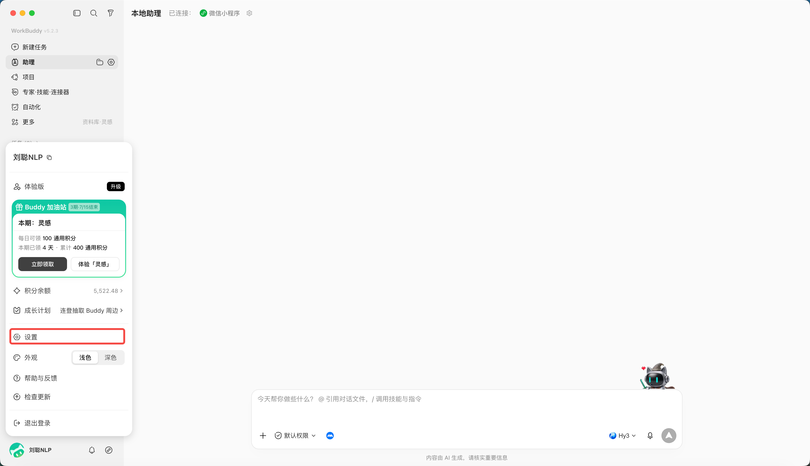
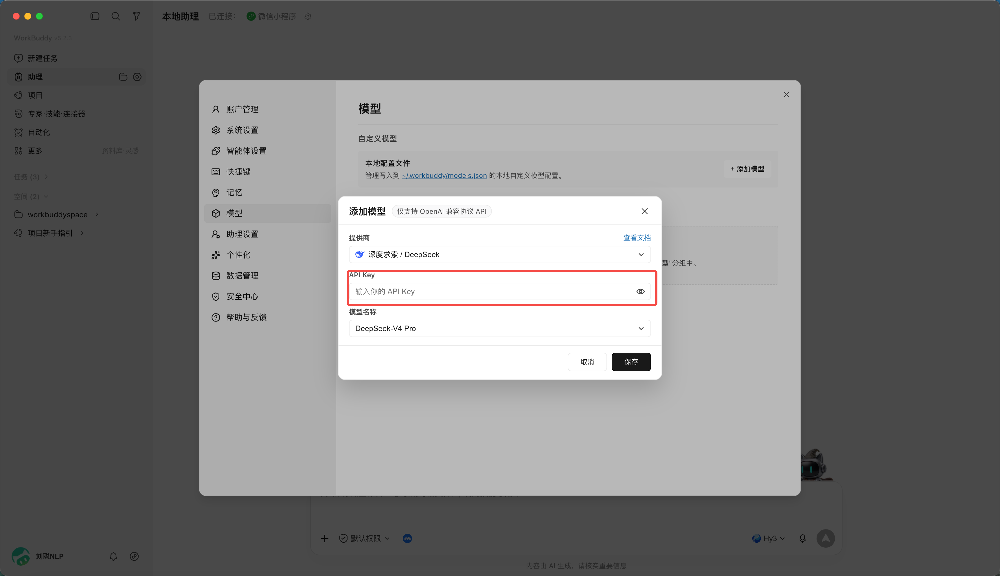
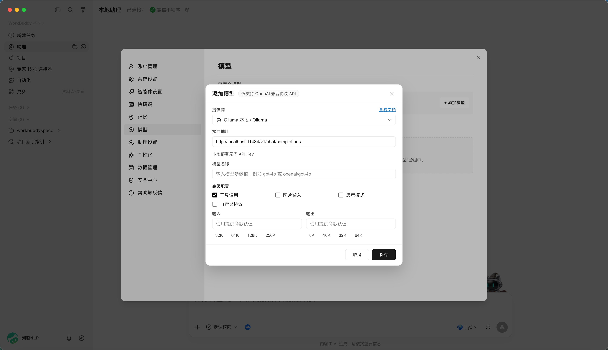

# 第 9 章 如何接入外部 API

你也許沒有積分，但是你有自己的LLM API，

WorkBuddy支援接入其他 LLM 的 API，以及 Coding Plan、Token Plan 等套餐。

直接從設定中進入，

選擇模型選項，

點選新增模型，

可以選擇各種coding plan或者自定義的api

比如，DeepSeek，你只需要輸入api key即可，

或者接入本地ollama模型，需先本地啟動 Ollama（預設埠 11434，OpenAI 相容介面），本地模型優勢為資料不出本機、可離線、零 Token 成本。

