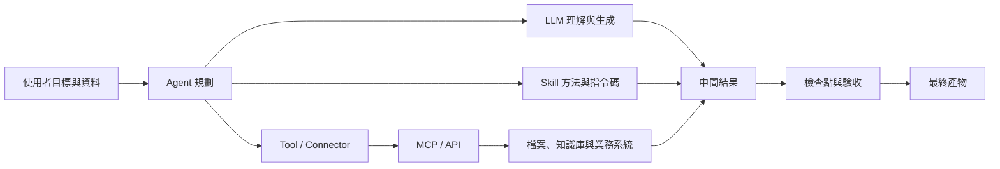
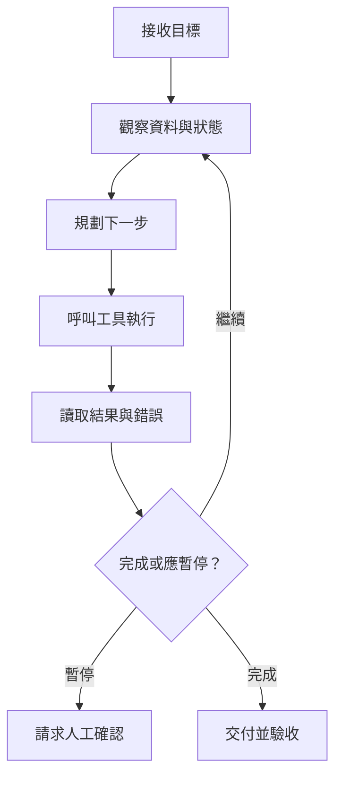

# 課外閱讀：一章看懂 AI 工作系統

## 先看全景：一次 AI 任務裡發生了什麼



這張圖可以用一句話解釋：**模型負責理解和生成，Agent 負責圍繞目標組織行動，Skill 提供專業方法，工具與 MCP/API 讓行動觸達真實世界，人負責邊界與驗收。**


把一次真實任務拆開看，資訊大致這樣流動：


你提出一個目標 → Agent 把它拆成幾步 → 遇到專業子任務就載入對應的 Skill，遇到要碰外部系統就呼叫工具 → 工具通過 MCP 或 API 真正讀寫資料庫、發訊息、改檔案 → 結果回到模型，模型判斷下一步 → 你做邊界把控和最終驗收。


五類角色裡，**模型是大腦，Agent 是排程員，Skill 是專家手冊，工具與介面是手腳，人是裁判**。後面每一節就是把其中一個角色講清楚，順便標出它能和不能的邊界。


## LLM：會根據上下文預測內容的基礎模型


LLM 是 Large Language Model，大語言模型。它從大量資料中學習語言和知識模式，根據當前輸入生成最可能的後續內容。

它本質上是個「預測下一個內容」的引擎，不是資料庫，也不是會替你負責的人。

### 它擅長什麼

- 理解、歸納和改寫文本；
- 從材料中提取結構；
- 生成草稿、方案和程式碼；
- 根據示例模仿格式和風格；
- 在工具返回結果後繼續分析。


### 它不天然保證什麼

- 不保證每個事實都正確；
- 不知道企業最新內部狀態，除非提供資料或連線系統；
- 不會因為語言自信就擁有真實證據；
- 不自動擁有檔案、賬號、資料庫和網路許可權；
- 不承擔業務和法律責任。

### 為什麼會「幻覺」

模型的目標是生成連貫內容，不是內建事實資料庫。當資料缺失、問題含糊或要求它給出確定答案時，它可能用合理但不真實的內容填補空白。


這不是 bug，是「按機率補全」這件事的副作用。理解了這點，你就不會再追問「它明明說得很肯定，為什麼是錯的」——肯定和正確是兩件事。


### 降低幻覺的辦法

- 提供可靠資料；
- 要求引用位置（說清楚結論來自哪段材料）；
- 允許回答「無法確認」；
- 把事實提取與建議生成分開；
- 對高影響結論人工複核。

## Token 與上下文視窗：模型眼前能看到多少

Token 是模型處理文本的基本單位，不完全等於字數。中文裡一個字可能對應一個或幾個 Token，程式碼和標點也單獨計費。上下文視窗是一次推理中模型能夠處理的輸入、歷史對話和輸出總量。

把 Token 想成模型的短期記憶容量：裝得下才看得見，裝不下就得丟或壓縮。


### 上下文變長不一定更好

把所有檔案和幾個月對話都塞進一個任務，可能導致：

- 舊要求與新要求衝突；
- 關鍵資料被大量無關內容淹沒；
- 成本和等待時間增加；
- 模型引用了過期版本。

視窗越大，越容易「水漫金山」——重要的反而被沖淡。


### 更穩妥的做法

按專案整理「當前規則、已確認事實、決策記錄和本次輸入」，長專案使用檔案和專案記憶，而不是依賴無限對話。

簡單說：**別把所有聊天記錄當資料庫用**，該落盤的落盤，該分專案的分開。


## Prompt：任務說明，不是神秘咒語

Prompt 是給模型或 Agent 的輸入，包括目標、背景、資料、約束、示例和輸出要求。好的 Prompt 不以長度取勝，而以資訊是否足夠執行和驗收取勝。

寫 Prompt 不是在「唸咒」，是在寫一份能交給同事執行的任務單。


### 六要素

| 要素 | 要回答的問題 |
|-|-|
| 目標 | 最終解決什麼問題 |
| 輸入 | 使用哪些資料或系統 |
| 動作 | 分析、整理、生成還是寫入 |
| 約束 | 不能做什麼，採用什麼規則 |
| 輸出 | 交付什麼檔案或結構 |
| 驗收 | 怎樣判斷正確和可用 |

六要素裡最容易被忽略的是「驗收」：沒有驗收標準，模型只能按自己的理解交差，你也就沒法說它錯在哪。


### Prompt、任務卡與 SOP

- **Prompt**：本次怎麼說；
- **任務卡**：同類任務可以填寫的結構；
- **SOP**：固定步驟、角色、檢查點和異常處理；
- **Skill**：把穩定 SOP、指令碼和資源封裝成可執行能力。

四者是從「一次性說明」到「可複用能力」的逐級固化。

**不是每個 Prompt 都值得變成 Skill。** 先重複成功，再逐步固化。一個只做過一次的任務，先寫好 Prompt 跑通；跑順三五次、模式穩定了，再考慮沉澱成 Skill。


## Agent：能圍繞目標迴圈行動的執行體

Agent 不只是「回答一次」，而是持續執行一個迴圈：**理解目標、觀察環境、決定下一步、呼叫工具、讀取結果、修正計劃，直到交付或觸發停止條件。**




聊天模型是「你問一句它答一句」；Agent 是「你給目標，它自己一步步推進，中途還會看結果、改路線」。


### Agent 與聊天模型的區別

| 維度 | 聊天模型 | Agent |
|-|-|-|
| 核心動作 | 生成回答 | 規劃、呼叫工具、執行和交付 |
| 工作物件 | 當前對話 | 檔案、工具、系統和任務狀態 |
| 過程 | 通常一次生成 | 多輪觀察與行動 |
| 風險 | 內容錯誤 | 內容錯誤 + 真實操作影響 |
| 控制 | 提示與複核 | 許可權、檢查點、日誌和回滾 |


關鍵差異在最後一行：聊天模型說錯了，最多誤導你；Agent 做錯了，可能真的刪了檔案、發了郵件、改了資料庫。所以 Agent 需要的不是更聰明的提示，而是更硬的護欄。


### Agent 的停止條件

好的 Agent 不應「永遠想辦法繼續」。出現以下情況，應暫停並請求人處理：

- 關鍵輸入缺失；
- 目標衝突；
- 許可權不足；
- 成本超預算；
- 動作不可逆；
- 結果無法驗收。

知道什麼時候停下來問人比 什麼都自己硬扛 更專業。一個不會停的 Agent，比一個笨 Agent 更危險。


## Tool ：讓 Agent 真的能做事

Tool 是 Agent 可以呼叫的具體能力，例如讀取檔案、執行搜尋、生成表格或傳送訊息。Connector 通常是產品已經封裝好的第三方服務連線，強調授權後直接使用。


### 模型知道不等於模型能做

模型可以解釋「如何傳送郵件」，但只有獲得郵件工具和賬號許可權後才能實際建立草稿或傳送。模型可以寫 SQL，但只有資料庫工具、網路和賬號允許時才能查詢。


這點是普通使用者最容易誤解的：**模型「懂」一件事，不代表它「能」做這件事。** 能不能做，取決於有沒有對應的工具、許可權和連線。任務失敗時，先問「工具通沒通、許可權給沒給」，而不是「模型是不是不行」。


### 每個工具要問五件事

1. 使用誰的身份；
2. 能讀取什麼；
3. 能修改什麼；
4. 資料會發到哪裡；
5. 失敗後如何停止和回退。

## Skill：可複用的專業工作方法

Skill 不是更聰明的模型，而是把某類任務需要的說明、指令碼、知識和模板組織起來，讓 Agent 更穩定地完成動作。

Skill 的價值不在「讓模型變強」，而在「把容易做錯、容易遺漏的環節固定下來」。同樣的發票處理，讓模型每次現寫，十次可能有三種寫法；寫成 Skill，十次走同一條被驗證過的路。


### 一個 Skill 可能包含

```Plain Text
invoice-skill/
├── SKILL.md          # 觸發條件、步驟、邊界與輸出
├── references/       # 欄位、分類和業務規則
├── scripts/          # OCR、校驗、表格處理
├── templates/        # Excel 和報告模板
└── tests/            # 正常與異常樣例
```

SKILL.md 是入口，告訴 Agent「什麼時候用我、怎麼用、邊界在哪」；references 放業務知識；scripts 放真正執行的程式碼；templates 保證輸出格式一致；tests 保證異常情況也被覆蓋。


### Skill 與 Prompt 的區別

Prompt 往往隻影響本次對話；Skill 可以被不同任務呼叫，並能攜帶指令碼、資源和穩定流程。但 Skill 仍可能出錯，也可能請求本地、網路或第三方許可權。

記住：**Skill 是「方法封裝」，不是「能力保證」。** 裝了 Skill，Agent 更可能走對路，但不等於永遠不會出錯。


### 安裝第三方 Skill 的風險

- 讀取不必要的本地目錄；
- 外發輸入材料；
- 獲取 API Key 或賬號；
- 執行系統命令；
- 包含惡意提示或程式碼；
- 依賴過期、無人維護。

因此應檢查來源、程式碼、許可權、網路、憑證、成本和停用方法，並先在隔離目錄測試。第三方 Skill 和裝瀏覽器外掛一個道理：方便，但要先看它要什麼許可權。


## MCP：讓 AI 接入工具與資料的標準介面

MCP 是 Model Context Protocol。它規定 AI 客戶端如何發現和呼叫外部工具、讀取資源或獲取提示模板，可以理解為 AI 工具生態的一類標準介面。

把 MCP 想成「AI 世界的 USB 介面」：工具提供方按一套標準暴露能力，AI 客戶端按同一套標準去用，不用每家重新適配。


### MCP 解決什麼

如果每個 AI 產品都要為每個系統開發一套專用連線，整合成本很高。MCP 讓工具提供方和 AI 客戶端按統一方式描述能力，降低重複適配。

沒有 MCP 時，接一個 CRM 要寫一套適配，接一個數據庫又寫一套；有了 MCP，工具方一次性按標準暴露，所有支援 MCP 的客戶端都能直接用。


### MCP 不解決什麼

- 不自動判斷資料是否合規；
- 不替你保管好所有金鑰；
- 不保證工具結果正確；
- 不自動實現身份與最小許可權；
- 不等於連線後可以開放生產寫入。

MCP 解決的是「怎麼連」，不解決「連了之後安不安全、對不對」。安全那層仍然是你的責任。


### 使用者級與專案級

- **使用者級**適合多個專案複用的公共能力；
- **專案級**適合客戶、資料庫或業務專屬工具。

敏感連線優先專案隔離，避免跨專案誤呼叫。比如公司的生產資料庫，只該在對應專案裡接，別放成全域性使用者級，否則另一個無關任務也可能摸到它。


## API 與 MCP 的關係

API 是軟體之間互動的介面，例如通過 HTTP 查詢資料或建立記錄。MCP Server 可以在內部呼叫一個或多個 API，再以 Agent 更容易使用的方式暴露工具。


一句話：**API 是地基，MCP 是在地基上蓋的、Agent 能直接進出的門。** Agent 通常不直接跟一堆原始 API 打交道，而是通過一個 MCP Server 間接呼叫它們。


### 直接用 API 還是用 MCP

- **直接使用 API** 更靈活，但需要理解認證、引數、錯誤和限流；
- **使用成熟 MCP** 更方便，但仍要審查它封裝了什麼請求和許可權。

方便不等於免審。MCP 幫你省了適配活，但「它背後到底調了什麼 API、用了什麼許可權」你得心裡有數。


## 知識庫、RAG 與記憶

這三者都和「AI 依據什麼」有關，但儲存的東西和失效方式完全不同。


### 知識庫

儲存可檢索的制度、產品、案例、SOP 和其他資料。它解決「AI 依據什麼」，不等於 AI 永遠記住一切。

知識庫是external 的資料室，模型用時才去翻，翻完不保證下次還記。


### RAG

RAG 是 Retrieval-Augmented Generation，檢索增強生成。系統先從資料庫找到相關片段，再把片段提供給模型回答。效果取決於資料質量、分段、後設資料、檢索和引用。


RAG 不是「接了知識庫就聰明」，它是一根鏈條：資料差、切得爛、檢索偏，回答就跟著歪。引用機制很重要——能指出結論來自哪段，你才能判斷信不信。


### 記憶

記憶用於儲存偏好、長期規則、專案決策或歷史狀態。錯誤記憶會被反覆放大，因此重要資訊要有來源、日期、負責人和更新機制。

記憶最危險的地方是「它自己不會發現過期」。一條半年前的錯誤規則，會被 Agent 當真理反覆用。


### 三者的區別

| 概念 | 儲存什麼 | 主要風險 |
|-|-|-|
| 對話上下文 | 當前任務交流 | 太長、衝突、過期 |
| 知識庫 / RAG | 可檢索事實與資料 | 來源差、版本舊、檢索不到 |
| 記憶 | 偏好、長期規則、專案狀態 | 錯誤被長期沿用 |

一句話區分：**上下文是這次聊天的短期記憶，知識庫是隨時可查的資料室，記憶是跨任務保留的長期設定。**


## Workflow 與 Agent 的區別

前面把 Agent 講清楚了，但還有一個常被混用的詞：**Workflow（工作流）**。它和 Agent 不是替代關係，而是兩種「組織行動」的思路。


### 一句話區分

- **Workflow 是標準化的生產線**：步驟在設計時就定好，按順序或分支執行。
- **Agent 是會思考、能自己拿主意的執行者**：只給目標，執行時自己決定下一步怎麼走。

打個比方，Workflow 像一份寫了「第一步做 A，第二步做 B，B 通過後做 C 否則做 D」的 SOP；Agent 像你僱的一個人，你只說「把這批發票處理完」，他中途自己判斷要先查哪張、卡住了問你。


### 核心區別：決策權在哪

Workflow 的每一步「走哪條路」在設計階段就固定了；Agent 的下一步由模型在執行階段根據環境即時決定。這是兩者最本質的差別，其他差別都從這兒長出來。

### 對比表

| 維度 | Workflow（工作流） | Agent（智慧體） |
|-|-|-|
| 一句話 | 標準化的生產線 | 會思考、能自己拿主意的執行者 |
| 路徑是否預設 | 是，步驟在設計時定好 | 否，執行時根據環境決定 |
| 決策時機 | 設計階段固定 | 執行階段動態 |
| 誰來選下一步 | 流程定義 | 模型自己 |
| 可控性 | 高，容易預測和回滾 | 較低，路徑可能變化 |
| 除錯難度 | 低，步驟清晰可追 | 高，需看日誌和中間狀態 |
| 適用場景 | 步驟明確、可重複、合規要求高 | 路徑不確定、需環境反饋、開放目標 |
| 典型失敗 | 卡在某步、分支沒覆蓋 | 跑偏、無限迴圈、越權操作 |
| 與 LLM 關係 | 管道里可嵌入模型，但控制流是人定的 | 模型驅動控制流 |

### 什麼時候用 Workflow

- 固定 SOP，比如「收到工單 → 分類 → 派給對應人」；
- 批次處理，比如「把 100 張圖統一壓縮加水印」；
- 合規審批，每一步都要留痕、可審計；
- 可重複的報表生成。

這些任務路徑清楚，用 Workflow 更穩、更便宜、更好查。


### 什麼時候用 Agent

- 目標清楚但路徑不清，比如「調研競品並出對比報告」；
- 需要多工具探索、中途看結果再決定；
- 環境會變，需要邊做邊調整；
- 開放性強、難以寫成固定步驟的任務。

### 常見誤區

- **「Agent 一定比 Workflow 強」**：不對。確定任務用 Workflow 更穩更省，硬上 Agent 反而容易跑偏、難審計、成本高。
- **「Workflow 不能含智慧」**：錯。Workflow 的節點完全可以呼叫模型做摘要、分類、抽取，只是「走哪條路」仍由流程定。
- **「Agent 全自動就最好」**：過度放權會讓失敗更難定位。真複雜的系統，往往是 Agent 在高層決策，把穩定環節交給 Workflow。

### 兩者如何協同

不是二選一，而是巢狀使用：

- **Agent 內含 Workflow**：Agent 把已經穩定的子任務寫成固定流程（比如一個 Skill 背後就是 Workflow），只在不確定處自己判斷；
- **Workflow 節點調 Agent**：生產線上某個判斷節點，交給一個 Agent 處理非結構化輸入。