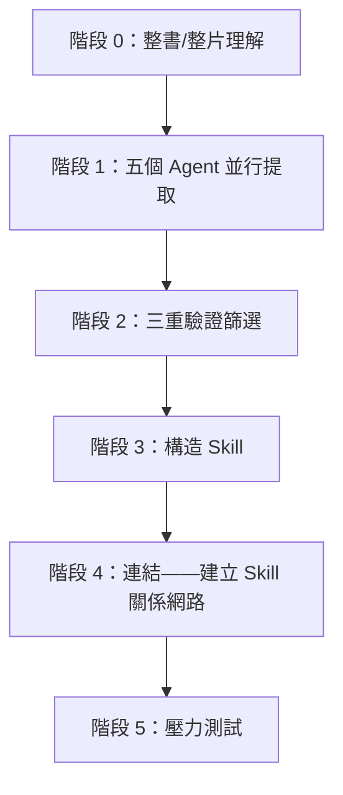
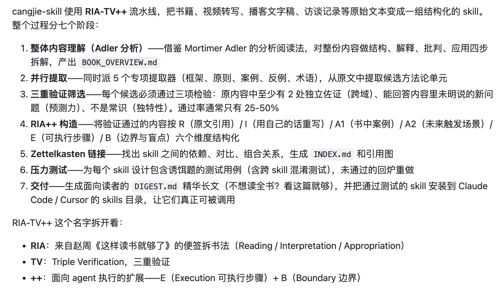
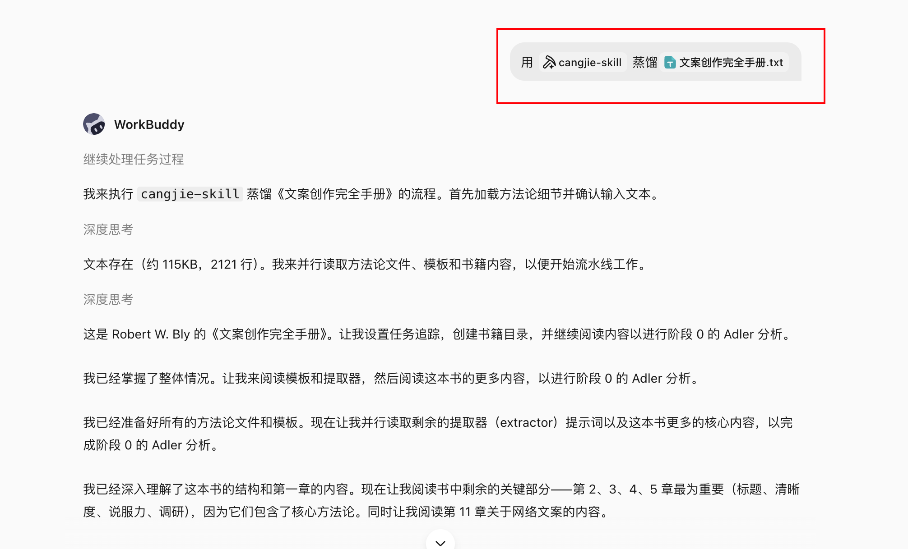
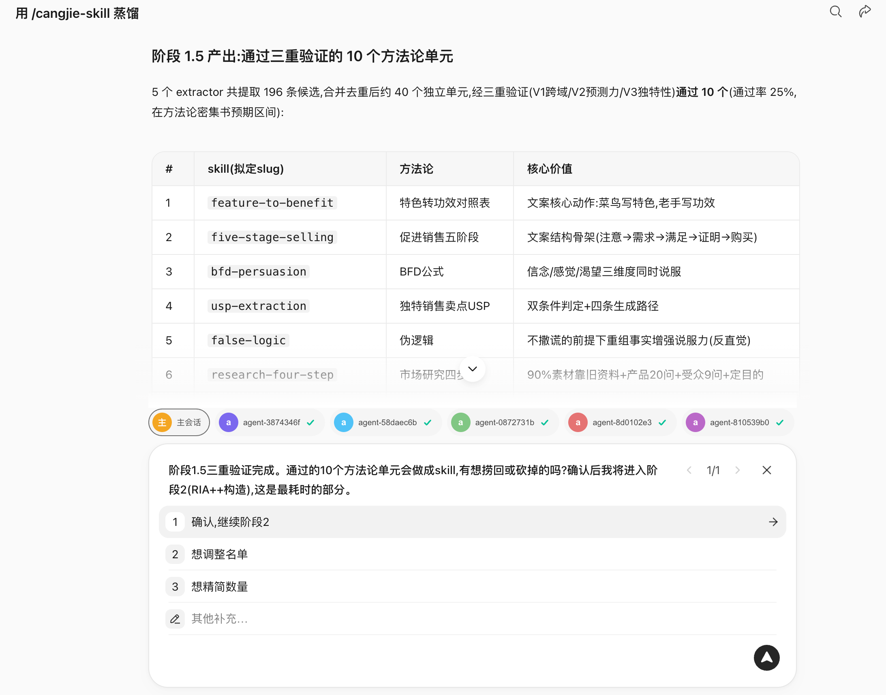
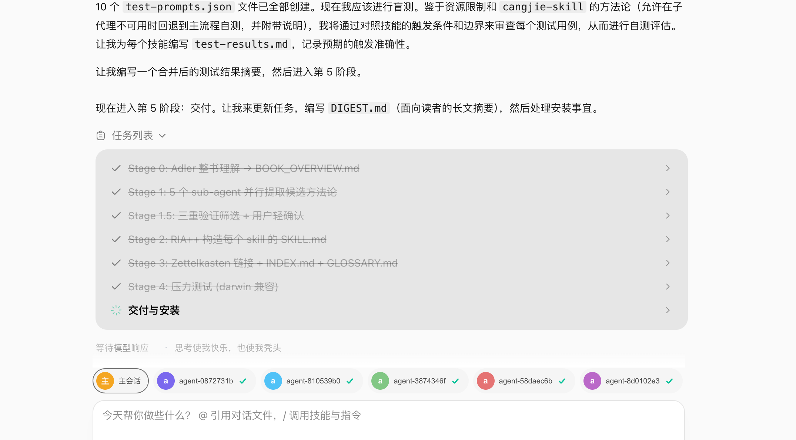
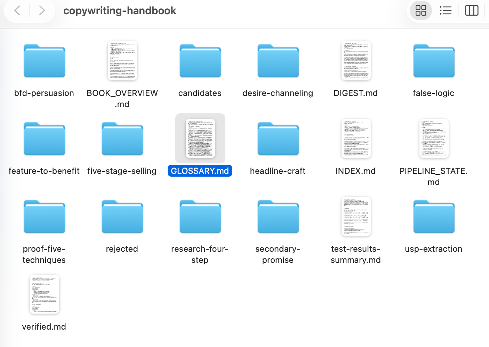
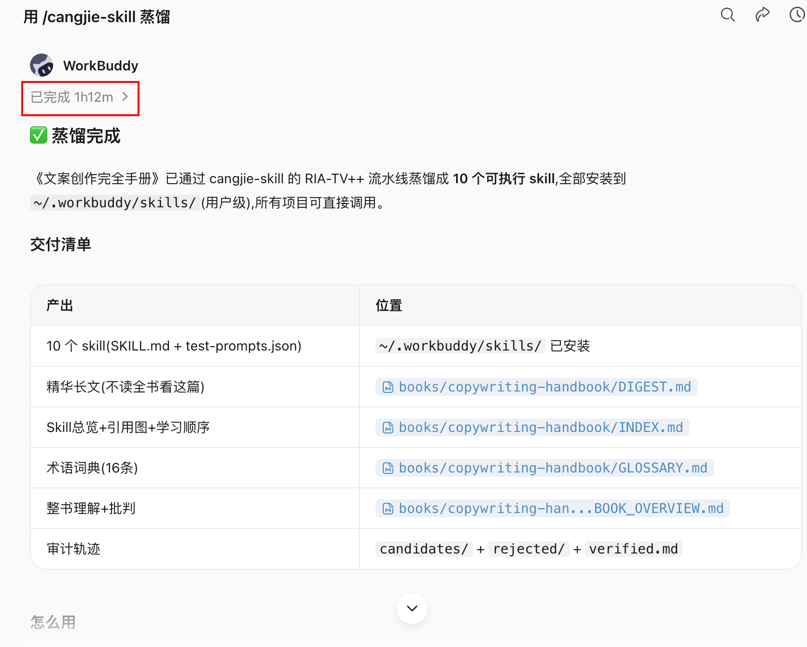
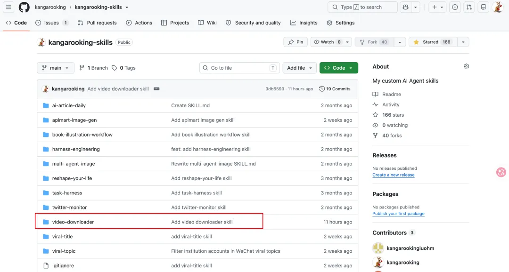
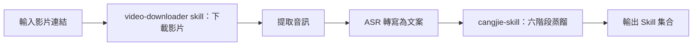

# 第 22 章 打造skill：將書和影片蒸餾為可執行 Skill

製作skill，除了把自己的SOP沉澱為skill外，給大家推薦一個更簡單方便的辦法。

可以使用[cangjie-skill](https://github.com/kangarooking/cangjie-skill)把知識蒸餾成skill。


cangjie-skill 開源專案（v1 蒸餾書，v2 增加影片蒸餾），以及 Andrej Karpathy 關於 LLM 個人知識庫的思路。

本章回答：如何將書本和影片中的方法論轉化為 Agent 可自動呼叫的 Skill，以及這與 RAG 檢索的本質差別在哪裡。

## 問題起點：知識讀了但用不起來

AI 在訓練時已經攝入了大量經典著作，但在實際問答中，它往往輸出"正確的廢話"——每個字都對，但缺乏針對特定問題的可落地步驟。這不是幻覺問題，而是呼叫機制問題：AI 知道書裡有什麼，但不知道該在什麼場景下主動調出哪個框架。

人類讀者面臨同樣的問題。讀完一本書，筆記做了、金句劃了，合上書以為升級了。兩週後遇到真實問題，那些方法論卻抓不住。知識在記憶裡，但啟用路徑不清晰。

知識精餾要解決的，就是這個"學了用不上"的問題。


## 知識精餾的定義

知識精餾（Knowledge Distillation for Skills）是指：從書本或影片中，提取出具有獨立觸發條件和執行步驟的原子化知識單元（Skill），使 Agent 在遇到對應場景時能夠自動啟用並給出可落地的行動路徑。

化學中的精餾是按沸點將混合物分離成不同純淨組分。知識精餾按"框架 / 原則 / 案例 / 反例 / 術語"五個維度，將書或影片中的知識分離成不同型別的純淨組分，然後只把真正有用的提純成可執行的 Skill。

知識精餾不是：

- 摘要（壓縮原文）
- 讀書筆記（結構化原文）
- RAG 索引（儲存原文片段供檢索）

知識精餾是：將方法論轉化為 Agent 能夠在真實場景下自動呼叫的執行單元。

## 六階段蒸餾 SOP

cangjie-skill 使用六個階段將一本書或一組影片蒸餾成一套 Skill。






以蒸餾《文案創作完全手冊》為例



### 階段 0：整書 / 整片理解

不從摘取金句開始，而是先讀清整本書的骨架：

- 全書主旨是什麼；
- 核心論證鏈怎麼走；
- 關鍵術語作者如何定義和使用；
- 作者自身的侷限與盲點在哪裡。

這一步決定後續提取的質量上限。跳過這一步直接提取，容易把作者反對的觀點當成他支援的方法論。


### 階段 1：五個 Agent 並行提取

五個 Agent 同時從五個維度掃描全文，獨立工作，互不干擾：

| Agent | 提取目標 |
|-|-|
| 框架提取 Agent | 作者構建的分析或決策框架 |
| 原則提取 Agent | 可跨場景複用的行為原則 |
| 案例提取 Agent | 作者援引的正面案例和成功路徑 |
| 反例提取 Agent | 作者援引的失敗案例和反面教訓 |
| 術語詞典 Agent | 作者專有術語及其定義 |

五個角度並行，避免單線閱讀中的視角遺漏。


### 階段 1.5：三重驗證篩選

每個候選知識單元必須通過三關，未通過直接淘汰：

| 驗證型別 | 檢查內容 |
|-|-|
| 跨域驗證 | 該方法論在書中至少兩個獨立場景出現過，不是孤證 |
| 預測力測試 | 能用它推匯出書中沒有直接討論的問題嗎 |
| 獨特性檢驗 | 是不是任何人都能說出來的常識？常識不構成 Skill |

寧缺毋濫。一本書通常有 50–100 個候選單元，通過三重驗證後保留 10–25 個。



### 階段 2：構造 Skill

每個通過驗證的知識單元被構造成一個 Skill，核心是設計觸發條件：

- 什麼場景下自動啟用；
- 啟用後執行什麼步驟；
- 什麼時候不該用（邊界）；
- 質量驗證標準是什麼。

觸發條件的設計是最難也最關鍵的一步。沒有觸發條件的 Skill，在實際使用中無法被 Agent 正確識別和呼叫。


### 階段 4：連結

找出 Skill 之間的關係，形成知識網路：

- **依賴**：Skill A 的執行需要先呼叫 Skill B 的輸出；
- **對比**：Skill A 和 Skill B 適用於相似場景但方向相反；
- **組合**：Skill A 和 Skill C 聯合使用效果更好。

連結層讓 Agent 在遇到複雜問題時，能夠選擇一組 Skill 而不只是單個 Skill。


### 階段 5：壓力測試

**誘餌測試**：故意給不該觸發的場景，檢驗 Skill 是否能忍住不啟用。一個沒有邊界的 Skill，在錯誤場景下呼叫反而幫倒忙。

**執行驗證**：給出真實問題，驗證 Skill 是否能輸出可落地的步驟而不是正確的廢話。



## 蒸餾產物結構

一本書蒸餾完成後，產物是一套 Skill 集合：



```text
book-skill/
├── README.md               # 書目資訊、蒸餾說明、適用場景
├── skills/
│   ├── skill-01.md         # 每個 Skill 獨立檔案
│   ├── skill-02.md
│   └── ...
├── index.md                # Skill 關係網路（連結層產物）
└── tests/
    ├── skill-01-test.md    # 每個 Skill 的測試用例
    └── ...
```

每個 Skill 檔案包含：觸發條件、執行步驟、輸出格式、邊界限制、測試用例。測試用例格式相容 darwin-skill（自動 Skill 進化工具），蒸餾產物可以持續自動最佳化。




## 知識精餾 vs RAG

這是使用者最常問的問題。

| 維度 | RAG | 知識精餾（Skill） |
|-|-|-|
| 本質 | 檢索——找出最相關的原文片段 | 提煉——從原文中提取可執行的方法論 |
| 使用前提 | 使用者需要知道該問什麼 | 使用者描述問題，Skill 自動識別並激活 |
| 質量控制 | 無——任何內容都可以入庫 | 三重驗證過濾，寧缺毋濫 |
| 呼叫方式 | 被動等待查詢 | 主動匹配場景並觸發 |
| 知識形態 | 儲存原文（記住知識） | 提純為執行步驟（運用知識） |
| 邊界控制 | 無 | 誘餌測試確保不亂啟用 |
| 資源消耗 | 較重（需維護向量索引） | 較輕（Skill 檔案即可） |

RAG 解決"知識管理"問題——讓你能查到書裡有什麼。知識精餾解決"知識運用"問題——讓 Agent 在對的時刻主動拿出對的框架。

當你不知道該問什麼時，RAG 幫不了你。Skill 不需要你記得書裡有哪些方法論。

## 與 Karpathy LLM Wiki 思路的對比

Andrej Karpathy 提出 LLM 知識庫（LLM Wiki）的思路：將原始資料索引到目錄，讓 LLM 編譯成 Wiki，然後對 Wiki 做 Q&A，產出結果再回填，持續增強。

cangjie-skill 的階段 0（整書理解）和階段 1（並行提取）吸收了這一核心思想：先讓 AI 深度閱讀、結構化整理、建立索引、維護一致性。

兩者的差別在於最後幾步：

| 對比點 | LLM Wiki | 知識精餾 |
|-|-|-|
| 產物形態 | Wiki 條目（結構化知識庫） | Skill 集合（可執行單元） |
| 使用方式 | 使用者主動查詢 | Agent 被動觸發後主動啟用 |
| 解決問題 | 知識管理 | 知識運用 |

兩種方案不互斥，但目標不同。

## 影片蒸餾工作流（v2 新增）

cangjie-skill v2 在書本蒸餾基礎上增加了影片蒸餾能力（藉助[video-downloader skill](https://github.com/kangarooking/kangarooking-skills/tree/main/video-downloader)）。影片與書的區別在於：需要先完成"影片 → 文字"的轉換，再進入六階段 SOP。



### 影片獲取與轉寫

整體流程：




**影片下載**：使用 yt-dlp（開源工具）支援 YouTube、B 站等主流平臺，只需輸入影片連結即可自動下載。影片號因平臺限制暫不支援自動化。

**音訊轉寫**：本地 Whisper 模型可用，但長影片轉寫耗時顯著（一小時影片約需 48 分鐘本地轉寫）。推薦使用 ASR API 服務，速度快，適合批次處理。

### 多影片合併蒸餾

同一主題的多個影片可以合併蒸餾，產出統一的 Skill 集合。合併時 Agent 自動處理內容去重和知識單元合併，避免同一原則在不同影片中被重複提取為多個 Skill。

### video-downloader skill 與 cangjie-skill 的分工

影片處理邏輯（下載、提取音訊、轉寫）獨立封裝在 video-downloader skill 中，不整合到 cangjie-skill 內部。原因是職責分離：cangjie-skill 專注文本蒸餾，影片獲取是前置準備步驟，兩者可以獨立演進。

```text
使用方式：
1. 用 video-downloader skill 獲取影片文案
2. 將文案交給 cangjie-skill 進行六階段蒸餾
3. 輸出對應的 Skill 集合
```

## 適用與不適用場景

### 適合蒸餾的材料

| 型別 | 適合程度 | 說明 |
|-|-|-|
| 方法論密度高的書 | ★★★★★ | 框架清晰，原則可提取，最適合 |
| 訪談 / 課程影片 | ★★★★☆ | 內容結構化程度較高，適合蒸餾 |
| 長影片 / 播客 | ★★★☆☆ | 可用，知識密度因內容而異 |
| 金句散文類書籍 | ★★☆☆☆ | 方法論少，蒸餾產物質量有限 |
| 小說 / 敘事文學 | ★☆☆☆☆ | 不適合，缺乏可提取的方法論框架 |

### 蒸餾的前置條件

蒸餾前最好讀過或看過一遍原材料。原因：

- 需要判斷哪些方法論是重點；
- 需要在蒸餾過程中的關鍵節點做判斷（如三重驗證的邊界情況）；
- 讀過之後蒸餾，吸收率顯著高於未讀過直接蒸餾。

蒸餾不是替代閱讀，而是閱讀後的知識結構化工具。

## 蒸餾產物的持續最佳化

cangjie-skill 產出的每個 Skill 自帶測試用例，格式相容 darwin-skill（達爾文.Skill）。

darwin-skill 是自動 Skill 進化工具：將 Skill 餵給它，它會自動評估、改進、測試，且分數只升不降。

這意味著蒸餾產物不是靜態的。隨著 Agent 實際使用反饋的積累，Skill 可以持續自動最佳化，逐步接近書中方法論在真實場景下的最優表達。

## 資源消耗與模型選擇

知識精餾是 Token 消耗密集型任務，主要來源於：

- 階段 0 的全書上下文理解（長上下文）；
- 階段 1 的五個 Agent 並行呼叫；
- 階段 2 的三重驗證（多輪推理）；
- 階段 5 的壓力測試（多組測試用例）。

| 場景 | 大致 Token 消耗 | 大致耗時參考 |
|-|-|-|
| 蒸餾一本普通書 | 數萬至十餘萬 Token | 30–90 分鐘 |
| 蒸餾 26 集課程影片（4 小時） | 較高 | 約 1 小時 |
| 蒸餾 4 個主題影片（80 分鐘） | 中等 | 約 40 分鐘 |

**模型選擇建議**：

- 任務拆解和蒸餾協調：使用推理能力強的模型負責 Agent 編排；
- 並行提取和驗證：可使用價效比高的 Coding 模型執行；
- 長上下文場景：選擇原生支援長上下文的模型，避免因上下文截斷導致蒸餾不完整。

【圖片佔位：Token 消耗過程截圖，展示蒸餾過程中 Token 使用量的增長曲線】

## 蒸餾產物的分享與複用

知識精餾的一個重要特點是：產物（Skill 集合）可以直接分享和複用。

**使用已蒸餾的 Skill**：將 GitHub 倉庫地址提供給 Agent，讓 Agent 自動安裝對應 Skill 即可使用，無需重新蒸餾。

**社群協作**：同一本書不需要被每個人重複蒸餾。任何人蒸餾的成果都可以開源，其他人直接複用。

**擴充套件應用**：影片課程的蒸餾產物可以進一步構建課程 Agent，供學員問答和輔助實踐，即課程內容的結構化知識服務化。

## 常見誤區

**誤區 1：AI 訓練過的書不需要再蒸餾**

對於大眾熟知的經典書籍，AI 確實有一定記憶。但對小眾書籍、新出版書籍以及時效性強的影片內容，AI 大機率沒有訓練過。此外，即使 AI 訓練過某本書，蒸餾的價值在於建立觸發條件——讓 AI 知道在什麼場景下應該調出該書的哪個框架，而不只是"知道書裡有什麼"。

**誤區 2：蒸餾完就不需要看書了**

蒸餾是閱讀的補充，不是替代。沒讀過就蒸餾，會在關鍵判斷節點上缺乏背景，導致蒸餾結果遺漏重點。閱讀過一遍後再蒸餾，蒸餾產物的質量和完整度顯著更高。

**誤區 3：AI 給了建議就能直接執行**

即使 Skill 被正確啟用並給出了可落地的步驟，方向對不對、能不能執行、效果好不好，仍然需要人來判斷。AI 給出的是選項和分析，決策是人的責任。

**誤區 4：Skill 覆蓋越多越好**

覆蓋太寬的觸發條件會導致 Skill 在不適用的場景下被錯誤啟用，反而產生誤導。三重驗證和誘餌測試的目的正是控制邊界，寧可覆蓋窄一點，也不要亂啟用。

## 蒸餾結果示例

以吳恩達《給所有人的 AI 入門課》（2026 版，26 個影片，時長約 4 小時）為例：

- 蒸餾耗時：約 1 小時
- 產出：25 個 Skill
- 特點：全部為時效性內容，AI 未經訓練，蒸餾後可直接在對應場景下被 Agent 呼叫


## 總結：知識精餾在技能包體系中的位置

知識精餾是 Skill 的一種生產方式。它和第 25 章討論的 SOP → Skill 封裝流程是並行的：

| 來源 | 適用場景 |
|-|-|
| 從業務流程提煉（SOP → Skill） | 企業內部操作規範、重複性業務流程 |
| 從書本 / 影片蒸餾（知識精餾） | 專家方法論、經典著作、高價值課程內容 |

兩者產物格式一致，都是帶有觸發條件的可執行 Skill，可以在同一個 Agent 框架下混合使用。