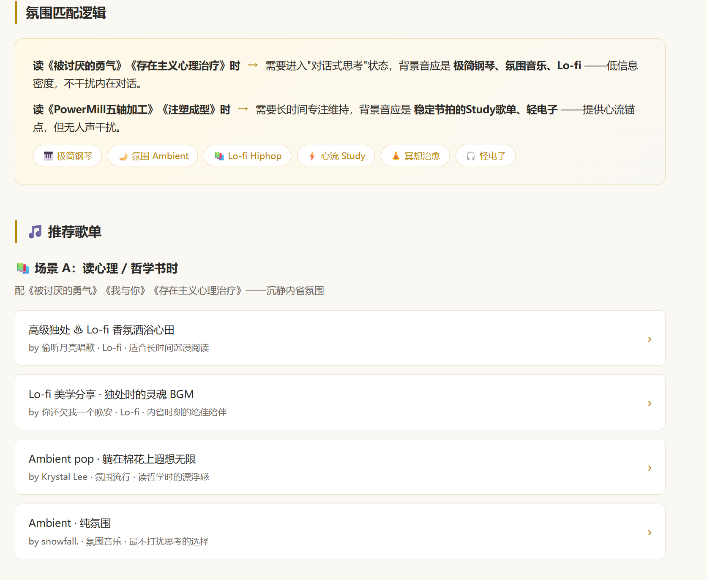

# 第 23 章 其他用法補充：WorkBuddy 實操案例集

前面的章節介紹了 Agent 工具鏈的核心能力：檔案處理、資料庫操作、MCP 連線和企業協作。這一章補充幾類容易被忽略但實際價值很高的用法，以 WorkBuddy 為例，覆蓋短任務、設計創意、Skill 聯動、瀏覽器自動化和專案管理等場景。

WorkBuddy 與大多數 AI 聊天軟體的核心區別在於三點：能直接讀取和修改本地檔案，學習門檻低，入口清晰。對於還沒有系統搭建 Agent 工作流的讀者，這些案例可以作為起點。

## 模型與成本：先把免費額度用透

WorkBuddy 內建了多款國產大模型。每日簽到領取的積分基本能覆蓋輕度使用的全部消耗。新發布的模型通常附帶免費體驗期——以 HY3 為例，釋出後有兩週免費額度，即使過期，定價也屬於國產模型價效比第一梯隊。

如果拿不準做什麼，WorkBuddy 已經按應用場景預設了模板，選一個直接開始即可。


## 短任務實戰：Excel 視覺化與資料清洗

HY3 在短任務上表現突出。PPT 生成、資料清洗、Excel 圖表視覺化分析都能直接完成。

從開屏介面出發，輸入任務描述後點擊右下角"最佳化提示詞"按鈕，WorkBuddy 會自動補全細節並執行。

**提示詞示例：**

```text
幫我視覺化這份流水賬資料並分析一下。
重點關注：
1. 每月收支趨勢；
2. 支出分類佔比；
3. 異常大額支出標註；
4. 給出 3 條可操作的省錢建議。
```

執行過程可能較慢，但最終產出的視覺化效果通常超出預期——包括圖表、趨勢分析和文字總結。資料清洗和 PPT 生成同理。


## 設計創意：用提示詞生成完整網站

這是一個容易被低估的用法。勾選"網站設計"場景後給出提示詞，可以生成可執行的前端頁面。以下是兩個經過驗證的模板。

### 模板一：個人作品集 Hero Section

生成一個帶有影片背景、滑鼠互動和響應式佈局的全屏 Hero 頁面。

**提示詞：**

```text
Build a full-screen hero section for a creative portfolio using React, Vite, Tailwind CSS, and the Figtree Google Font.

要求：
1. 三個全屏迴圈影片作為背景，通過 crossfade 切換，透明度過渡 1200ms；
2. 頂部導航欄：左側導航項格式為"01 / Works"，右側顯示郵箱和即時時鐘；
3. 底部內容區：左側大字名稱（200px），右側介紹文案和 CTA 按鈕；
4. 按鈕 hover 效果：背景色從底部填充上來；
5. 支援平板和手機端的響應式適配；
6. prefers-reduced-motion 下停用所有動畫。
```

<video controls preload="metadata" src="./assets/003_asset_HE1Nb74Hfo.mp4"></video>


### 模板二：創意機構 Landing Page（滑鼠控制影片）

這個模板的特色是影片不自動播放，而是跟隨滑鼠水平移動控制播放進度。

**提示詞：**

```text
Build a full-screen hero landing page for a creative agency called "Mainframe" using React, TypeScript, Vite, and Tailwind CSS.

核心互動：
1. 全屏影片背景，不自動播放；
2. 滑鼠水平移動控制影片播放進度（sensitivity = 0.8）；
3. 頂部導航：左側 Logo + 裝飾星號，中間導航連結用逗號分隔，右側 CTA；
4. Hero 內容：模糊的介紹文字 + 打字機效果的主文案 + 圓角藥丸按鈕組；
5. 移動端：漢堡選單，CSS Grid 展開動畫；
6. 按鈕 hover：白色填充變黑色文字。
```

以上兩個模板全程使用 HY3 模型完成。


## Skill 聯動：跨服務的智慧推薦

WorkBuddy 的 Skill 系統允許 Agent 連線日常使用的各類服務。這種跨服務聯動是 Skill 生態的核心價值——不是替代某個 App，而是成為多個 App 之間的連線層。

**示例：微信讀書 + QQ 音樂**

安裝並連線微信讀書和 QQ 音樂的 Skill 後，可以實現跨服務的智慧推薦：

**提示詞：**

```text
根據我最近在微信讀書中閱讀的書目，推薦適配閱讀氛圍的歌單。
要求：
1. 先讀取最近 7 天的閱讀記錄；
2. 分析書目的情緒基調和主題；
3. 在 QQ 音樂中匹配風格相近的歌單；
4. 輸出推薦理由和歌單鏈接。
```



微信讀書 Skill 的安裝連結可以在官方頁面獲取：`https://weread.qq.com/r/weread-skills`。
