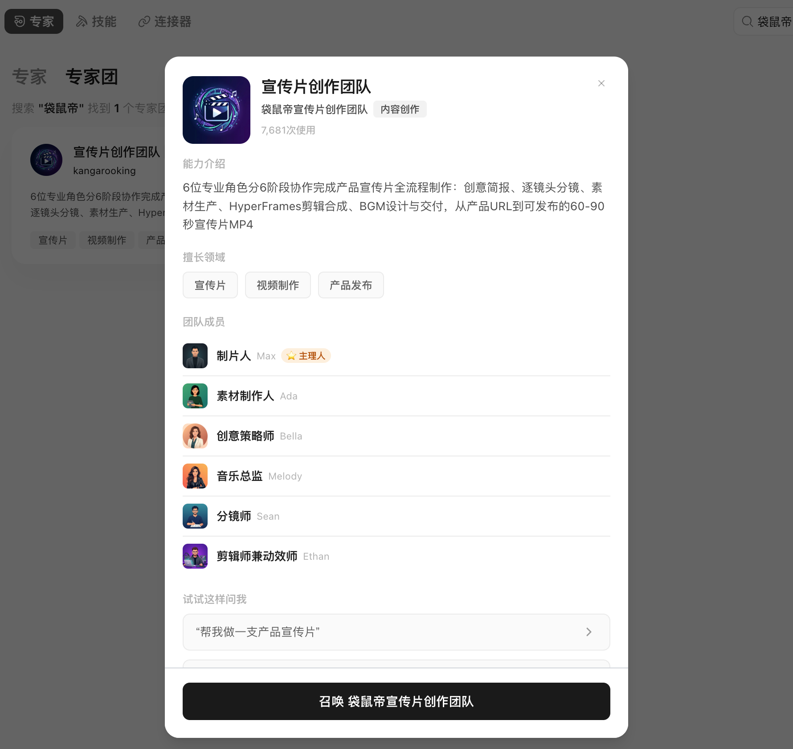
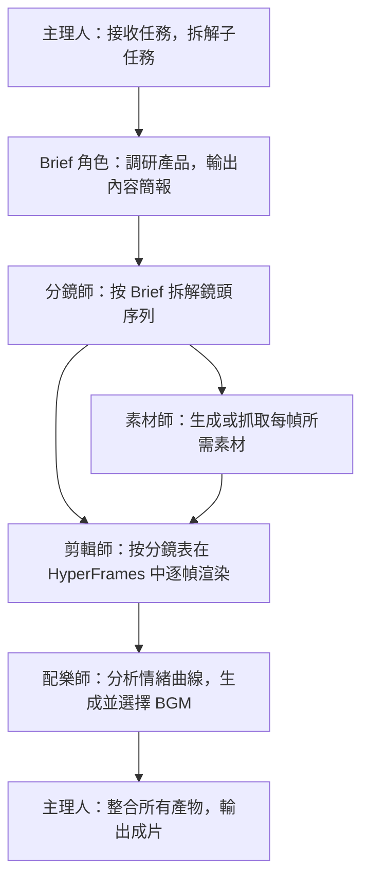
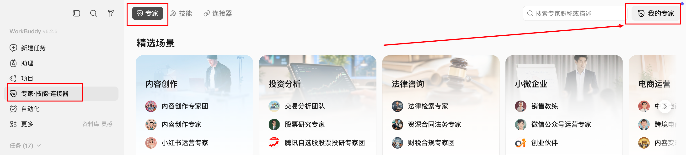
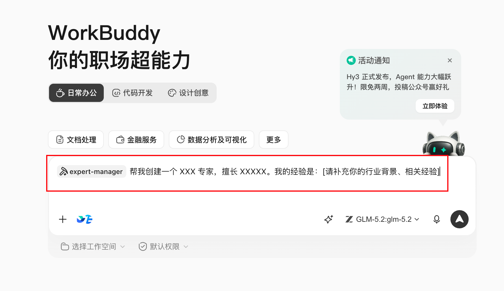

# 第 24 章 如何進行多 Agent 系統設計

一人公司產品宣傳部實踐（HyperFrames + 多 Agent）、WorkBuddy 專家團產品。本章以產品宣傳片專家團的實際案例，回答：多 Agent 系統如何設計分工、如何串聯產物、何時值得拆分。


## 單 Agent 和多 Agent 的真正差別

| 維度 | 單 Agent | 多 Agent |
|-|-|-|
| 上下文 | 所有資訊在一個任務 | 角色只接收必要上下文 |
| 分工 | 一個執行體序列完成 | 多角色並行或接力 |
| 工具 | 同一組許可權 | 可按角色隔離工具和許可權 |
| 質量 | 自己生成、自己檢查 | 可設定獨立評審者 |
| 成本 | 較低 | 協調、模型和工具呼叫更多 |
| 風險 | 一處錯誤影響整體 | 錯誤可能在角色間傳播 |

多 Agent 的價值來自專業分工、並行、許可權隔離或獨立評審，不來自角色數量。



## 任務是否值得拆分

滿足越多，越適合多 Agent：

- 至少兩個子任務可以獨立進行；
- 子任務需要不同方法、資料或工具；
- 輸出可以定義清楚的交接格式；
- 並行能顯著縮短等待；
- 有明確總負責人和最終驗收；
- 預算允許多輪呼叫。

只改一封郵件、總結一份 PDF 或格式化一個表格，不需要專家團。

## 案例：產品宣傳片專家團

### 任務背景

HyperFrames 是 HeyGen 開源的影片渲染框架（截至案例時 GitHub 17.7K Star），核心特點是對 AI Agent 友好：Agent 可以自動生成基於 HTML 的影片幀並渲染輸出。產品宣傳片具有相對固定的套路——無需口播和演員，主要由產品展示、概念字幕和 BGM 構成。這類任務適合 Agent 團隊分工處理。


### 工序設計

產品宣傳片專家團的完整工序如下：



### 角色契約

| 角色 | 輸入 | 輸出 | 禁止動作 |
|-|-|-|-|
| 主理人 | 使用者任務描述、素材空間 | 任務拆解、狀態追蹤、成片 | 不跳過子任務驗收直接交付 |
| Brief 角色 | 產品官網、介紹文件 | brief.md（產品定位、核心價值、目標使用者） | 不直接寫指令碼 |
| 分鏡師 | brief.md | 分鏡表（時間碼、畫面、字幕、轉場、動效） | 不引入 Brief 未確認的資訊 |
| 素材師 | 分鏡表 | 產品截圖、概念圖、介面素材 | 不使用無版權來源素材 |
| 剪輯師 | 素材、分鏡表 | 逐幀 MP4 片段 | 不改動分鏡結構 |
| 配樂師 | 分鏡表、情緒標註 | BGM 候選及推薦理由 | 不只輸出一個選項 |

### 專家團演示

在做產品宣傳片之前，需要先把相關素材放到工作空間內。

```Plain Text
我希望你做一個產品宣傳片，具體的話，是宣傳騰訊的workbuddy最新的專家團，主打opc場景。當前空間下我放了一些素材，成片風格可以偏apple風格、真實軟體介面。整個過程全自動
```


團長先接到任務：把"做一支宣傳片"拆成了一串子任務：先得搞清楚 WorkBuddy 專家團到底是什麼、賣給誰、核心價值是什麼；再決定敘事結構、鏡頭數量、節奏；然後再分頭去做素材、剪輯、配樂。


brief 角色先開工：去把 WorkBuddy 官網、產品介紹、專家團列表都翻了一遍，輸出一份 brief ，這是什麼產品、目標使用者是誰、最值得放進 60 秒的幾個核心點。


分鏡師接著 brief 幹活：把 60 秒拆成了 7 個鏡頭，每個鏡頭都細到時間碼、畫面、文字、轉場、動效、需要的素材型別。


然後 素材師 和 剪輯師 開始幹活：一個去生成 / 抓產品截圖、概念圖，另一個把素材按分鏡表往 HyperFrames 裡塞，逐鏡頭渲染出每一段 MP4。


最有意思的是 配樂師：它不是簡單寫個"科技感 BGM"的 prompt 完事，它會先把分鏡表讀一遍，研究每個鏡頭的情緒曲線，標好哪些地方需要鼓點卡產品 reveal、哪些地方需要降下來做留白、哪些地方需要一個 hit point 推 CTA。然後再去呼叫音樂模型生成候選 BGM。


最後由 團長 把所有產物整合，跑最後一道剪輯，輸出成片。


整個過程我基本就是個旁觀者：偶爾在關鍵節點拍一下板，比如分鏡要不要這麼排、BGM 喜不喜歡、字幕文案要不要改。

最後出來的片子，還挺不錯的。

<video controls preload="metadata" src="./assets/006_asset_Um2SbSClHo.mp4"></video>


## 共享產物層

多個 Agent 不應各自維護一份"產品事實"。建立單一產物路徑：

```text
project/
├── brief.md                  # 產品簡報（Brief 角色產出，主理人確認）
├── storyboard.md             # 分鏡表（分鏡師產出，主理人確認）
├── assets/                   # 素材（素材師產出）
│   ├── screenshots/
│   └── concepts/
├── clips/                    # 逐幀片段（剪輯師產出）
├── bgm/                      # BGM 候選（配樂師產出）
└── output/final.mp4          # 成片（主理人整合）
```

下游角色只讀取上游已確認的產物。角色之間不通過對話傳遞關鍵內容細節。

## 並行與序列

**可以並行：** 素材生成與剪輯準備、不同鏡頭段落的渲染。

**必須序列：** Brief 確認後才寫分鏡、分鏡確認後才生成素材、素材就緒後才剪輯、成片完成後才配樂合成。

並行計劃必須標明匯合點。素材和剪輯可以並行準備，但最終合成必須等待所有素材就位。

## 主理人的職責

主理人（製片人）是工作流控制器：

- 解釋使用者任務並維護子任務狀態；
- 分發最小必要上下文給各角色；
- 檢查上游產物是否滿足交接格式；
- 決定並行、等待或重試；
- 在關鍵節點（如分鏡確認、BGM 選擇）請使用者拍板；
- 彙總所有產物，執行最終合成；
- 對成片做一致性檢查（畫面、字幕、BGM 節奏是否對齊）。

## 三個必須由人確認的點

1. **Brief 確認**：產品定位、目標使用者、核心賣點是否準確；
2. **分鏡確認**：敘事結構、鏡頭數量、節奏是否符合預期；
3. **BGM 選擇**：情緒風格是否與成片調性匹配。

Agent 負責生成和執行，不能替代品牌方向和風格判斷。

## 產品化路徑：從自建到預置專家團

### 自建團隊

將上述角色封裝為一套 Skills，在 Agent 框架中自行編排。適用場景：開發者需要完全控制每個角色的提示詞、工具許可權和交接格式。門檻包括：定義角色職責、設計交接格式、除錯並行與序列邏輯。

### 預置專家團

WorkBuddy 專家團將上述分工產品化：團長負責任務拆解和分配，團員並行執行，使用者只需描述任務。

建立專家團也很簡單在專家->我的專家->建立專家



就會跳轉到workbuddy的對話方塊，根據它給定的格式即可快速建立屬於自己的專家。




當前專家團覆蓋的典型場景：

| 場景類別 | 代表專家團 |
|-|-|
| 內容創作 | 產品宣傳片、爆款內容創作、全域分發 |
| 軟體研發 | 軟體開發、程式碼測試 |
| 商業分析 | 深度研究、投資分析、資料分析 |
| 業務支援 | SEO、銷售、營銷、財稅合規、HR |
| 法律合規 | 中文法律 |


### 兩種路徑的選擇

| 維度 | 自建 Skills | 預置專家團 |
|-|-|-|
| 適用人群 | 開發者，需要深度定製 | 一人公司，直接使用 |
| 上手門檻 | 高（需定義角色、除錯流程） | 低（描述任務即可） |
| 靈活度 | 高（可修改任意環節） | 中（支援自定義模型接入） |
| 速度 | 取決於搭建時間 | 即開即用 |

## 質量影響因素

成片質量主要受以下因素影響：

- **Agent 底座模型**：Agent 模型的指令跟隨和推理能力直接影響分鏡質量和任務拆解準確性；
- **影像生成模型**：影響產品截圖的清晰度和概念圖的視覺質量；
- **使用者提供的素材**：提前放入素材空間（圖片、影片）可顯著提升成片質量；
- **瀏覽器工具接入**：若 Agent 具備瀏覽器操作能力，可自動抓取官網截圖和產品介面，減少人工準備。

全自動方案適合快速出片（開源專案介紹影片、產品演示影片等）。對品質要求高的場景，建議以 Agent 產物為基礎再做一輪人工二次剪輯。

## 失敗傳播控制

| 角色失敗 | 降級方式 |
|-|-|
| Brief 角色無法獲取產品資訊 | 使用者補充基礎資訊後重試 |
| 素材生成失敗 | 使用使用者預置素材或標記空缺位置 |
| 剪輯渲染超時 | 交付已完成的片段和分鏡表 |
| BGM 生成失敗 | 提供推薦 BGM 型別描述，由使用者自選 |
| 主理人合成失敗 | 交付各角色產物清單，由使用者手動合成 |

降級交付必須說明缺失內容，不偽裝成完整成果。

## 多 Agent 任務 Brief 模板

```text
目標：為 [產品名稱] 製作一支 [時長] 的產品宣傳片。
風格：[參考風格，如 Apple 風、極簡風]。
素材：[素材空間路徑或已提供的圖片/影片]。
角色：主理人、Brief、分鏡師、素材師、剪輯師、配樂師。
確認節點：Brief 完成後、分鏡完成後、BGM 選擇時，需使用者確認後繼續。
模型：Agent 模型 [指定]；影像生成模型 [指定]。
全自動/半自動：[說明是否需要中間節點人工介入]。
```
