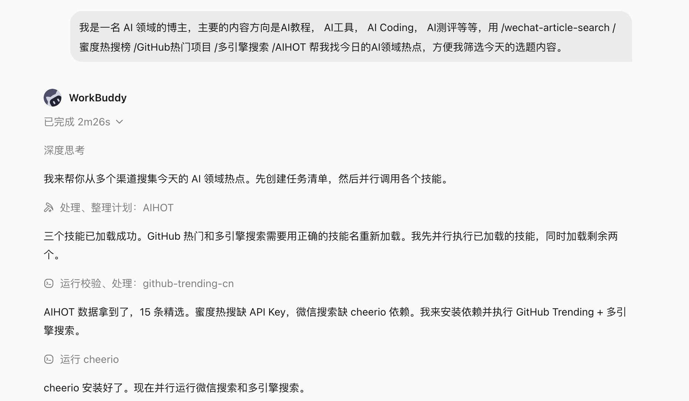
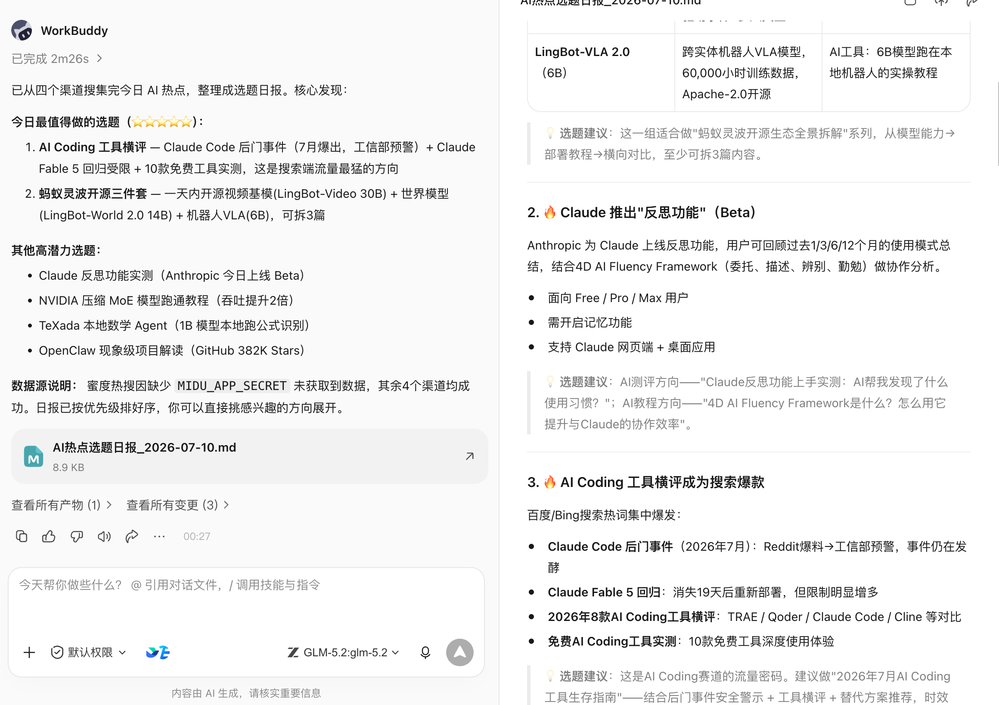
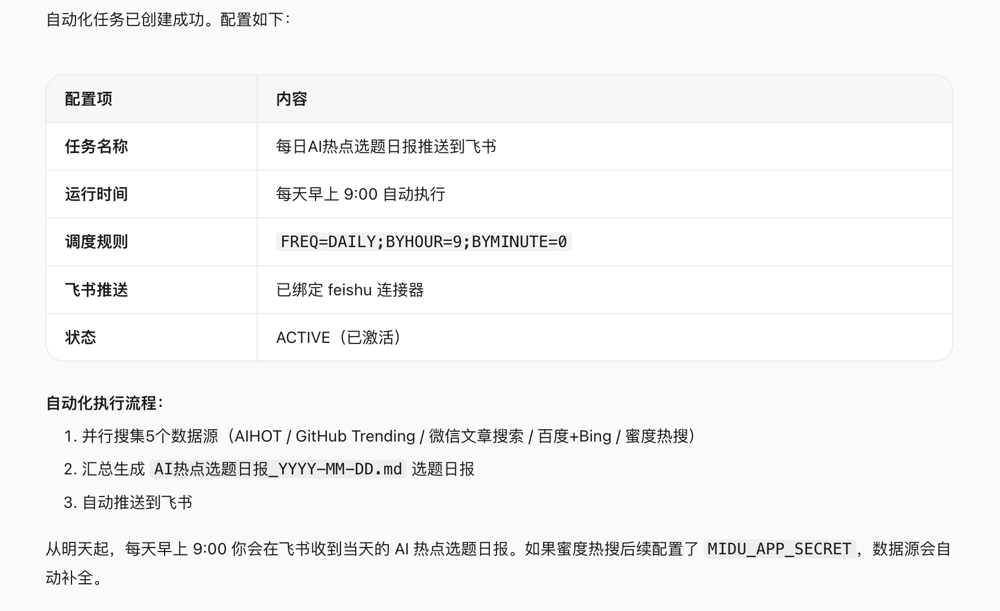
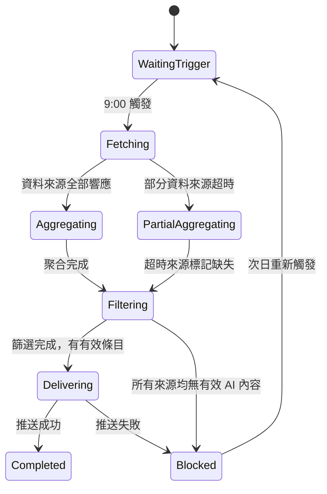

# 第 25 章 自動化工作流的可靠性

以"每日 AI 熱點選題聚合"為貫穿案例，說明自動化工作流在從手動執行到定時可靠執行的過程中，需要處理哪些問題。

## 案例背景：內容博主的每日選題任務

AI 內容領域更新速度快，每天需要從多個資訊源中篩選當日值得寫的選題。手動逐一翻閱各個平臺耗時且容易遺漏。一個典型的 AI 博主選題需求如下：

```text
我是一名 AI 領域的博主，主要內容方向是 AI 教程、AI 工具、AI Coding、AI 測評等。
幫我找今日的 AI 領域熱點，方便篩選當天的選題內容。
來源：
- 微信公眾號近期爆款文章（@wechat-article-search）
- 蜜度熱搜榜 AI 相關條目（@蜜度熱搜榜）
- GitHub 今日熱門 AI 專案（@GitHub熱門專案）
- 多引擎 AI 新聞聚合（@多引擎搜尋）
- AI 熱點追蹤（@AIHOT）
```

手動執行一次這個任務，WorkBuddy 會同時呼叫五個資料來源，整合輸出一份當日 AI 熱點清單，供博主快速判斷和篩選。





跑通一次後，下一步是把它設定為定時自動化任務：每天早上 9:00 自動執行，結果推送到指定位置，無需每天手動觸發。

本章圍繞這個場景，說明從"能用"到"可靠自動化"需要處理哪些問題。

## 自動化前的三個門檻

不是所有任務都適合立即自動化。判斷標準：

1. **同一 Prompt 已手動執行至少三次**，輸出質量和格式基本穩定；
2. **觸發條件、輸入來源和驗收標準清楚**：什麼時候執行、依賴哪些資料來源、輸出什麼格式；
3. **有 owner、有告警、有停用方法**：任務失敗時誰處理，如何臨時停用不影響其他流程。

選題任務滿足以上三點：Prompt 結構固定、每天早上 9:00 觸發、輸出內容為當日熱點清單。

頻繁改 Prompt 或資料來源還不穩定的任務，先手動執行，不急於自動化。

## 在 WorkBuddy 中設定自動化任務

手動執行確認效果後，在同一對話方塊中直接告訴 WorkBuddy：

```text
把這個任務設定為自動化，每天早上 9:00 執行，
結果傳送到 [指定飛書群 / 郵件 / 企微通知]。
```

WorkBuddy 會將當前 Prompt 和資料來源配置儲存為定時任務，按設定時間自動執行。




設定完成後，每天早上 9:00，WorkBuddy 自動呼叫五個資料來源，整合結果並推送。博主開啟通知，直接開始篩選選題，不需要手動觸發。


## 把自動化任務設計成狀態機

自動化不是讓任務"跑起來就行"。真實環境中，每次執行都可能遇到：某個資料來源返回超時、熱搜榜當日無 AI 相關條目、GitHub API 限流、推送目標不可達。

將任務設計成狀態機，每個狀態都有明確的成功條件和失敗出口：



關鍵原則：部分資料來源失敗不應阻斷整體任務，而是標記缺失後繼續聚合；推送失敗應保留結果並告警，不丟失已生成的內容。

## 資料來源就緒檢查

定時觸發不等於資料來源已就緒。每次執行開始時，先檢查各資料來源的可用性：

| 資料來源 | 檢查項 | 不可用時的處理 |
|-|-|-|
| @wechat-article-search | 搜尋 API 可達，返回非空結果 | 標記缺失，繼續其他來源 |
| @蜜度熱搜榜 | 當日熱搜列表可獲取 | 標記缺失，繼續其他來源 |
| @GitHub熱門專案 | GitHub API 未限流，熱門列表正常 | 退避重試一次，失敗則標記缺失 |
| @多引擎搜尋 | 搜尋引擎可達 | 標記缺失，繼續其他來源 |
| @AIHOT | 熱點追蹤服務正常 | 標記缺失，繼續其他來源 |

五個來源中至少有三個正常，才輸出熱點清單。全部失敗時，進入 Blocked 狀態並推送告警，次日重新觸發。

## 內容質量門禁

資料來源可達不代表內容有效。聚合後需要過濾：

- **相關性**：條目是否真正屬於 AI 領域（排除泛科技話題的噪音）；
- **時效性**：內容日期是否為當日（排除過期熱點被重新推送的情況）；
- **重複性**：同一事件是否已在多個來源出現，合併展示；
- **最低數量**：有效條目少於 5 條時，視為當日 AI 熱點不足，在輸出中標註。

質量狀態：**pass**（正常輸出）、**warning**（部分來源缺失，在輸出頂部說明）、**blocked**（有效條目不足，不推送正文，只推送說明）。

## 輸出結構

聚合完成後，輸出一份結構固定的熱點清單，方便博主快速掃描和判斷：

```text
📋 AI 熱點選題日報 — 2026-07-10

【今日概況】
有效條目：18 條 | 來源：5/5 | 執行時間：09:02

━━━━━━━━━━━━━━━━
🔥 高熱度（適合快速蹭熱點）
1. [模型名稱] 釋出，[核心能力] — 來源：AIHOT + GitHub
   熱度指數：★★★★★ | 建議角度：功能測評 / 使用教程

2. [工具名稱] 開源，[功能描述] — 來源：GitHub熱門專案
   熱度指數：★★★★ | 建議角度：上手教程 / 對比測評

━━━━━━━━━━━━━━━━
📈 潛力方向（適合深度分析）
3. [話題] 引發討論 — 來源：微信公眾號
   熱度指數：★★★ | 建議角度：觀點分析 / 案例拆解

━━━━━━━━━━━━━━━━
⚠️ 資料來源說明
蜜度熱搜榜：正常 | GitHub：正常 | 微信：正常
多引擎搜尋：正常 | AIHOT：正常
```

輸出格式固定後，博主可以在 5 分鐘內完成選題判斷，而不是每次重新整理格式。

## 推送目標與冪等

每次執行的輸出需要推送到固定位置。常見推送目標：

| 推送目標 | 適用場景 | 注意事項 |
|-|-|-|
| 飛書群訊息 | 團隊共享選題 | 記錄 message ID，避免重複推送 |
| 個人飛書通知 | 個人使用 | 同上 |
| 飛書文件（追加） | 保留歷史記錄，便於回溯 | 每日一條，按日期追加，不覆蓋歷史 |
| 郵件 | 跨平臺通知 | 記錄發件 ID |

**冪等原則**：如果某次任務因推送失敗而重試，不應重複傳送已成功推送的內容。每次執行生成唯一批次 ID（如 `ai-hotspot-2026-07-10`），推送成功後記錄狀態，重試時檢查狀態跳過已完成步驟。

## 超時和重試策略

| 失敗型別 | 是否重試 | 策略 |
|-|-|-|
| 資料來源 API 超時 | 是 | 等待 10 秒後重試一次，仍失敗則標記缺失 |
| GitHub API 限流（429） | 是 | 按響應頭中的 Retry-After 等待，最多等待 2 次 |
| 認證失效（401/403） | 否 | 轉人工處理，不自動重試 |
| 推送目標不可達 | 是 | 指數退避重試 2 次，失敗則告警並保留結果 |
| 聚合結果為空 | 否 | 進入 blocked 狀態，推送說明，次日重新觸發 |

重試只針對臨時性故障，不對輸入問題或配置問題重試。

## 斷點續跑

每次執行生成狀態檔案，記錄已完成的步驟和產物：

```json
{
  "batch_id": "ai-hotspot-2026-07-10",
  "trigger_time": "2026-07-10T09:00:00+08:00",
  "state": "delivering",
  "completed": ["fetching", "aggregating", "filtering"],
  "source_status": {
    "wechat": "ok",
    "midu": "ok",
    "github": "ok",
    "multi_search": "ok",
    "aihot": "ok"
  },
  "item_count": 18,
  "last_error": null,
  "updated_at": "2026-07-10T09:02:14+08:00"
}
```

推送失敗後重試，從 `delivering` 步驟繼續，不重新抓取和聚合。

## 告警要可行動

自動化任務失敗時，告警內容必須包含足夠資訊，讓收到告警的人能夠立即判斷如何處理：

```text
⚠️ AI 熱點選題任務告警

批次：ai-hotspot-2026-07-10
狀態：Blocked
觸發時間：09:00
失敗原因：所有資料來源均返回空結果或超時
已完成步驟：fetching（部分失敗）
影響：今日熱點清單未生成，未推送

建議處理：
1. 檢查各資料來源 API 狀態
2. 如為臨時故障，可手動觸發一次任務重跑
3. 如需跳過今日，確認後標記為已處理

恢復入口：WorkBuddy → 自動化任務 → 手動執行
```

"任務失敗，請檢視"不足以讓人處理。

## 降級交付

當部分資料來源失敗，不應等待全部就緒再輸出：

- 3 個及以上來源正常 → 輸出清單，頂部標註哪些來源缺失；
- 2 個來源正常 → 輸出簡化清單，標註資料不完整；
- 1 個或 0 個來源正常 → 不輸出正文，只推送說明和告警。

降級結果必須顯式標記來源覆蓋情況，不偽裝成完整執行。

## 日誌

每次執行記錄：

- 批次 ID 和觸發方式（定時 / 手動）；
- 各資料來源響應狀態和耗時；
- 聚合條目數量和過濾後數量；
- 推送目標和結果（成功 / 失敗 / message ID）；
- 總耗時和錯誤資訊；
- 執行成本（Token 消耗、API 呼叫次數）。

日誌不記錄熱點內容正文（避免日誌過大）。

## 成本預算

選題任務的主要成本來源：

| 成本項 | 說明 |
|-|-|
| WorkBuddy 呼叫次數 | 每次執行呼叫五個 Command，按平臺計費規則計算 |
| 外部 API 呼叫 | GitHub、熱搜榜等資料來源的 API 呼叫費用 |
| 模型推理 | 聚合和過濾階段的 LLM 推理 |
| 推送服務 | 飛書等推送 API 的呼叫 |

設定預算上限：單次執行超過設定成本時，記錄告警並繼續執行，但下一次執行前需確認。

## 自動化任務定義模板

以選題任務為示例，記錄完整的自動化任務定義：

```text
任務名稱：AI 熱點選題日報
觸發方式：每天 09:00（工作日）
觸發條件：無前置檢查，定時直接執行
Prompt：[完整 Prompt 文本]
資料來源：@wechat-article-search / @蜜度熱搜榜 / @GitHub熱門專案 / @多引擎搜尋 / @AIHOT
質量門禁：有效 AI 相關條目 ≥ 5 條；資料來源可用數量 ≥ 3 個
輸出格式：結構化熱點清單（含來源、熱度、建議角度）
推送目標：[飛書群 / 個人通知 / 飛書文件追加]
冪等控制：批次 ID = ai-hotspot-{date}，推送成功後標記，不重複推送
重試策略：資料來源超時重試 1 次；推送失敗退避重試 2 次；其他失敗轉人工
告警接收：[個人飛書通知]
owner：[博主本人]
停用方式：WorkBuddy 自動化任務管理頁 → 暫停
```

## 上線前演練

正式開啟定時任務前，手動模擬以下場景，確認任務行為符合預期：

| 場景 | 預期行為 |
|-|-|
| 所有資料來源正常 | 輸出完整清單，推送成功 |
| GitHub API 限流 | 退避重試，仍失敗則標記缺失，繼續聚合其他來源 |
| 當日無 AI 相關熱點 | 有效條目不足，輸出說明，不推送空清單 |
| 推送目標不可達 | 重試 2 次，失敗則告警並保留結果 |
| 重複觸發（手動觸發與定時同時） | 檢測批次 ID，跳過重複執行 |

演練通過後再開啟定時執行。

## 執行指標

穩定執行後，定期檢查以下指標：

- **按時觸發率**：09:00 定時是否準時觸發；
- **一次執行成功率**：不需要重試的成功比例；
- **資料來源可用率**：各來源的單獨可用比例；
- **有效條目數量趨勢**：監測 AI 熱點資訊量的波動；
- **推送成功率**：推送不丟失的比例；
- **單次執行成本**：追蹤成本變化趨勢。

指標出現持續下降時，檢查對應資料來源或推送配置是否發生變化。

## 從個人自動化到團隊服務

個人選題任務執行穩定後，可以擴充套件為團隊共享：

| 維度 | 個人使用 | 團隊服務 |
|-|-|-|
| 推送目標 | 個人通知 | 團隊飛書群 |
| 選題方向 | 單一方向 | 多方向分類推送 |
| 稽核流程 | 個人判斷 | 主編確認後分發 |
| 故障處理 | 自己處理 | 有 owner 和備份處理人 |
| 成本歸屬 | 個人賬戶 | 團隊預算 |

擴充套件為團隊服務時，需要補充：明確 owner、建立執行手冊、設定許可權（誰能修改 Prompt 和推送配置）、制定變更流程（修改資料來源需測試後生效）。

自動化的高階形態，不是完全沒有人，而是正常路徑少打擾人，異常路徑能及時找到正確的人。

## 選題任務的迭代最佳化

自動化任務上線後，根據實際使用反饋持續迭代：

**Prompt 最佳化**：根據哪類條目真正被採用、哪類被忽略，調整過濾維度和描述。修改 Prompt 後需手動執行三次確認效果再重新儲存自動化配置。

**資料來源調整**：某個資料來源長期質量差或可用率低，考慮替換或降低其權重。

**輸出格式迭代**：根據篩選習慣調整清單格式（如增加"本週已覆蓋"標記，避免重複選題）。

**時間調整**：根據實際使用習慣調整觸發時間（如改為 8:30 或 10:00）。

每次調整都是一次小型配置變更，遵循"改 → 手動驗證 → 重新儲存"的流程，不直接在定時任務上實驗。