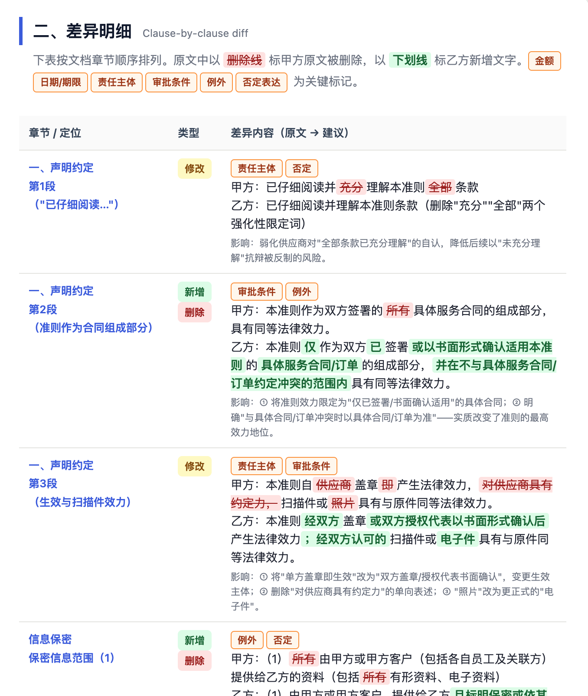
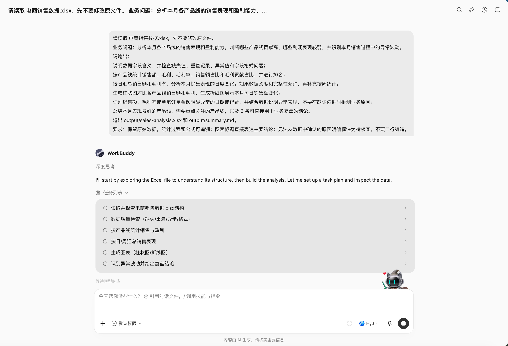
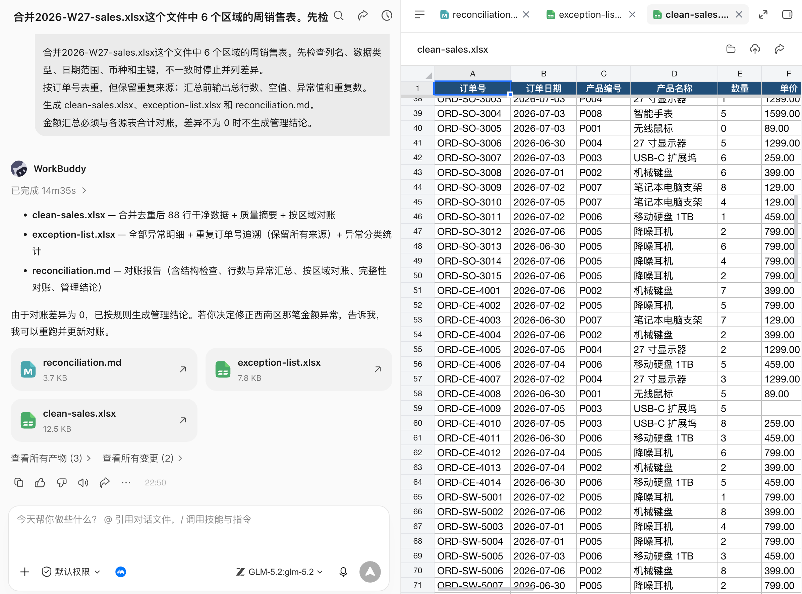

# 第 11 章 辦公三件套：Word、Excel、PPT

辦公三件套是多數人第一次感受到 WorkBuddy 價值的地方。

該章節聚焦三類最常見的辦公產物：Word 文件、Excel 表格和 PPT 彙報。


## 辦公三件套的共同工作流

無論文件型別是什麼，都建議先把任務拆成五個問題。很多“AI 做得不好”的辦公任務，根源不是模型不會寫，而是人沒有把交付標準說清楚。

| 問題 | 要說清什麼 | 示例 |
|-|-|-|
| 目標 | 這份材料要幫助誰做什麼決定 | 給部門負責人看，用於判斷專案是否繼續投入。 |
| 受眾 | 閱讀者是誰，懂不懂背景 | 管理層只看結論；專案組需要過程和責任人。 |
| 材料 | 哪些檔案是事實來源，哪些只是參考 | `data.xlsx` 是唯一資料口徑，舊版 PPT 只參考結構。 |
| 格式 | 要 Word、Excel、PPT，還是三者聯動 | 輸出一份專案覆盤 Word、一張風險臺賬 Excel、一份 8 頁彙報 PPT。 |
| 驗收 | 怎麼判斷結果可用 | 數字能回到原始檔，表格公式可重新整理，PPT 投屏不溢位。 |


## 先選對 Skill：辦公任務的推薦組合

SkillHub上有很多辦公效率、文件處理、表格處理、PPT 生成和會議紀要相關技能。

| Skill 名稱 | 適合處理 | 本章怎麼用 | 注意點 |
|-|-|-|-|
| Word / DOCX | Word 文件 | 建立、檢查、編輯 DOCX，處理標題、編號、表格、修訂記錄。 | 適合本地 docx 檔案。 |
| Excel / XLSX | Excel 表格 | 讀取、清洗、寫入工作簿，處理公式、日期、格式和模板保留。 | 先確認資料口徑。 |
| Powerpoint / PPTX | PPT 檔案 | 建立、編輯、檢查 PPTX，處理版式、佔位符、備註、圖表和視覺質檢。 | 適合需要可編輯 PPTX 的場景。 |
| Office Document Specialist Suite | Word / Excel / PPT | 綜合處理 Office 檔案，適合自動化報告和多檔案聯動任務。 | 複雜任務建議分步驗收。 |
| wps | WPS 三件套 | 面向中國使用者的 WPS Office 工作流，覆蓋文字、表格、演示。 | 適合 WPS 生態使用者。 |
| 騰訊文件 TENCENT DOCS | 線上文件協作 | 建立、讀取、編輯、搜尋騰訊文件，覆蓋線上 Word、Excel、幻燈片。 | 通常需要 API Key 或授權。 |
| kdocs skill | 金山文件 / WPS 雲文件 | 處理 WPS 雲文件、智慧文件、表格、PPT、PDF、知識庫。 | 通常需要 API Key。 |
| Markdown Converter | 材料解析 | 把 PDF、Word、PPT、Excel 轉成 Markdown，方便模型先理解內容。 | 適合讀材料，不等於最終排版。 |
| PPT Generator / PPT Workflow | PPT 生成 | 從主題、講稿或材料自動生成演示稿，適合初稿和結構化彙報。 | 生成後仍要人工審稿。 |
| PowerPoint Automation | PPT 批改與匯出 | 讀取大綱、匯出 PDF/圖片、替換文字、統一字型和主題。 | 更適合 Windows + PowerPoint/WPS。 |
| Excel公式生成 | 公式問題 | 把自然語言轉換為 Excel/WPS/Google Sheets 公式，並解釋防錯版本。 | 公式要在樣例資料上驗證。 |
| 騰訊會議 | 會議到文件 | 預約會議、獲取轉寫、獲取 AI 紀要，再轉成 Word 紀要、Excel 待辦、PPT 彙報。 | 需要會議平臺授權。 |

一個實用的搭配思路是：本地檔案優先用 **Word / DOCX、Excel / XLSX、Powerpoint / PPTX**；線上協作優先用 **騰訊文件** 或 **kdocs skill**；材料很多時先用 **Markdown Converter** 抽取結構；會議類辦公流再疊加 **騰訊會議** 或會議紀要類 Skill。


## Word：從空白頁到正式文件

### 這個場景的痛點

Word 看起來只是寫字，但真實辦公里的難點通常有四個：不知道該按什麼結構寫、語氣不夠正式、標題和編號混亂、內容沒有證據來源。

尤其是方案、通知、報告、會議紀要、制度、申請、PRD 這類文件，如果開頭就讓 AI 自由發揮，結果往往像“萬能模板”，讀起來完整，卻很難直接提交。

WorkBuddy 適合解決的不是“替你拍腦袋”，是把已有材料變成結構穩定、語氣一致、可以繼續修改的文件初稿。

要把文件目標、提交物件、語氣和結構要求一次說清楚；生成後再用差異化反饋繼續修改，而不是每次從頭生成。

### 適合交給 Word 的任務

- **正式方案**：活動策劃、專案方案、營銷方案、培訓方案。
- **管理文件**：制度、通知、申請、會議紀要、覆盤報告、週報月報。
- **產品材料**：PRD、需求說明、競品分析、使用者訪談總結。

### 推薦流程

| 步驟 | WorkBuddy 做什麼 | 人要確認什麼 |
|-|-|-|
| 1 | 讀取材料，列出可用資訊和缺失項。 | 哪些材料是事實來源，哪些只是參考。 |
| 2 | 生成文件大綱和寫作口徑。 | 讀者是誰，文件是彙報、審批還是執行。 |
| 3 | 按大綱生成 Word 初稿。 | 標題層級、章節順序、關鍵資訊是否完整。 |
| 4 | 根據反饋潤色、補充、刪減。 | 哪些內容可以定稿，哪些必須標“待確認”。 |
| 5 | 輸出可編輯 docx 和修改說明。 | 是否能直接發給同事審閱。 |

### 提示詞示例：生成一份團建活動策劃 Word

```text
幫我生成一份公司團建活動策劃的 Word 文件框架。
公司約 80 人，包含：活動目標、活動主題建議、整體流程安排（含時間節點）、分組與互動遊戲建議、預算構成清單、人員分工、風險預案和注意事項。
語言簡潔實用，不需要寫得過於詳細，重點把整體框架和關鍵決策項列清楚，適合直接拿去和領導確認活動方向。
```


### 二次修改不要重寫，要說差異

```text
請在上一版公司團建活動策劃 Word 文件基礎上進行修改，不要重新生成整篇。
修改要求：
將活動目標壓縮為 3 條，每條不超過 50 字；
將流程安排改成表格，列為：時間、環節、主要內容、負責人、所需物料；
在節目型別建議中增加適合 100 人規模公司的互動環節，並刪除執行難度過高的方案；
將預算構成進一步細化，增加：預算專案、預計金額、數量、單價、備註，並補充預算總額；
新增風險預案部分，覆蓋人員遲到、裝置故障、節目超時和突發安全問題；
整體語言更加正式、簡潔，適合直接提交給領導審批。
輸出修改後的 v2 版 Word 文件，並在 changelog.md 中列出本次修改內容。
```


### 進階實戰：比較兩版制度、合同或方案

```text
比較 policy-v3.docx 與 policy-v4.docx。
輸出新增、刪除、修改和僅格式變化四類差異，附章節和原文定位。
重點標記金額、日期、責任主體、審批條件、例外和否定表達。
生成影響清單和待確認問題，不給法律結論，不修改原檔案。
```




文件對比適合發現變化，不替代法務、財務或制度責任人的最終判斷。

## Excel：把表格變成能回答問題的分析

### 這個場景的痛點

Excel 的問題通常不在“會不會做圖”，而在“這個表到底能回答什麼問題”。

很多表格混著日期、文本、空值、合併單元格、多個口徑和臨時備註，直接讓 AI 分析，很容易得到一份看似專業、其實沒有業務價值的圖表。

建議先匯入 Excel 或 CSV，再一次說明分析指標、圖表型別、統計維度、時間範圍和是否需要報告。這個順序很重要：先定義業務問題，再決定圖表，而不是先生成漂亮圖。


### 適合交給 Excel 的任務

- **資料清洗**：去重、補空值、統一日期格式、拆分欄位、合併多個表。
- **經營分析**：銷售額、利潤率、轉化率、客單價、續費率、庫存週轉。
- **報表生成**：週報、月報、預算執行、考勤彙總、專案進度臺賬。
- **公式輔助**：生成或解釋複雜公式，排查 `#N/A`、`#VALUE!`、迴圈引用。
- **視覺化**：柱狀圖、折線圖、餅圖、透視表、儀表盤、異常點提示。

### 推薦流程

| 階段 | 提示重點 | 輸出 |
|-|-|-|
| 讀表 | 先描述工作簿結構、欄位含義、樣例行和明顯髒資料。 | 資料字典、問題清單。 |
| 定指標 | 說明要回答的業務問題，而不是隻說“分析一下”。 | 指標口徑表。 |
| 清洗 | 說明空值、重複值、異常值如何處理。 | 清洗後的 xlsx / csv。 |
| 計算 | 生成公式、透視表或統計表，並保留可重新整理結構。 | 彙總表、公式說明。 |
| 視覺化 | 根據業務問題選擇圖表，避免圖表堆砌。 | 圖表、分析結論。 |

### 提示詞示例：銷售資料分析

```Plain Text
請讀取 電商銷售資料.xlsx，先不要修改原檔案。
業務問題：分析本月各產品線的銷售表現和盈利能力，判斷哪些產品線貢獻高、哪些利潤表現較弱，並識別本月銷售過程中的異常波動。
請輸出：
說明資料欄位含義，並檢查缺失值、重複記錄、異常值和欄位格式問題；
按產品線統計銷售額、毛利、毛利率、銷售額佔比和毛利貢獻佔比，並進行排名；
按日彙總銷售額和毛利率，分析本月銷售表現的日度變化；如果資料跨度和完整性允許，再補充按周統計；
生成柱狀圖對比各產品線銷售額和毛利，生成折線圖展示本月每日銷售額變化；
識別銷售額、毛利率或單筆訂單金額明顯異常的日期或記錄，並結合資料說明異常表現，不要在缺少依據時推測業務原因；
總結本月表現最好的產品線、需要重點關注的產品線，以及 3 條可直接用於業務覆盤的結論。
輸出 output/sales-analysis.xlsx 和 output/summary.md。
要求：保留原始資料，統計過程和公式可追溯；圖表標題直接表達主要結論；無法從資料中確認的原因明確標註為待核實，不要自行編造。
```





### 進階實戰：多表合併、對賬與異常清單

基礎辦公中最有價值的不是“做個圖表”，而是把資料口徑和異常暴露出來：

```text
合併 input/sales 中 6 個區域的周銷售表。
先檢查列名、資料型別、日期範圍、幣種和主鍵，不一致時停止並列差異。
按訂單號去重，但保留重複來源；彙總前輸出總行數、空值、異常值和重複數。
生成 clean-sales.xlsx、exception-list.xlsx 和 reconciliation.md。
金額彙總必須與各源表合計對賬，差異不為 0 時不生成管理結論。
```




**驗收**：輸入總量、清洗變化和輸出總量守恆；公式可重算；異常沒有被靜默刪除；圖表使用的欄位和彙總表一致。


## PPT：不是套模板，而是把材料變成敘事

### 這個場景的痛點

PPT 最容易被誤用。

很多人把任務寫成“幫我做一份高階感 PPT”，結果 AI 只能猜風格，生成一堆好看的空話。真正可用的 PPT 必須先回答三個問題：這次彙報給誰看、對方聽完要做什麼決定、你有多少時間講。

PPT 生成強調同時提供素材、頁數要求、受眾物件和風格偏好。對 WorkBuddy 來說，PPT Skill 可以負責頁面生成，但故事線必須先確認。否則頁面越漂亮，越容易掩蓋邏輯問題。

### 適合交給 PPT 的任務

- **專案彙報**：專案進展、階段覆盤、里程碑計劃、風險與資源請求。
- **經營彙報**：月度經營分析、銷售覆盤、預算執行、使用者增長覆盤。
- **培訓課件**：新人培訓、產品培訓、客戶培訓、內部分享。
- **方案展示**：客戶方案、競標材料、商業計劃、產品釋出。

### 推薦流程

| 步驟 | WorkBuddy 做什麼 | 人要確認什麼 |
|-|-|-|
| 1 | 把 Word、Excel、圖片、舊 PPT 轉成材料摘要。 | 哪些內容必須保留，哪些可以刪。 |
| 2 | 生成 6-10 頁故事線和每頁標題。 | 彙報物件、時長、決策目標。 |
| 3 | 根據確認後的大綱製作 PPT。 | 每頁是否只有一個核心觀點。 |
| 4 | 補圖表、備註、來源對映和匯出版本。 | 關鍵數字是否來自 Excel。 |
| 5 | 做版式檢查：文字溢位、圖片缺失、字號、顏色。 | 投屏後是否能讀，是否適合現場講。 |

### 提示詞示例：從材料包製作彙報 PPT

```text
請根據當前工作區材料製作一份 8 頁以內的 AI Agent 主題分享 PPT。
受眾：對 AI 有基礎認知，但不瞭解 Agent 的業務和管理人員。
彙報時長：10 分鐘。

目標：讓聽眾理解 AI Agent 是什麼、與普通 AI 對話工具有什麼區別、能解決哪些問題，以及企業應該如何判斷是否值得落地。
素材：
AI術語全景手冊.md 是主要內容材料；
不要補充工作區材料之外的事實和資料。
全文控制在 8 頁以內，每頁只表達一個核心結論；
案例、資料和關鍵判斷必須標註素材來源，無法確認的內容不要自行補充；
PPT 標題儘量直接表達觀點，不使用 AI Agent 介紹、應用場景這類泛化標題；
輸出 output/ai-agent.pptx；
生成後檢查文字溢位、頁面留白、圖表口徑、圖片缺失、字型一致性和頁碼。

整體風格：專業、簡潔、有科技感，但不要過度使用漸變、發光和裝飾性元素，適合正式分享和內部彙報。
```


## 三件套聯動案例：會議之後自動形成交付包

很多辦公任務不是單檔案，而是“會議之後要有東西”。

比如開完一次產品評審會，會議裡有使用者反饋、功能決策、待辦事項和下個版本計劃。手工做法通常是：先整理紀要，再補 PRD，再做任務表，最後做彙報 PPT。

WorkBuddy 的價值就在於把這些交付物串成同一條事實鏈。

### 場景痛點

- 會議討論是口語化的，決議、分歧和待辦混在一起。
- PRD 需要結構化，但會議紀要裡沒有標準格式。
- Excel 任務表需要負責人、截止日期和狀態欄位，不能只是一段總結。
- PPT 彙報需要給老闆看，不能把會議全文搬進去。

### 可用 Skill 組合

| 環節 | 推薦 Skill | 作用 |
|-|-|-|
| 獲取會議內容 | 騰訊會議 / 智慧會議紀要類 Skill | 獲取轉寫、AI 紀要、決議、行動項。 |
| 生成 PRD | Word / DOCX、騰訊文件、kdocs skill | 把會議內容改寫成產品需求文件。 |
| 生成任務表 | Excel / XLSX、Excel/WPS 表格自動化工具 | 輸出負責人、截止日期、優先順序、狀態和驗收標準。 |
| 生成彙報 | Powerpoint / PPTX、PPT Workflow、PPT Generator | 把 PRD 和任務進度轉成管理層彙報。 |

### 提示詞示例：會議到 PRD、任務表、彙報

```text
請讀取本次產品評審會議的轉寫和 AI 紀要，生成一個辦公交付包。
目標：把會議內容轉成可以推進研發的材料。
請輸出：
1. Word：output/feature-prd.docx，包含背景、目標使用者、核心問題、需求列表、流程說明、驗收標準、風險和待確認問題；
2. Excel：output/action-items.xlsx，欄位包含事項、負責人、優先順序、截止日期、依賴、狀態、驗收標準；
3. PPT：output/review-summary.pptx，6 頁以內，面向管理層，突出本次會議決議、資源請求和風險。
約束：
- 會議中沒有明確確認的內容，不要寫成既定結論；
- 人名、日期、功能範圍必須保留來源；
- 如果缺少負責人或時間，請標為待確認；
- 先輸出大綱和任務表字段預覽，等我確認後再生成檔案。
```


## 常見錯誤與修正方式

| 常見錯誤 | 為什麼會發生 | 更好的寫法 |
|-|-|-|
| “幫我做個 PPT，要高階一點” | 沒有受眾、目標和材料約束。 | 說明受眾、彙報時長、頁數、決策目標、參考模板和必須保留的資料。 |
| “分析一下這個 Excel” | 沒有業務問題，模型只能泛泛總結。 | 說明要回答什麼問題、統計哪些指標、按什麼維度比較。 |
| “寫一份報告” | 沒有文件型別和語氣要求。 | 說明是方案、總結、申請、紀要還是 PRD，並指定讀者。 |
| “全部自動完成，不用問我” | 關鍵口徑沒確認，風險會被放大。 | 先讓 WorkBuddy 輸出材料清單、風險清單和大綱，確認後再生成。 |
| “把這堆材料合成一個檔案” | 沒有區分事實、參考和待確認。 | 指定唯一資料來源、參考檔案和不能編造的欄位。 |
