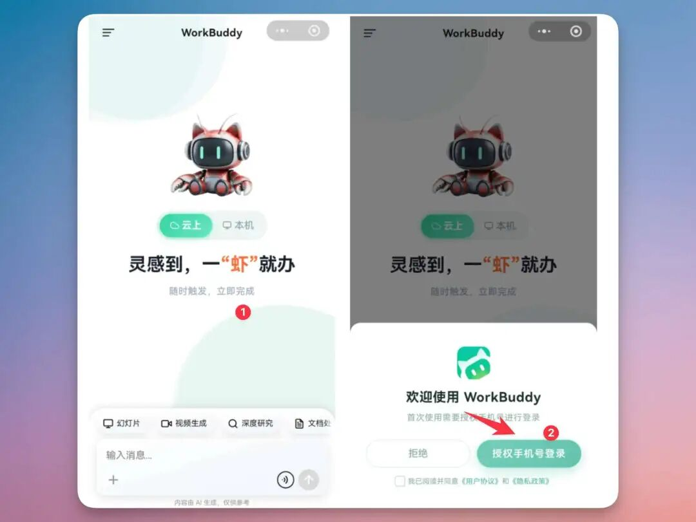
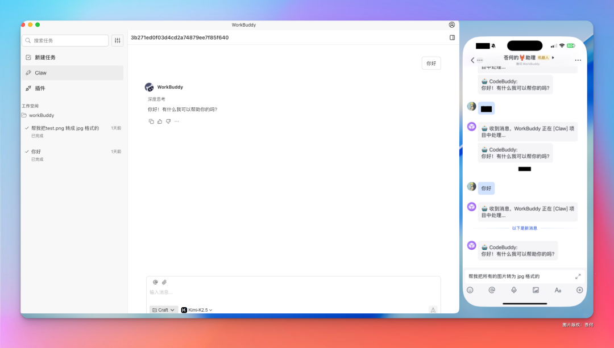

# 第 13 章 遠端控制你的電腦，不用發愁不在電腦前

你人不在電腦前，WorkBuddy 小程式可以成為遠端任務入口，把指令發回正在執行的電腦端，讓電腦繼續查檔案、讀資料、整理發票、處理微信檔案，甚至持續彙報一個長任務的進展。

## 小程式遠端控制電腦



傳統遠端辦公通常有兩種方式：一種是把電腦螢幕投到手機上，自己點滑鼠；另一種是把檔案先傳到雲端，再在手機上處理。

WorkBuddy 的遠端方式介於二者之間：使用者不直接操控滑鼠，而是把任務說清楚；電腦端 WorkBuddy 根據授權範圍讀取本地檔案、呼叫 Skill 或本地工具，把中間結果和最終產物回傳到手機端。

| 能力層 | 解決什麼問題 | 使用時要確認什麼 |
|-|-|-|
| **手機端入口** | 在路上、會議間隙、客戶現場也能發起任務 | 賬號已登入，訊息能送達，語音轉文字沒有關鍵錯誤 |
| **電腦端執行** | 讀取本機目錄、呼叫本地軟體、處理私有資料 | 電腦線上，WorkBuddy 正在執行，目錄許可權已授權 |
| **任務回傳** | 把候選檔案、摘要、表格、截圖、壓縮包返回給手機 | 輸出路徑明確，不覆蓋原檔案，敏感資訊先脫敏 |
| **人工確認** | 避免遠端狀態下誤刪、誤發、誤改重要資料 | 高風險動作必須暫停確認，不把“執行完”當成“驗收完” |


## 先分清：雲端模式還是本機模式

移動端適合在通勤、出差、跨裝置辦公時繼續推進任務。但在使用前，必須先判斷任務究竟應該跑在雲端，還是跑在本機。

這個判斷會直接影響它能否讀取電腦檔案、是否需要電腦線上，以及資料是否適合進入雲端環境。


| 判斷問題 | 雲端模式 | 本機模式 |
|-|-|-|
| 是否需要電腦線上 | 通常不需要 | 需要電腦線上，並且 WorkBuddy 處於可響應狀態 |
| 能否讀取電腦目錄 | 不能直接讀取 | 可以讀取已授權範圍內的本地目錄 |
| 適合任務 | 公開資料調研、寫提綱、生成輕量文本 | 查詢本機檔案、讀取私有資料、呼叫本地 Skill 或軟體 |
| 主要風險 | 資料是否適合進入雲端 | 目錄許可權、誤操作、電腦離線、結果未驗收 |


## 人在外面，臨時要電腦裡的檔案

這是最容易讓使用者第一次感受到遠端控制價值的場景。合作方突然問培訓課件、專案彙報、合同版本、報價單、活動海報原始檔在哪裡，而資料都在辦公室電腦裡。過去只能回覆“我回去找一下”，現在可以在小程式里語音發起任務，讓電腦端 WorkBuddy 在指定目錄中查詢候選檔案，讀取內容並整理摘要。

### 場景痛點

- 檔名不一定記得完整，只記得“培訓”“專案彙報”“某客戶”等關鍵詞。
- 電腦裡可能有多個版本，遠端狀態下不能憑感覺直接發。
- 臨時需求往往只需要先給對方一個摘要或確認口徑，不一定馬上傳送原檔案。

### 推薦流程

1. 先限定目錄，比如桌面、Downloads、專案資料、training 資料夾。
2. 讓 WorkBuddy 只讀掃描，列出候選檔案、修改時間、檔案大小和可能匹配原因。
3. 確認目標檔案後，再讀取內容並生成手機端可轉發的摘要。
4. 需要傳送檔案時，先整理到一個單獨輸出目錄，不直接移動原檔案。

```text
你幫我看一下，我電腦上在我這個local long GPT裡邊有一個關於xx公司的一些PPT，然後你整理一下內容發給我。
```


## 微信檔案直接處理，不必先搬來搬去

很多工不是從電腦資料夾開始，而是從微信聊天裡突然冒出來：客戶發來一個合同 PDF，朋友發來一張票據照片，同事丟來一個 Excel，供應商轉來一個壓縮包。傳統流程是先下載到手機，再傳電腦，再找目錄，再開啟軟體。小程式更適合把“微信上下文裡的檔案”直接變成 WorkBuddy 的輸入。


## 遠端監控長任務，讓手機成為任務看板

遠端控制還有一個更進階的用法：不是讓 WorkBuddy 做一個幾秒鐘的小任務，而是讓它持續推進一個需要等待、分階段處理或容易失敗的任務。比如批次轉換檔案、整理大目錄、生成網站、處理會議錄音、執行程式碼測試、下載資料、爬取公開網頁、自動化檢查系統狀態。

### 遠端監控適合什麼

- 任務耗時超過 3 分鐘，需要階段彙報。
- 任務中間可能遇到失敗項，需要記錄並繼續處理其他檔案。
- 任務結果需要先看預覽，再決定是否批次執行下一步。
- 任務過程中可能觸發登入、付款、傳送訊息、覆蓋檔案等高風險動作。


```text
請啟動這個批次處理任務，並把手機端當作進度看板。
```



```Plain Text
你控制攝像頭拍張照片，描述一下電腦前面的畫面
```

