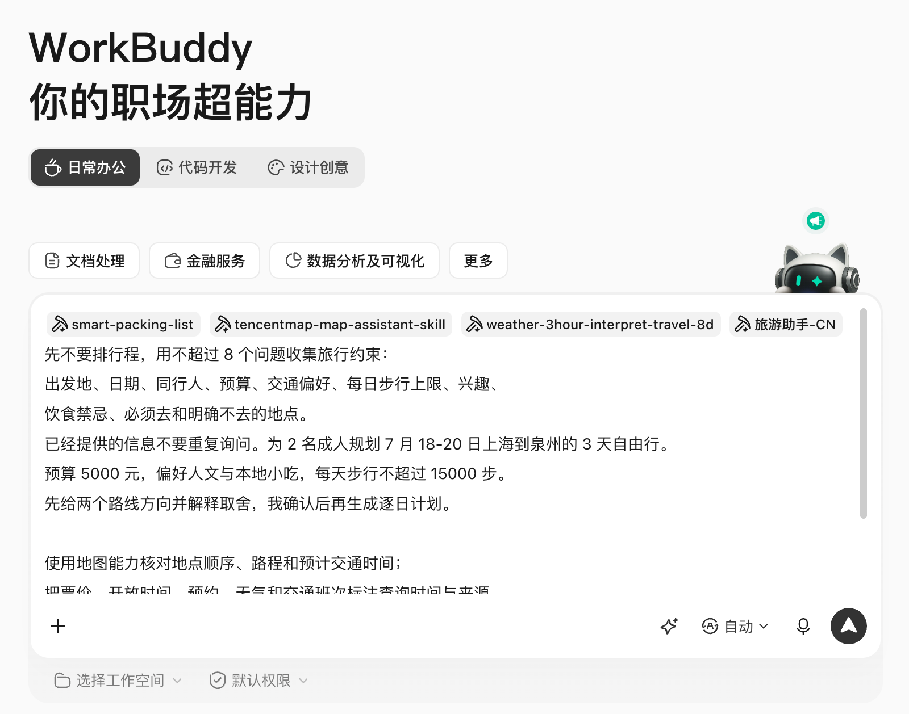
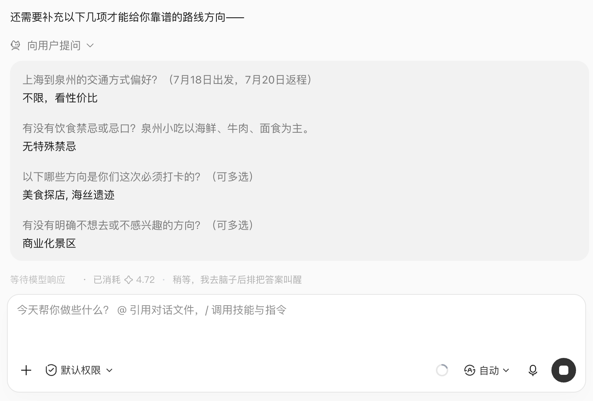
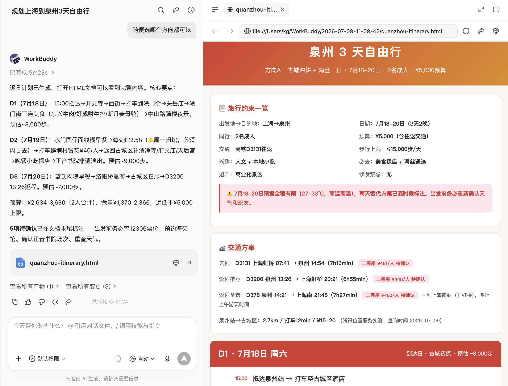
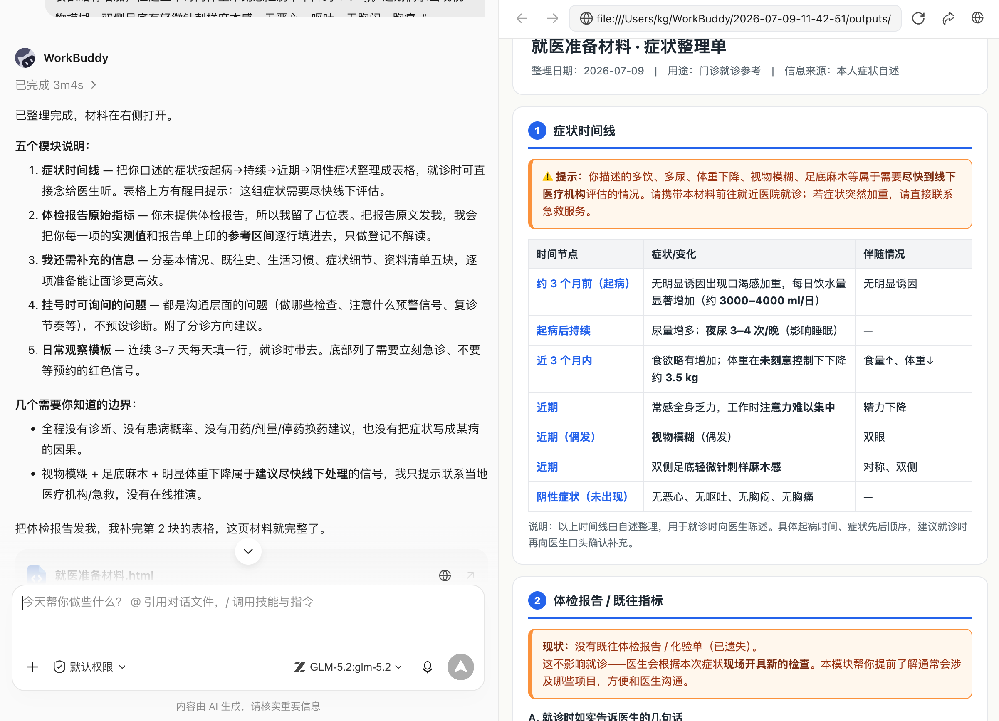
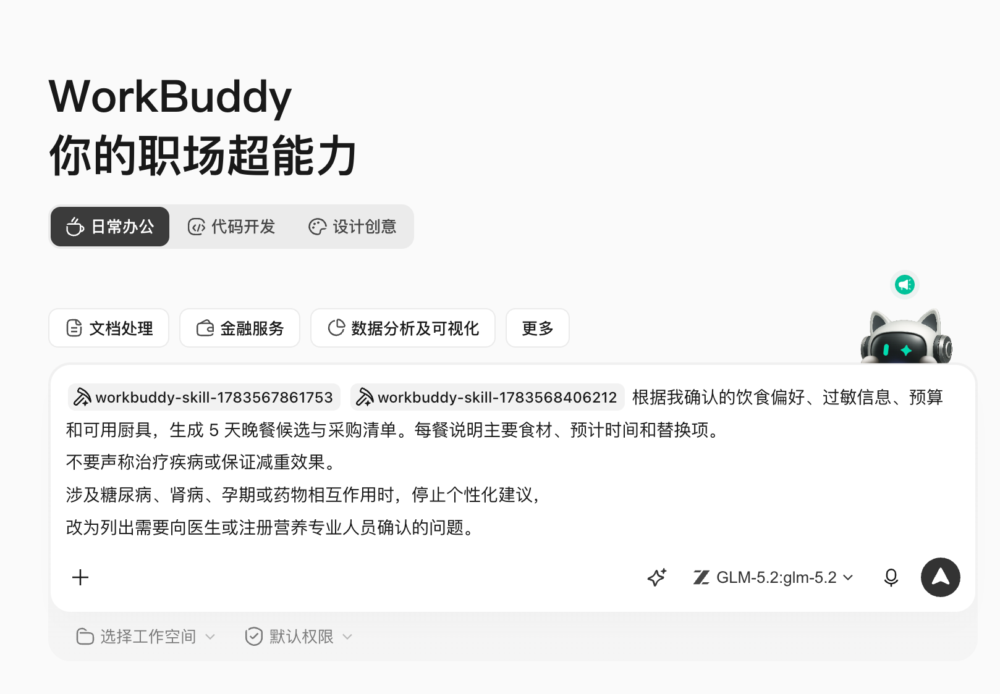
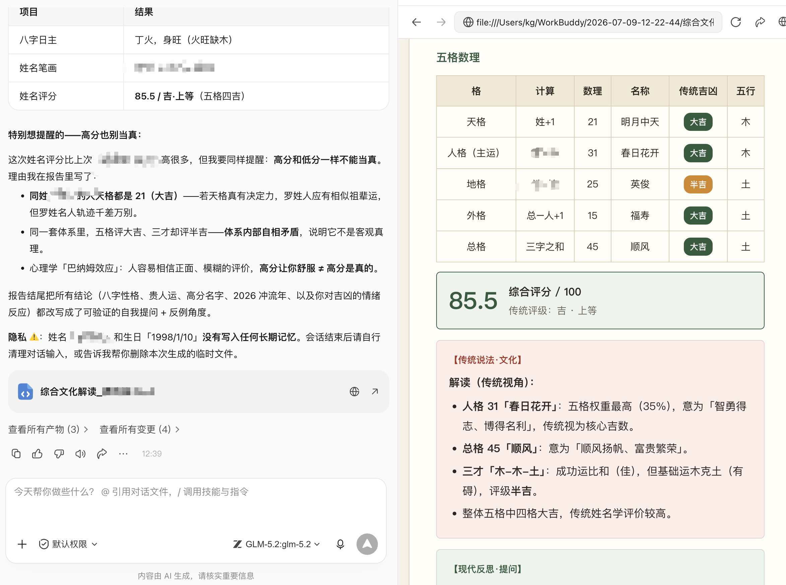
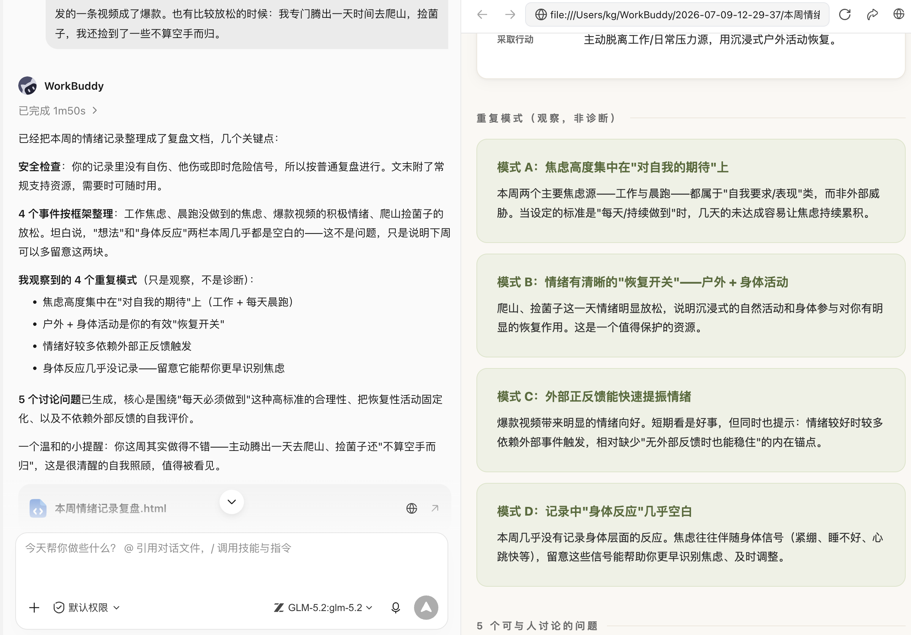

# 第 14 章 生活助手的價值，是減少瑣碎

## 生活問題比辦公問題更模糊

“幫我規劃旅行”“看看體檢報告”“今天吃什麼”“給我算算運勢”，看起來都只需一句話，背後卻混合了偏好、即時資料、隱私和風險。辦公檔案做錯還可以返工，醫療、付款、簽證和重大決定做錯，代價可能完全不同。

因此生活場景先分三類：

| 型別 | WorkBuddy 可以做什麼 | 人必須做什麼 |
|-|-|-|
| 資訊整理型 | 收集偏好、比較候選、生成清單 | 確認事實與最終選擇 |
| 即時決策型 | 查詢天氣、路線、庫存和規則，標註時間 | 回到官方或服務商頁面核驗並操作 |
| 高風險或娛樂型 | 整理就醫問題、提供娛樂性解讀 | 醫療交給專業人員，命理不作為決策依據 |

## 場景一：三天旅行，不想開啟二十個 App

攻略、地圖、天氣、酒店、交通、預算和同行人偏好都存在於不同應用中。普通 AI 規劃的行程看起來完整，卻可能把相距很遠的地點排在一起，有的會引用過期營業時間，甚至虛構餐廳。

- [旅遊助手](https://skillhub.cn/skills/travelassistant)：行程、目的地、住宿、美食和行李清單；
- [騰訊地圖地圖助手](https://skillhub.cn/skills/tencentmap-map-assistant)：POI、路線、距離、天氣與地圖；
- [旅遊行李清單](https://skillhub.cn/skills/smart-packing-list-new)：按天氣、天數和人群生成打包清單；
- [旅遊天氣風險](https://skillhub.cn/skills/weather-8tour)：需要精細天氣風險時補充。

### 第一步：先收集約束

```text
先不要排行程，用不超過 8 個問題收集旅行約束：
出發地、日期、同行人、預算、交通偏好、每日步行上限、興趣、
飲食禁忌、必須去和明確不去的地點。
已經提供的資訊不要重複詢問。
```

### 第二步：候選路線與即時核驗

```text
為 2 名成人規劃 7 月 18-20 日上海到泉州的 3 天自由行。
預算 5000 元，偏好人文與本地小吃，每天步行不超過 15000 步。
先給兩個路線方向並解釋取捨，我確認後再生成逐日計劃。

使用地圖能力核對地點順序、路程和預計交通時間；
把票價、開放時間、預約、天氣和交通班次標註查詢時間與來源。
無法即時核驗的內容寫“待確認”，不要補造。
輸出雨天替代方案、預算區間和行李清單。
不要登入、預訂、付款或代替我接受退改條款。
```



WorkBuddy 在執行過程中並不是一來就直接幫你做決定，而是儘可能詳盡的再向你詢問一些問題，確保真的像個專屬導遊那樣幫你規劃行程。



### 執行鏈與交付物

偏好問卷 → 兩個路線草案 → 人工選方向 → 地圖最佳化 → 天氣與開放資訊核驗 → 預算與行李 → 可分享行程頁。真正可用的交付物應包含了地圖行程規劃、合理的遊玩和交通時間規劃、資料來源與真實的車次，而不只是一張漂亮日程表。

預訂前由人再次確認庫存、價格、簽證、證件、保險和退改政策。涉及老人、兒童、孕婦、慢性病或無障礙需求時，要把限制明確寫入任務，不能由模型自行推斷。




## 場景二：旅行結束後，把照片和賬單變成可複用記錄

WorkBuddy 還可以在旅行後完成照片按日期地點整理、票據分類、預算覆盤和攻略草稿，但不要預設讀取整本相簿或刪除原圖。

```text
只讀取 trip-quanzhou/import 中的照片和票據副本。
按拍攝時間生成每日時間線，識別失敗的檔案列入人工確認。
票據按交通、住宿、餐飲、門票分類，金額彙總後與預算對比。
根據我確認的地點和感受生成一份私人旅行記錄，
人物照片、定位和訂單號在公開版本中全部脫敏。
不移動、不刪除原檔案。
```

這個場景最終可以反哺自媒體章：私人記錄確認後，再選擇哪些資訊適合做小紅書攻略或公眾號長文。


## 場景三：體檢報告看不懂，先準備一次更有效的就醫

體檢指標和症狀記錄很多，使用者容易在網上搜索後自行診斷；部分健康 Skill 甚至宣稱可以給出患病機率。藍皮書不採用這種寫法。

- [健康管理顧問](https://skillhub.cn/skills/health-coach-pro)：強調生活方式、體檢資料理解和就醫準備，不診斷、不處方；
- 騰訊健康相關臨床 Skill 只應在符合資質、授權和實際醫療工作流時使用；普通使用者不能把輸出當診斷結論；
- 用藥安全問題應優先諮詢醫生或藥師，不讓通用 Agent 決定停藥、換藥和劑量。

世界衛生組織在 AI 健康治理中強調，應把倫理、人權和問責置於技術設計與使用中心。對個人使用者而言，最實用的邊界是：AI 幫助整理資訊和準備問題，不代替臨床判斷。[參考：WHO《Ethics and governance of artificial intelligence for health》](https://www.who.int/publications/i/item/9789240029200)

### 安全指令

```text
把我提供的體檢報告和症狀記錄整理成一頁就醫準備材料。
輸出：症狀時間線、報告中的原始指標與參考區間、
我還需要補充的資訊、掛號時可詢問的問題、日常觀察模板。

不得給出確定診斷、患病機率、處方、劑量、停藥或換藥建議；
不得把相關性寫成因果。發現可能需要及時線下處理的資訊時，
只提示我聯絡當地醫療機構或急救服務，不繼續線上推演。
```


以上是我從網上找的一份就診記錄，當我把這份不太詳盡的就診記錄同步給WorkBuddy，他會幫我分析並生成就醫材料。




## 場景四：健康習慣與飲食計劃，可以做得更日常

低風險健康管理更適合 WorkBuddy：飲水、睡眠、運動、膳食記錄和複診提醒。可選 [營養健康](https://skillhub.cn/skills/nutrition-and-health)、[健康食譜推薦](https://skillhub.cn/skills/healthy-recipe-recommender)等 Skill，但仍需宣告過敏、疾病、用藥、孕期和專業限制。

```text
根據我確認的飲食偏好、過敏資訊、預算和可用廚具，
生成 5 天晚餐候選與採購清單。每餐說明主要食材、預計時間和替換項。
不要聲稱治療疾病或保證減重效果。
涉及糖尿病、腎病、孕期或藥物相互作用時，停止個性化建議，
改為列出需要向醫生或註冊營養專業人員確認的問題。
```




同樣的在執行過程中會仔細詢問我的飲食結構和目前廚房裡可用的廚具，給出真正的屬於我自己的晚餐計劃，而不是一份看似精確但對我個人並不適配的醫療飲食方案。


## 場景五：算命、星盤與卜卦，怎樣寫得有趣又不越界

傳統文化和娛樂測試是很多普通使用者接觸 Agent 的入口，可以用於傳統文化體驗、社互動動、寫作靈感和自我提問。

不過出生時間、地點和家庭資訊屬於個人資訊；解釋結果容易被寫成確定預言；使用者也可能據此做醫療、投資、招聘、婚戀或職業決定。

更穩妥的指令

```text
使用傳統文化娛樂方式，根據我主動提供的資訊生成一份八字文化解讀。
開頭明確“僅供娛樂與文化體驗，不預測確定未來”。
區分排盤計算、傳統說法和現代反思問題，不把傳統解釋寫成事實。
不提供醫療、投資、法律、婚戀或職業決策建議。
結尾把每個結論改寫成可驗證的自我提問，並提供至少一個反例角度。
不要長期儲存出生時間和地點，任務結束後提醒我清理輸入。
```





## 場景六：穿搭、家庭清單和消費比較

生活助手還有很多低風險、但非常實用的場景：


使用天氣查詢和 [每日穿搭靈感](https://skillhub.cn/skills/daily-outfit-inspiration)，輸入城市、場合、已有衣物和不喜歡的風格。結果應優先使用衣櫃現有單品，不要預設推薦購買。


把證件、藥品、充電裝置、兒童用品和寵物安排做成按人分組的清單，明確負責人和完成狀態。自動化負責提醒，不負責確認藥品是否適合某個家庭成員。


讓 WorkBuddy 建立引數、價格、售後、隱私和長期成本表，再由人檢視官方頁面和真實合同。廣告軟文、聯盟連結和商家評分要單獨標記，不能混入事實列。

```text
比較 3 款掃地機器人，只使用廠商官網、說明書和我提供的報價。
表格列出清潔結構、避障、耗材、隱私、保修、價格和不確定項。
把營銷表述與可驗證引數分開，不根據銷量自動推薦。
最後根據“家中有寵物、門檻 2cm、重視隱私”給條件性建議，
不要代替我下單或接受服務條款。
```


## 場景七：情緒記錄與現實支援

WorkBuddy 可以幫助記錄情緒觸發點、睡眠、事件和應對方式，生成覆盤問題或與諮詢師溝通的摘要。它不會冒充心理醫生，也不會讓使用者只依賴 Agent。

```text
把我本週的情緒記錄按“事件、想法、感受、身體反應、採取行動”整理。
只總結重複模式，不診斷、不貼人格標籤。
生成 5 個我可以與可信賴的人或專業人員討論的問題。
如果內容出現自傷、他傷或即時危險訊號，停止普通覆盤，
提示我立即聯絡當地緊急服務、專業機構或身邊可信賴的人。
```




## 生活 Skill 安裝前的四項檢查

1. **即時性**：天氣、價格、庫存、政策和營業時間從哪裡來，查詢日期是什麼；
2. **隱私**：出生資訊、位置、健康資料和家庭資料傳送到哪裡，能否只在本地處理；
3. **動作許可權**：是否會登入、預訂、付款、傳送訊息或修改日曆，能否在動作前暫停；
4. **專業邊界**：是否把娛樂寫成事實，把健康建議寫成診斷，把推薦寫成保證。