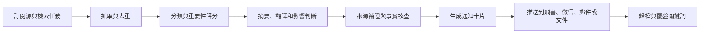
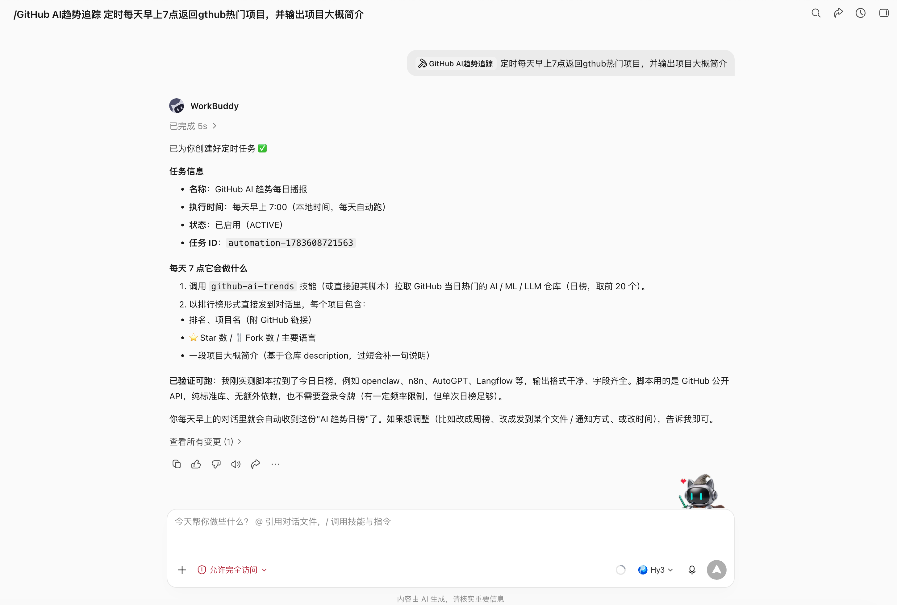
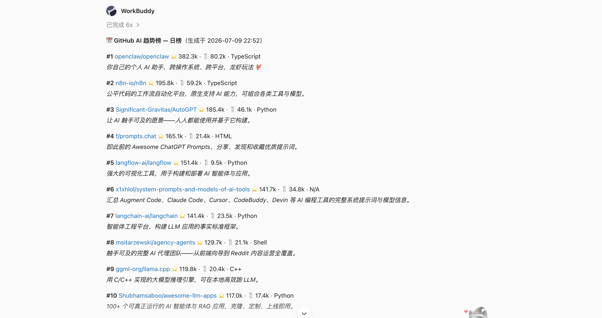
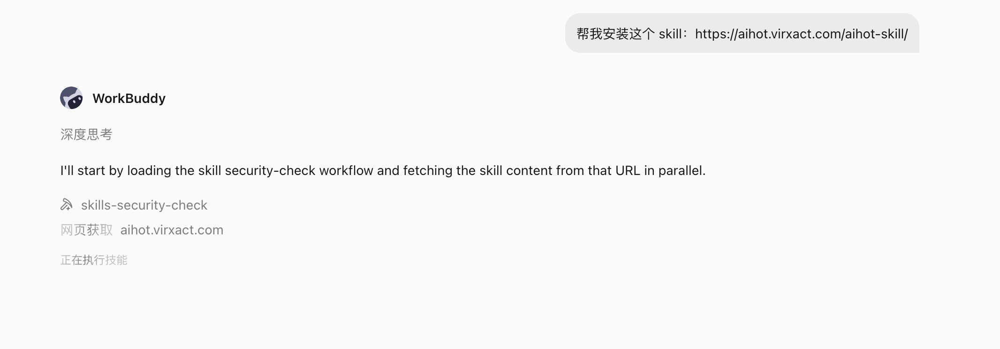
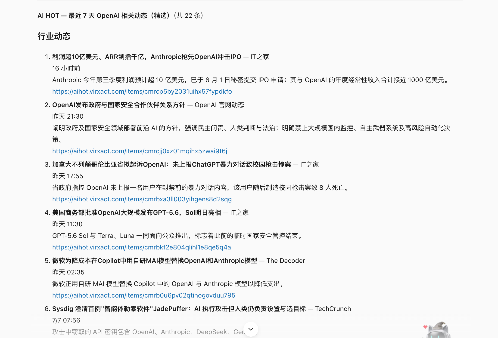

# 第 15 章 資訊整合：把資訊流變成每日通知

資訊整合最怕兩件事：一是資訊太多，真正重要的內容被淹沒；二是通知太吵，最後所有人都把它當背景噪音。

WorkBuddy 把多個資訊源變成可篩選、可解釋、可追蹤的通知系統。比如，GitHub 熱點專案每日通知、AIHOT 行業日報、論文與技術趨勢追蹤、公眾號和部落格監控、新聞與熱榜輿情、事實核查與來源補證。

讓使用者每天少錯過真正值得看的東西。

## 資訊通知的共同工作流

無論是 GitHub 專案、AI 新聞、論文、政策還是熱榜，穩定的資訊通知都可以拆成同一條鏈路：先收集，再去重，再篩選，再摘要，最後按人群和場景推送。



| 環節 | 要解決什麼 | 常見輸出 |
|-|-|-|
| 收集 | 從新聞、熱榜、GitHub、arXiv、RSS、公眾號、搜尋引擎拉取候選內容。 | 候選列表、原始連結、釋出時間、來源。 |
| 去重 | 同一事件可能被多個來源重複報道。 | 合併同源事件，保留首發和權威來源。 |
| 篩選 | 不是所有新內容都值得推送。 | 重要性評分、相關性評分、風險等級。 |
| 摘要 | 把長文章、論文、專案 README 轉成可讀摘要。 | 三句話摘要、影響判斷、適用人群。 |
| 核查 | 避免把傳聞、營銷稿、錯誤資訊當事實。 | 證據表、可信度、待確認項。 |
| 通知 | 用固定格式推送給對應人群。 | 飛書卡片、微信群訊息、日報文件、郵件摘要。 |

## 可用的資訊類 Skill


大致可以分成六類：新聞、AI 行業、開發者趨勢、科研論文、內容監控、事實核查與搜尋補證。

| Skill / 工具 | 適合通知什麼 | 本章怎麼用 |
|-|-|-|
| 騰訊新聞 | 國內外熱點、早晚報、即時資訊、領域新聞。 | 適合做管理層早報、行業新聞通知、突發事件提醒。 |
| AIHOT | AI 模型、產品、行業、論文動態。 | 適合做 AI 行業日報和團隊技術雷達。 |
| GitHub 熱門專案 | 今日、本週、本月熱門專案，支援語言過濾。 | 適合給研發團隊做每日開源專案推薦。 |
| GitHub AI 趨勢追蹤 | GitHub AI 熱門專案趨勢報告。 | 適合做 AI 工程團隊每週趨勢簡報。 |
| ArXiv 論文追蹤 | 最新研究論文搜尋與總結。 | 適合研究、演算法和產品策略團隊跟蹤論文動向。 |
| 新聞摘要 | 從 RSS 源獲取新聞並生成摘要和語音播報。 | 適合固定源日報、行業資訊語音簡報。 |
| 部落格監控 | 監控部落格和 RSS 訂閱源更新。 | 適合關注競品部落格、官方 changelog、技術團隊部落格。 |
| wechat-article-search | 搜尋公眾號文章標題、摘要、釋出時間、來源賬號和連結。 | 適合監控行業 KOL、競品公眾號和爆款選題。 |
| 蜜度熱搜榜 | 30+ 主流平臺熱搜資料，支援關鍵詞、時間範圍和榜單型別篩選。 | 適合做輿情預警、內容選題觸發器。 |
| Twitter 分析 | Twitter 研究與內容情報分析。 | 適合跟蹤海外 AI、開源、投資和產品討論。 |
| 多引擎搜尋 / Tavily / Exa / Perplexity / 元寶搜尋標準版 | 多源搜尋、深度研究、引用來源補證。 | 適合給重要新聞、論文、專案做二次驗證。 |
| jiaozhen-factcheck / 鵝廠闢謠助手 | 事實查證、謠言識別、騰訊相關闢謠輔助。 | 適合在通知前給爭議資訊加可信度判斷。 |


## GitHub 熱點專案每日通知

比如：每天 9 點抓取 GitHub Trending 和 AI 熱門專案。按語言、主題、star 增長、最近提交、license 過濾。只推送 Top 5-10 個，並給出“是否值得試用”的判斷。


```text
 定時每天早上7點返回gthub熱門專案，並輸出專案大概簡介
```






## AIHOT 生成 AI 行業日報

AI 行業資訊更新快，AIHOT 可以作為一個現成的資訊源。它面向 AI 動態提供精選內容，覆蓋模型、產品、行業和論文等方向，並支援 Agent 使用。


比如：每天固定時間從 AIHOT 拉取 AI 動態。按模型、產品、行業、論文、開源專案、商業化分組。對每條內容做“影響範圍、可信度、與本團隊相關性”評分。只推送 5-8 條重點，其餘進入文件歸檔。對高影響內容追加二次檢索，補充原始連結或官方來源。


安裝aihot skill，

```Plain Text
幫我安裝這個 skill：https://aihot.virxact.com/aihot-skill/
```




```text
請看一下最近 OpenAI 釋出了什麼新東西
```




```Plain Text
總結今日熱點新聞，值關注AI大模型方向
```


| 日報模組 | 寫什麼 | 通知物件 |
|-|-|-|
| 今日三件大事 | 最值得打擾所有人的變化。 | 全員或管理層。 |
| 模型與產品 | 新模型、新功能、新 API、新價格。 | 產品、研發、運營。 |
| 開源專案 | 可試用工具、框架、Agent 專案。 | 研發團隊。 |
| 論文研究 | 可能影響技術路線的新方法。 | 演算法、技術負責人。 |
| 機會與風險 | 競品動作、替代方案、合規變化。 | 業務負責人。 |