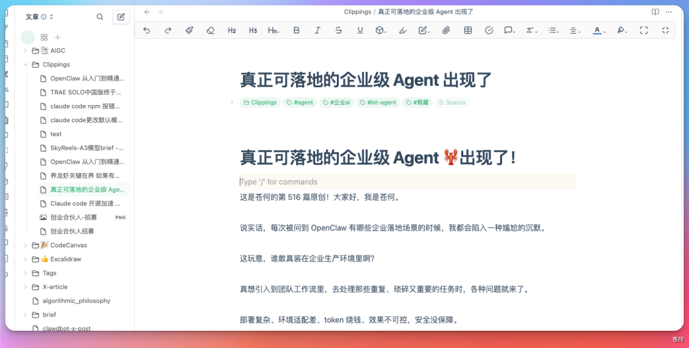

# 第 16 章 收藏不是知識管理，能再次用起來才是

## 工具都裝了，知識還是散的

繼續向前一步：如果一個人同時使用 WPS、ima、Obsidian、微信收藏、會議記錄和本地檔案，怎樣分工才能避免“每個地方都有一份，但沒有一份可信”。

## 先決定主版本，再連線工具

一個穩健的個人知識系統可以有多個入口，但只能有清楚的主版本：

| 系統 | 推薦角色 | 不建議承擔 |
|-|-|-|
| WPS / Kdocs | 工作文件、表格、協作筆記和團隊知識 | 同時充當所有私人原始資料的唯一備份 |
| ima | 微信生態收集、移動問答和知識庫檢索 | 儲存沒有來源的二手結論 |
| Obsidian | 本地 Markdown、雙鏈、專題 Wiki 和長期遷移 | 未備份情況下讓自動化批次移動或重新命名 |
| 微信收藏 / 靈感工具 | 低摩擦入口和臨時收件箱 | 永久歸檔與結構化檢索 |
| 飛書 / 騰訊文件 | 團隊協作、評論和釋出副本 | 預設擴大私人資料可見範圍 |

## 場景一：靈感來了，只記下一句話

靈感最怕兩種處理：一種是沒來得及記，另一種是 AI 立刻把一句話擴寫成一篇看似完整、卻已經偏離原意的文章。

- [靈感捕手](https://skillhub.cn/skills/inspiration-hunter-skill)：自動分類並寫入 Markdown 收件箱；
- [ima-skills](https://skillhub.cn/skills/ima-skills)或 [ima](https://skillhub.cn/skills/ima-pro)：移動端記錄、知識庫讀寫與檢索；
- Obsidian 本地目錄作為長期主版本時，可接入後文的 Wiki Skill。


```text
把下面內容記入“靈感收件箱”，保留我的原話，不擴寫、不評價：“AI 工具真正的門檻不是提示詞，而是驗收結果。”
```


## 場景二：微信收藏很多，真正寫作時還是搜不到

- [微信收藏知識庫](https://skillhub.cn/skills/wechat-favorite)：匯出、分類，並可選擇進入 ima、Obsidian 或 Notion；
- [URL to Obsidian](https://skillhub.cn/skills/url-to-obsidian)：抓取網頁、總結並儲存到 Vault；
- [公眾號內容提取](https://skillhub.cn/skills/wxpublic-fetch)：將公眾號文章儲存為本地 Markdown。

```text
處理本週微信收藏，只讀，不刪除原收藏。
```


## 場景三：ima 作為移動知識入口

ima 的優勢不是“問答更聰明”，而是手機收集、知識庫讀寫和微信上下文銜接。使用 [ima-skills](https://skillhub.cn/skills/ima-skills) 時，先明確目標知識庫和寫入規則。

```text
將我剛選擇的 3 份檔案放入 ima“WorkBuddy 案例庫”的收件箱。
```


## 場景四：Obsidian 不是資料夾，而是可維護的 Wiki

- [Obsidian 資料整理](https://skillhub.cn/skills/obsidian-core-notes)：維護核心筆記、專題綜合和目錄連結；
- [agent + Obsidian 長期記憶](https://skillhub.cn/skills/obsidian-memory)：在明確專案邊界後讀寫長期記憶。

```text
把一篇公眾號文章交給 WorkBuddy 解析，再要求放進指定的 Obsidian 素材目錄。
```

WorkBuddy 能識別文章正文和作者，並生成 Markdown 條目。

