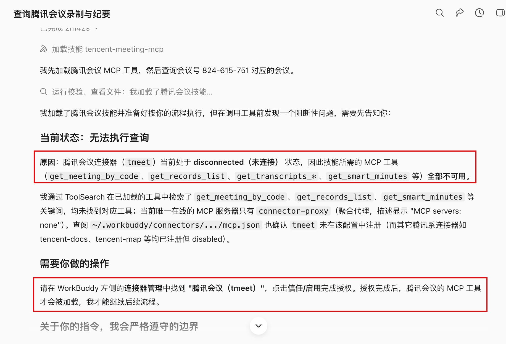
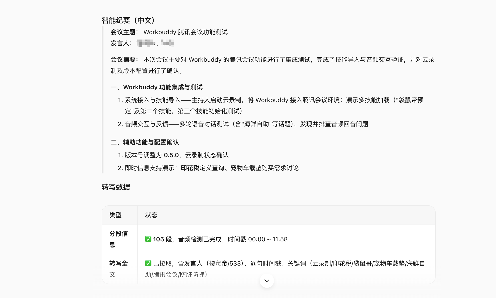

# 第 17 章 會議結束不是終點，工作才剛剛開始

## 日常辦公為什麼總在重複搬運

很多辦公室的一天由同一組動作組成：約會議、找材料、開會、記筆記、發紀要、建待辦、追進度、寫週報、做彙報。每個動作看似不難，真正消耗精力的是資訊不斷從聊天、會議、郵件、文件和表格之間流轉，而且每流轉一次都可能丟掉上下文。


## 主案例：一次產品評審會，怎樣真正推動專案

場景設定：產品團隊要評審“會議紀要自動生成待辦”功能。過去會後由產品經理回聽錄音、整理紀要，再把行動項逐個錄入任務系統，通常要半天，而且參會人對“誰答應了什麼”經常理解不同。

這條協同鏈不追求無人值守。它在建立會議、讀取錄製、建立待辦和確認 PRD 四處保留人工檢查點。

### 第一步：會前先定義要做出什麼決定

沒有議程的會議，轉寫再完整也只是大量對話。會前最重要的不是發連結，而是明確會議型別、要回答的問題和期望產物。

```text
為“會議紀要自動生成待辦”產品評審準備 45 分鐘議程。
參會角色：產品、研發、設計、測試、運營。
本次必須形成三個決定：首期範圍、待辦欄位、上線驗收指標。

讀取 project/meeting-to-task 中的需求草案和上次決策記錄，
輸出：會議目標、會前材料、按分鐘議程、每個議題的主持人、
需要當場決定的問題、可以會後非同步處理的問題。
事實與建議分開；缺少的資訊列入會前補充，不自行補造。
```

### 第二步：建立騰訊會議，並同步日曆

[騰訊會議 Skill](https://skillhub.cn/skills/tencent-meeting-skill)用於會議全生命週期：建立、修改、取消、查詢會議，檢視參會成員，並在許可權允許時獲取錄製、轉寫和智慧紀要。官方說明要求通過環境變數儲存 Token，並提醒使用者遵守企業資料和隱私要求。

騰訊會議 Skill 不等於通用日曆。正確順序是：先建立會議得到會議號和連結，再通過日曆或辦公協作聯結器建立日程、邀請參會人和預定會議室。

建立前必須確認的欄位

| 欄位 | 示例 | 為什麼要確認 |
|-|-|-|
| 主題 | 會議紀要自動生成待辦 - 首期評審 | 避免會議列表中無法識別 |
| 開始與結束 | 7 月 8 日 14:00-14:45 | 相對時間容易理解錯 |
| 時區 | Asia/Shanghai | 跨地區協作必須明確 |
| 參會人 | 產品、研發、設計、測試、運營 | 會議許可權和責任邊界 |
| 週期規則 | 單次 | 週期會議取消影響更大 |
| 入會與等候室 | 企業內可直接入會 | 涉及外部人員時需調整 |
| 錄製與轉寫 | 會中由主持人確認 | 涉及告知、許可權和隱私 |

```text
使用騰訊會議 Skill 建立一場會議。
主題：會議紀要自動生成待辦 - 首期評審
時間：2026-07-08 14:00-14:45，時區 Asia/Shanghai，單次會議。
先返回擬建立資訊讓我確認；確認後建立會議。

建立成功後，把會議號、連結、開始結束時間寫入 meeting-brief.md。
再生成日曆邀請草稿，包含議程和會前材料連結；
不要自行新增參會人、傳送邀請或預定會議室，等待我確認名單。
```

建立、修改和取消是不同風險等級。取消會議、修改週期規則、擴大參會範圍前要展示目標會議和影響範圍，不能只憑一句“把下午的會取消”。

ps：以上提示詞可以根據自己的會議修改。

### 第三步：會後獲取錄製、轉寫和會議內容

會議結束後，最容易犯的錯誤是把“有錄音”當成“已經有可用資訊”。錄製可能沒有開啟，轉寫可能尚未生成，呼叫人也可能沒有檢視許可權。

```text
查詢會議號 123 456 789 對應的已結束會議。
先返回主題、時間和主持人，確認是目標會議後，再查詢錄製列表。
如果有許可權，獲取轉寫全文、分段資訊和智慧紀要；
如果無許可權，停止讀取並返回所需授權，不嘗試繞過。
下載或儲存前說明檔案型別、大小、目標目錄和保留期限。
```


在這個過程中需要連線騰訊會議聯結器，按照提示在連線管理器中找到“騰訊會議”，並授權連線就行。



騰訊會議能力通常需要先把 9 位會議號轉換成內部 `meeting_id`，再查詢詳情、錄製和轉寫。這個過程由 Skill 完成，不需手工轉換，但保留會議號、會議 ID、錄製 ID、查詢時間和許可權狀態，方便排錯。



錄製與轉寫的邊界

- 會前或會中明確告知錄製和轉寫安排；
- 不把錄製連結轉發給沒有許可權的人；
- 不因獲取失敗而把聊天截圖或未經同意的錄音當替代來源；
- 轉寫是機器識別結果，專有名詞、數字、責任人和否定句必須回聽核對；
- 企業會議遵守所在組織的保留期限、資料分類和合規要求。

### 第四步：從轉寫生成可執行會議紀要

一份紀要，包含五類資訊

| 型別 | 例子 | 處理方式 |
|-|-|-|
| 背景事實 | 當前紀要平均需 40 分鐘整理 | 附來源或發言時間 |
| 已確認決定 | 首期只支援會後生成待辦草稿 | 記錄決定人和時間 |
| 行動項 | 產品補充欄位對映表 | 負責人、截止日期、驗收物 |
| 未決問題 | 是否支援跨專案複製待辦 | 進入下次決策，不偽裝成結論 |
| 討論建議 | 研發提出先做非同步佇列 | 標記為建議，不寫成承諾 |

```text
生成會議紀要，不得只依賴平臺智慧摘要；關鍵數字、責任人和否定表達回到轉寫核驗。

輸出：
1. 會議基本資訊；
2. 三句話結論；
3. 按議題整理的討論摘要；
4. 決策表：決定、理由、決定人、時間戳；
5. 行動項表：任務、負責人、截止日期、交付物、依賴；
6. 未決問題與下次確認時間；
7. 轉寫中無法確認的人名、數字和術語。

沒有明確負責人的任務寫“待認領”，沒有明確日期寫“待確認”，
不得根據語氣猜測負責人或截止時間。
```


### 第五步：紀要裡的待辦，不能直接靜默寫入任務系統

為什麼要兩步確認

會中發言和正式任務不是同一件事。把“可以看看”直接變成分派給某人的任務，會製造額外管理成本。

```text
讀取 minutes-approved.md 中的行動項，只生成待辦匯入預覽。
每條顯示：標題、描述、負責人、截止日期、優先順序、驗收物、來源會議。
負責人或日期缺失的條目進入“待補充”，不要建立。
先按負責人分組讓我確認；確認後再寫入指定任務清單。
寫入完成後返回成功、失敗、跳過和重複四個清單，不傳送催辦訊息。
```


這裡由於我這次的會議主要是為了演示用，所以待辦項的相關責任人都是待確認狀態。

穩定流程是：紀要草稿 → 參會人確認 → 待辦預覽 → 人工補齊責任與日期 → 寫入任務系統 → 返回任務連結。重複執行時使用“會議 ID + 行動項序號”作為冪等鍵，避免建立重複任務。

### 第六步：會後通知和跟蹤

會議後可以生成郵件或群訊息草稿，但傳送前必須確認物件和可見範圍：

```text
根據會議記錄生成兩份會後通知草稿：
A. 發給全體參會人：結論、行動項、未決問題和紀要連結；
B. 發給管理層：三句話結論、關鍵風險和需要支援的決定。
不要包含錄製下載地址、內部爭議原話或未確認個人責任。
只生成草稿，不傳送。
```


批次重新命名要保留對映表；同名衝突不覆蓋；合同、財務和人事檔案按組織規則處理，不能只按檔名猜分類。

## 會後延伸：把會議紀要變成彙報 PPT

先確定彙報物件和結論，再設計頁面：

```text
根據會議紀要生成 8 頁專案彙報 PPT。
受眾是管理層，目標是確認首期範圍和資源缺口。
頁面：結論、背景、使用者問題、已確認範圍、進度、風險、資源請求、下一步。
每頁只表達一個結論；數字來自狀態表，決定來自紀要；
不使用無法解釋的裝飾圖表。先返回頁級大綱和證據對映，確認後再生成 PPT。
```


## 一套基礎辦公 Skill 棧

| 任務層 | 可選能力 | 預設安全動作 |
|-|-|-|
| 會議 | 騰訊會議 Skill、日曆聯結器 | 建立前預覽，取消前二次確認 |
| 內容 | 錄製、轉寫、會議紀要模板 | 保留來源和時間戳 |
| 協作 | 任務、郵件、IM、騰訊文件/WPS | 先生成草稿或匯入預覽 |
| 產品 | PRD 模板、自定義產品經理 Skill | 只使用確認需求，保留未決問題 |
| 檔案 | DOCX、PDF、OCR、檔案整理 | 複製優先，不覆蓋、不刪除 |
| 資料 | Excel、公式、圖表、資料分析 | 先對賬，再分析 |
| 彙報 | PPT、圖表和品牌模板 | 先頁級大綱和證據對映 |
| 自動化 | 日報、週報、提醒和歸檔 | 小範圍試執行，失敗可接管 |

不要一開始安裝十幾個 Skill。先選擇一個每週都會發生、輸入穩定、結果容易驗收的任務，例如會議紀要到待辦；連續跑通後，再把 PRD、週報和彙報接到同一條鏈上。
