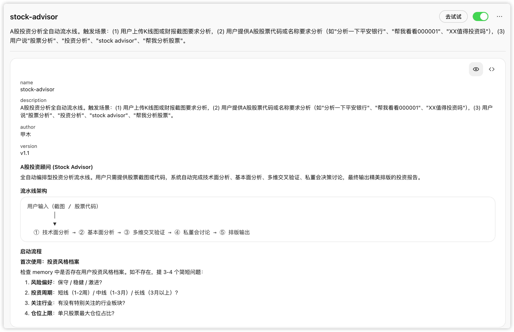
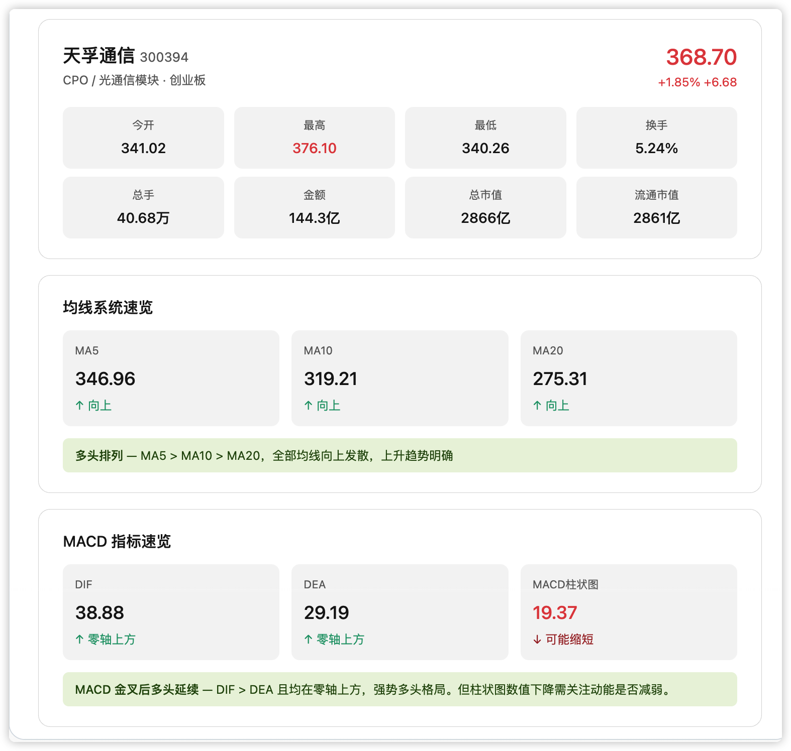
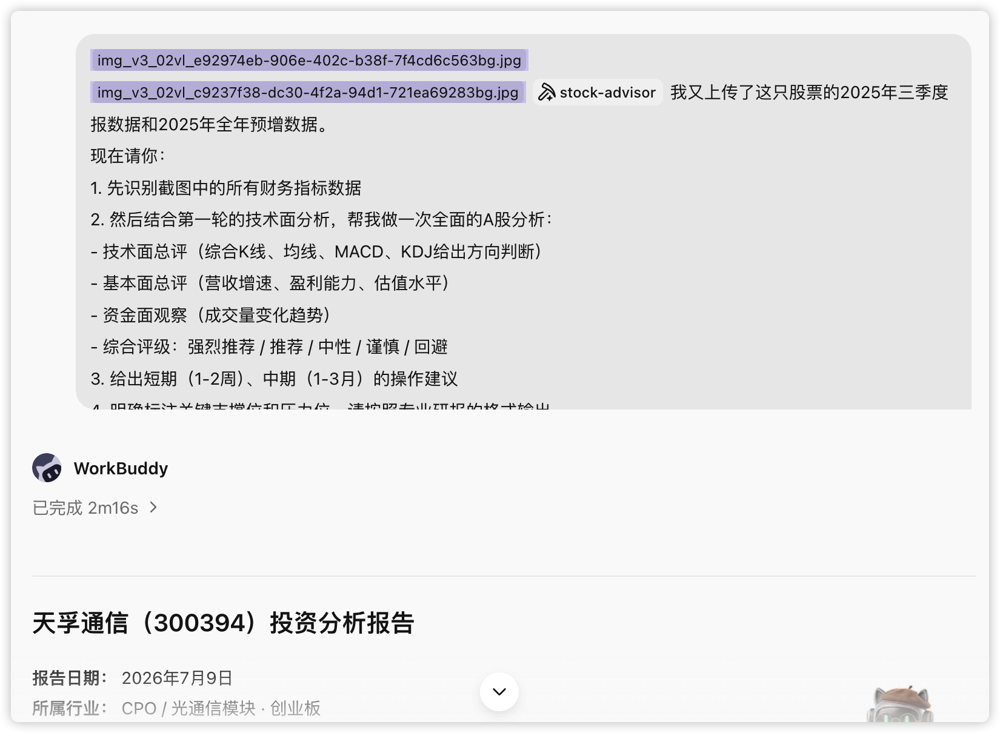
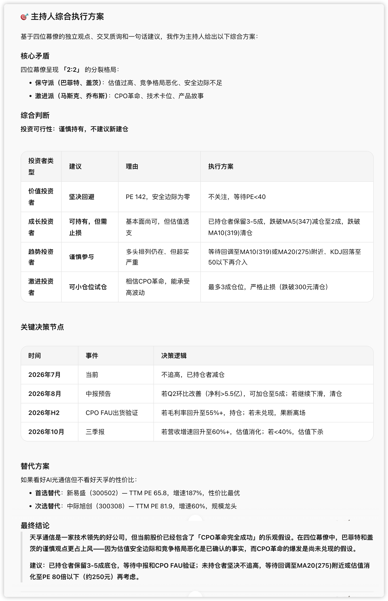

# 第 18 章 把投資分析變成你的日常

投資本身就是一件**高度資訊密集、強結構化、又極度依賴判斷**的事：讀不完的財報、理不清的行業、吵不停的多空。而整理碎片資訊、拆解複雜材料、把思考過程擺到檯面上，恰好是 AI 擅長的。

**在一次完整的股票研究裡，AI 到底能替你做掉哪些低質量的重複勞動，把精力還給判斷本身。**

## 先想清楚：AI 在投資裡該幹什麼

多數人對「AI 炒股」的想象是讓它預測漲跌。但從真實的高頻用法看，絕大多數有價值的提示詞其實只集中在四類事上：

- 讀不完的財報，幫我總結；
- 行業太複雜，幫我把邏輯理一遍；
- 市場吵得太兇，幫我把多空觀點放進一張表；
- 我怕自己自嗨，幫我找反證。

這四類都不是「預測漲跌」，而是**減少低質量思考的時間**。AI 在投資裡最合理的位置，是一個不知疲倦、不帶情緒、隨叫隨到的研究助理——它負責把事實底座打牢，把判斷留給你。

和辦公三件套一樣，動手前先用五個問題給這次研究定標。很多「AI 分析得不好」，根源不是模型不會分析，而是人沒把研究目標說清楚。

| 問題 | 要說清什麼 | 示例 |
|-|-|-|
| 目標 | 這次研究要支撐什麼決定 | 判斷是否把某隻票納入觀察池，還是決定當下加減倉。 |
| 標的 | 具體是哪家公司、哪個行業 | 天孚通訊（300394），光通訊 / CPO 板塊。 |
| 材料 | 哪些是事實來源，哪些只是參考 | 年報、三季報、券商研報是事實來源；股吧觀點只作情緒參考。 |
| 深度 | 只要事實梳理，還是要到估值和多空推演 | 先做事實底座（Prompt 1-3），再上盡調級 DeepResearch（Prompt 8）。 |
| 驗收 | 怎麼判斷結果可用 | 每個判斷都能追到資料來源，事實與觀點分開標註。 |

## 先選對工具：金融場景的 Skill 組合

在進入提示詞之前，先認識本章會用到的幾個 Skill。它們分工不同，可以單用，也可以像流水線一樣串起來。

| Skill 名稱 | 適合處理 | 本章怎麼用 | 注意點 |
|-|-|-|-|
| `stock-advisor` | 單隻股票的端到端分析 | 上傳截圖或給出程式碼，自動跑完技術面、基本面、交叉驗證、私董會、排版 | 本章主線，第三、四節詳解 |
| `a-share-analyst` | A 股日常行情與選股 | 即時行情、技術指標、量化選股、每日報告 | 偏日常盯盤與批次篩選 |
| `financial-expert` | 金融資料查詢與篩選 | 選股、基金篩選、財務指標、宏觀 / 行業時序、券商研報檢索 | 依賴資料來源 MCP，需先配置 |
| `peers-advisory-group` | 多視角決策討論 | 四位「幕僚」圍繞一個議題交叉辯論 | 被 `stock-advisor` 作為決策模組呼叫 |

一個實用的搭配思路是：**日常盯盤和批次選股用 `a-share-analyst` 與 `financial-expert`；要對一隻票下深功夫、出一份完整報告，用 `stock-advisor`；需要跳出單一視角、逼自己看反面時，叫上 `peers-advisory-group`。**

## 從查資料到下判斷：一套可複用的研究提示詞鏈路

這一節是純提示詞。它們按「**最簡單 → 相對複雜**」排列，覆蓋了從「查資料」到「下判斷」的完整鏈路。你不必每條都用——先用前三條建立事實底座，需要深挖時再往後走。第 8 條是把前面所有環節壓進一個框架的「全家桶」，也是日常在 ChatGPT、Gemini、豆包、千問的 DeepResearch 裡最常用的一條。

> 每條提示詞的用法統一是：把方括號 `【】` 裡的佔位換成你的標的，貼上執行即可。

### Prompt 1｜最基礎：給公司建一個「事實底座」

**解決的場景**：剛接觸一家公司，先別急著判斷，先搞清楚它到底是幹什麼的。很多錯誤判斷，從第一步認錯了業務就開始了——你以為它靠 A 賺錢，結果利潤主要來自 B。這一步的價值，是**壓縮你「搞清楚事實」的時間成本**。

```markdown
請幫我係統梳理【XXX 公司】的基礎情況，輸出結構化總結，包括：
1）核心業務與主要產品線
2）收入與利潤來源構成
3）主要客戶與應用場景
4）公司在產業鏈中的位置
5）近幾年最重要的戰略變化

## 要求：
- 只使用可核實的資訊
- 每一部分用 3–5 條要點說明
- 不做投資建議，只做事實整理
```

### Prompt 2｜行業視角：這是不是一個「好行業」

**解決的場景**：股票研究裡一個常被低估的問題——你選的往往不是公司，而是行業。AI 很適合做行業的「第一性梳理」。但行業拐點、價格見底這種問題，別指望它給答案。

```markdown
請從行業研究的角度，分析【<XXX公司>】所在的【<XXX行業>】：
1）行業所處的週期階段（復甦/擴張/衰退/蕭條）
2）供需關係與主要驅動因素
 - 產能、開工率、庫存、訂單/交付週期
3）價格變化機制與歷史波動
 - 產品價格指數/價差/成本傳導
 - 資本開支：Capex趨勢、擴產專案、行業新增產能
4）行業集中度與競爭格局
5）影響行業的關鍵外部變數（政策、技術、宏觀）
 - 政策與外部變數：利率、匯率、監管、補貼、貿易限制
請明確指出：哪些是長期結構性因素，哪些是短期波動因素。輸出週期階段判斷 + 關鍵證據圖表清單 + 領先指標(3個)與滯後指標(3個)。
```

### Prompt 3｜業務拆解：錢到底是怎麼賺來的

**解決的場景**：從「看公司」到「看生意」的關鍵一步。很多「看起來很美」的公司，核心利潤來源其實很脆弱。**混雜型公司**（主業 A、利潤卻來自 B）尤其適合讓 AI 幫你看清楚。

```markdown
請你以【價值投資 / 基本面研究】視角，對【XXX 公司】進行"業務拆解"，目標是回答一個核心問題：
👉 這家公司【真正、長期】是靠什麼賺錢的？

## 要求
- 僅基於可驗證資訊（年報、招股書、定期公告、投資者交流紀要、權威行業報告等）
- 明確區分【事實】與【判斷】，所有判斷必須給出證據或邏輯鏈
- 輸出為 Markdown 結構化報告

## 必答結構
一、公司"賺錢方式"的一句話結論
- 用不超過 50 字，概括公司最核心的賺錢邏輯（賣什麼 → 賣給誰 → 為什麼能賺錢）

二、業務結構全拆解（必須量化）
1. 業務板塊拆分
   - 列出所有核心業務 / 產品線 / 服務線
   - 對每一塊給出：收入佔比、毛利率、增長趨勢（近 3–5 年）
2. 利潤來源判斷
   - 哪些業務"貢獻了大部分利潤"
   - 哪些業務"收入大但不賺錢 / 甚至虧錢"
   - 是否存在【主業≠利潤核心】的情況？（如：主業A，利潤來自B）

三、賺錢機制拆解（Business Engine）
對核心業務逐條回答：
- 錢是怎麼收進來的？（一次性/訂閱/持續復購/專案制）
- 成本主要花在哪？（原材料、人力、渠道、研發、營銷）
- 毛利率由什麼決定？是結構性優勢還是週期紅利？
- 是否具備規模效應？規模擴大後，哪一項成本會被攤薄？

四、客戶、渠道與定價權
- 核心客戶是誰？是否集中？（Top5/Top10 客戶佔比）
- 銷售渠道結構（直銷 / 經銷 / 平臺 / 政府 / 大客戶）
- 是否具備定價權？歷史是否成功提價？證據是什麼？
- 客戶更換供應商的成本高不高？為什麼？

五、子公司 / 聯營公司 / 非經常性業務
- 列出重要子公司、聯營公司及其業務性質
- 明確哪些利潤來自：
  - 可持續經營
  - 週期波動
  - 投資收益 / 政策補貼 / 資產處置
- 判斷這些"非主營利潤"對長期估值邏輯的影響（正面 / 負面 / 干擾）

六、商業模式的"穩定性與脆弱點"
- 哪些假設一旦被破壞，賺錢邏輯就會失效？
- 最容易被競爭 / 技術 / 政策衝擊的環節在哪裡？
- 用 3–5 條"關鍵監控指標"總結如何持續驗證這門生意是否還成立

## 最終輸出
- 一句話商業本質總結
- 業務結構表（收入 / 利潤 / 毛利率）
- 賺錢機制邏輯鏈（文字 + 列點）
- 對長期投資者最重要的 3 個判斷結論
```

### Prompt 4｜財務質量：這家公司賺的錢乾不乾淨

**解決的場景**：財務調研指標很多，這裡給一個通用格式。核心是強制做「利潤 vs 現金流」的交叉驗證——賬面利潤漂亮，現金流跟不上，往往是第一個預警訊號。

```markdown
請分析【<公司>】近幾年的財務質量：
1）收入、利潤與經營現金流的匹配情況
2）應收賬款、存貨、合同資產變化
3）非經常性損益對利潤的影響
4）是否存在一次性專案或會計口徑變化
5）可能需要重點關注的財務風險點

## 研究原則
- 不預測股價，只判斷財務"質量"
- 強制進行"利潤 vs 現金流"的交叉驗證
- 對所有異常必須給出解釋假設與驗證路徑

請重點指出：哪些指標值得持續跟蹤。
```

### Prompt 5｜股權與治理：老闆和你是不是一條船上的

**解決的場景**：生意好 + 治理差 = 高波動風險資產。股權質押、減持、關聯交易、激勵條款，這些「籌碼面」的資訊很分散，適合讓 AI 一次性梳理成時間表和風險雷達。

```markdown
1、梳理【<公司>】股權結構與關鍵股東：
- 實控人、控股股東、董事會結構
- 股權質押比例與變化、減持計劃、潛在控制權變更風險
- 關聯交易、同業競爭、資金佔用風險
輸出：治理結構圖（文字版即可）+ 風險雷達(高/中/低) + 需要跟蹤的公告清單。

2、請建立【<公司>】未來<12個月>的"籌碼事件時間表"：限售解禁、員工持股解鎖、定增/配股、回購進度。
對每個事件給出：潛在拋壓/承接能力判斷、對估值中樞的影響路徑、歷史上類似事件的股價反應統計（如能找到）。

3、分析【<公司>】管理層薪酬與股權激勵：
- 激勵指標是否容易"做賬達成"？（收入/利潤/現金流/ROIC）
- 目標難度與行業對比
- 是否存在短期行為激勵（衝收入、降研發等）
輸出：同向性結論 + 關鍵條款摘錄 + 改進建議。
```

### Prompt 6｜市場分歧：多空到底在吵什麼

**解決的場景**：多空雙方的觀點最有資訊量。這一步不是告訴你該信誰，而是幫你把分歧攤平，看清楚**未來該盯哪些資料來驗證**。

```markdown
請整理市場對【XXX 公司】的主要分歧點：
1）多方核心邏輯
2）空方核心邏輯
3）各自最重要的論據
4）哪些分歧可以被未來資料驗證
5）關鍵驗證節點是什麼

## 分析要求
- 不得站隊
- 不給投資建議
- 不使用情緒化或立場性語言
- 所有判斷必須可被未來資料或事件驗證
```

### Prompt 7｜估值與護城河：市場在押什麼假設

**解決的場景**：護城河和估值，是價值投資繞不開的兩塊。下面兩條一條評護城河強度，一條搭 DCF 反推市場隱含預期。

```markdown
以價值投資視角分析【<公司>】的護城河，必須引用公司披露/權威來源。
1) 定價權：過去<5-10年>毛利率/提價能力/成本轉嫁證據？
2) 轉換成本：客戶更換供應商的成本是什麼（系統、流程、合規、生態）？
3) 網路效應/規模效應：規模如何降低單位成本或提升體驗？
4) 無形資產：品牌、專利、牌照、資料、渠道壁壘的可驗證證據？
5) 競爭反應：主要對手如何攻擊，公司如何防守（歷史戰役）？
輸出：護城河強度評分(0-5)+證據表+最可能被侵蝕的點與監控指標。
```

```markdown
請為【<公司>】構建 DCF 估值（允許使用公開財務資料，必須引用來源）：
- 明確WACC/折現率假設與依據
- 預測5-10年自由現金流：收入、利潤率、再投資率
- 給出敏感性分析表（折現率×永續增長率 或 折現率×利潤率）
- 反推：當前市值隱含的收入增速/利潤率路徑
輸出：估值區間 + 關鍵假設清單 + 最容易錯的2個假設及驗證方案。
```

### Prompt 8｜全家桶：一份盡調級 DeepResearch

**解決的場景**：這是把前七步的邏輯壓進同一個框架的「投資者盡職調查報告」。它強制區分事實與判斷、強制交叉驗證、強制推演空方邏輯與黑天鵝——用來對抗人最容易犯的「確認偏誤」。這條在各家 AI 的 DeepResearch 模式裡都很好用。

```markdown
我需要你幫我完成一份投資者盡職調查報告。目標是對標的 `<股票名稱/程式碼>` 進行全方位的商業模式、財務質量、行業週期及估值邏輯推演。
請嚴格按照以下邏輯框架進行推演。

## Constraints & Standards (研究原則)
1. 資料時效性與跨度：財務資料需涵蓋**過去 3-5 年**的趨勢（CAGR），估值分位需回溯**過去 5-10 年**的歷史區間。
2. 事實底座優先：區分【事實 Fact】與【判斷 Opinion】。所有判斷必須基於可驗證的資料（年報、招股書、監管問詢函）。
3. 雙重驗證：必須進行"利潤 vs 現金流"的交叉驗證，以及"公司 vs 同行"的對比驗證。
4. 反直覺思考：必須包含"空方邏輯"與"黑天鵝風險"推演，避免確認偏誤。

## Research Context (使用者輸入)
- **研究標的**：[在此輸入股票名稱/程式碼]
- **投資風格**：[如：價值投資 / 成長接力 / 困境反轉]
- **持有周期**：[如：中長線 1-3 年]

## Workflow
### Phase 1: 商業模式與護城河拆解 (Business Engine & Moat)
> 核心任務：搞清楚它真正靠什麼賺錢，剔除噪音，看清本質。
1. 業務透視與提純：
    - **拆解營收/利潤結構**：核心業務是什麼？是否存在"主業賺吆喝，副業（投資/補貼）賺利潤"的現象？
    - **子公司/聯營公司穿透**：深挖主要子公司和聯營公司的實際貢獻，**剔除噪音**，明確指出哪些業務是拖累，哪些是隱形金礦。
2. 護城河判定：
    - **定價權**：是否有提價能力？（證據：毛利率是否隨成本波動？還是能轉嫁成本？）
    - **核心壁壘**：是品牌溢價、極高的轉換成本、網路效應，還是單純的低成本優勢？
    - **行業天花板**：該行業 TAM 有多大？當前市場份額分佈如何？公司是否觸及增長天花板？

### Phase 2: 行業週期與供需格局 (Industry Context)
> 核心任務：判斷是順風還是逆風，是紅海還是藍海。
1. 週期定位：行業目前處於哪個階段（復甦/過熱/滯脹/衰退/蕭條）？請引用庫存水平、開工率、Capex（資本開支）趨勢作為證據。
2. 供需剪刀差：尋找"領先指標"與"滯後指標"。未來 1-2 年行業是否有大規模新增產能投放？
3. 競爭格局變化：行業集中度（CR5）是在提升還是分散？主要競爭對手近期有什麼大動作（價格戰/技術突破）？

### Phase 3: 財務健康度與質量掃雷 (Financial Health)
> 核心任務：這筆錢賺得乾不乾淨？增長是否有質量？
1. 核心指標趨勢：
    - 計算過去 3-5 年的 **營收 CAGR** 和 **淨利潤 CAGR**，判斷增長的持續性。
    - 分析 **ROE（淨資產收益率）** 的驅動因素（杜邦分析：是靠加槓桿，還是靠週轉快，還是利潤高？）。
    - 繪製 **毛利率與淨利率** 趨勢圖，判斷盈利能力的穩定性。
2. 異常排查（掃雷）：
    - 週轉率警報：存貨週轉率、應收賬款週轉天數是否有惡化（變長）趨勢？
    - 含金量測試：經營性現金流淨額 / 淨利潤是否匹配？（長期 <1 則為危險訊號）。
    - 非經常性損益：剔除一次性收益後，扣非淨利潤是否依然健康？

### Phase 4: 治理結構與資本配置 (Governance & Allocation)
> 核心任務：管理層是股東的夥伴，還是收割者？
1. 資本運作回顧：
    - 盤點近 2 年的增發、回購、股權激勵或重大併購。這些動作對中小股東是**增厚 EPS** 還是**稀釋權益**？
2. 股權與籌碼：
    - 實控人持股比例？是否有**高比例質押**風險？是否有重要股東（大基金/高管）持續減持？
3. 管理層畫像：
    - 他們的言行是否一致？
    - **資本配置能力**：歷史上賺到的錢投向了哪裡（瞎投資/擴產/分紅/回購）？回報率（ROIC）如何？

### Phase 5: 估值邏輯與風險反脆弱 (Valuation & Risk)
> 核心任務：價格是否包含了過高的預期？
1. 相對估值（縱向+橫向）：
    - **歷史分位**：當前 PE/PB/PS 處於歷史（過去 5-10 年）的什麼分位點？
    - **同行對比**：與同行業主要競爭對手相比，估值是溢價還是折價？理由充分嗎？
2. 絕對估值（反向思維）：
    - 不僅僅做預測，請進行**反向 DCF 推演**：當前股價隱含了未來 3-5 年多少的淨利潤增速？這個隱含預期是否過於樂觀？
3. 風險與空方邏輯：
    - **空方視角**：全網搜尋看空該股票的核心理由（做空報告/負面輿情）。
    - **黑天鵝**：政策監管風險、技術路徑被顛覆風險、地緣政治風險。

## Output Format (輸出結構)
請以結構化輸出，並在文末附上【引用來源清單】：
1. 投資結論摘要
    - 訊號燈評級：🟢買入 / 🟡觀望 / 🔴賣出
    - 核心邏輯總結（One-liner）
2. 關鍵財務資料表（含 CAGR, ROE, 現金流匹配度）
3. 深度分析正文（按上述 5 個 Phase 展開，每個結論需附帶資料支援）
4. 估值儀表盤（歷史分位 + 隱含預期 + 同行對比）
5. 未來監控清單
    - 只有當 [事件A] 發生時，才強化買入邏輯。
    - 一旦 [資料B] 惡化（如毛利率跌破X%），邏輯證偽，立即退出。
```

到這裡，一套從「查資料」到「下判斷」的提示詞鏈路就齊了。但你可能已經發現一個問題——**它們是散裝的**。每換一隻票，你都要一條條重新貼上、手動把上一步的結論餵給下一步、最後還要自己整理成報告。下一節，我們把這套鏈路裝進一個 Skill。

## 從提示詞到 Skill：`stock-advisor` 是怎麼長出來的

### 這個場景的痛點

上一節的提示詞單獨看都好用，但真要完整研究一隻票，痛點很明確：

- **要手動串**：技術面、基本面、多空、估值，八條提示詞得一條條跑，還要人肉把中間結論搬來搬去；
- **換標的重來**：每分析一隻新股票，整個流程從頭走一遍；
- **資料靠眼睛**：截圖裡的數字全靠人核對，容易看錯；
- **決策容易自嗨**：一個人分析，很難跳出自己的立場；
- **交付靠手工**：最後整理成一份像樣的報告，又是一輪體力活。

`stock-advisor` 要解決的，就是把這條鏈路**從「一堆提示詞」變成「一條按一次就跑完的流水線」**。


### 創作原理：編排，而不是重寫

`stock-advisor` 的設計核心是一個詞——**編排（Orchestration）**。它沒有把所有能力重新造一遍，而是把「已經好用的部件」按順序接成一條流水線：

```
使用者輸入（截圖 / 股票程式碼）
        │
        ▼
  ① 技術面分析 → ② 基本面分析 → ③ 多維交叉驗證 → ④ 私董會討論 → ⑤ 排版輸出
```

五個模組各司其職：

| 模組 | 做什麼 | 關鍵設計 |
|-|-|-|
| ① 技術面分析 | 從 K 線圖識別形態、均線、MACD 等，並用行情資料交叉驗證 | 影像識別 + 資料雙軌，**衝突時以資料為準並標註差異** |
| ② 基本面分析 | 識別財報關鍵指標，補充估值與行業對比，給綜合評級 | 技術 / 基本 / 資金三面各自打分，再合成評級 |
| ③ 多維交叉驗證 | 聯網檢索研報、行業動態、重大新聞、政策 | 出現矛盾訊號（如技術看漲但研報看空）**必須明確標註分歧** |
| ④ 私董會討論 | 呼叫 `peers-advisory-group`，四位幕僚就這隻票交叉辯論 | 複用現成 Skill，把「找反證」制度化 |
| ⑤ 排版輸出 | 整理成結構化報告，轉雜誌風 HTML / PDF，可上傳飛書 | 複用 `magazine-layout` 與 `lark-doc` |

這裡藏著 Skill 創作最值得學的一點：**複用而非重寫**。`stock-advisor` 的依賴清單裡，技術指標指令碼複用了 `a-share-analyst`，決策討論複用了 `peers-advisory-group`，排版複用了 `magazine-layout`，上傳複用了 `lark-doc`。它自己新寫的，只有「基本面分析」「HTML 轉 PDF」等少數幾塊。

> 換句話說，做一個複雜 Skill，不一定要從零寫一個龐然大物。**先把已有的能力當積木，缺哪塊補哪塊，再用一條主線把它們編排起來**——這就是 `stock-advisor` 的創作方法論，也是把個人經驗沉澱成工具的通用思路。

它還有兩個體現「產品化」意識的小設計：

- **首次使用建檔**：第一次跑會問你 3-4 個問題（風險偏好、投資週期、關注行業、倉位上限），存進記憶，之後的建議會按你的風格調權重；
- **兩種入口同一條流水線**：上傳截圖走「影像識別 + 資料驗證」，直接給程式碼走「純資料驅動」，差異只在取數方式，後面完全一致。

### 它到底解決了什麼問題

一句話：**把「一次嚴肅的股票研究」從半天的手工活，壓縮成一次對話。** 你提供截圖或程式碼，它自動完成取數、多面分析、交叉驗證、多視角辯論和報告排版。人要做的，從「搬運和拼接」變成了「拍板和質疑」——這正是第一節說的，把精力還給判斷。

> 
>
> 在 WorkBuddy 裡觸發 `stock-advisor` Skill 的介面（技能被識別、開始執行的那一刻）。

---

## 實戰案例：用 `stock-advisor` 跑一遍天孚通訊（300394）

光講原理不夠，下面是一次真實的完整對話。標的是**天孚通訊（300394）**，光通訊 / CPO 板塊。整個過程分三步遞進：先看圖、再看財報、最後開一場私董會。

### 第一步：上傳 K 線圖，先要一份技術面速讀

我上傳了這隻票的 K 線日線圖和 MACD 指標圖，讓它先做技術分析。用的提示詞就是第二節思路的實操版：

```text
我上傳了一隻 A 股的 K 線日線圖和技術指標圖（MACD）。請你作為一位專業的技術分析師，完成以下任務：
1. 識別股票資訊：這是哪隻股票？當前股價大約是多少？
2. K 線形態分析：近期呈現什麼形態？近 5 日 K 線的具體表現？
3. 均線系統分析：MA5/MA10/MA20 的排列狀態，最近是否出現金叉或死叉
4. MACD 分析：DIF 和 DEA 的位置關係，柱狀圖趨勢，是否出現背離
請以表格 + 文字結合的方式輸出技術面速讀報告。
```

> 
>
> 上傳 K 線圖 + 輸入上述提示詞的對話介面。

WorkBuddy 先從圖裡識別出這是**天孚通訊（300394）**，當前股價約 368.70 元，然後給出了結構化的技術面速讀。核心結論：

- **趨勢**：MA5 > MA10 > MA20，標準多頭排列，未見死叉，仍在主升浪；
- **風險訊號**：當日一根長上影線（最高衝 376.10 回落到 368.70），MACD 紅柱開始縮短，乖離率偏大；
- **關鍵位**：支撐看 MA5（347）/ MA10（319），壓力看當日高點 376。

> 
>
> 技術面速讀報告的完整輸出（含 K 線形態、均線、MACD 四張小表）
>
> 

一句話點評：這一步它沒有猜漲跌，而是把「圖裡能讀到的事實」結構化了——形態、均線、指標、支撐壓力，一目瞭然。



### 第二步：補上財報截圖，做一次全面分析

接著我又上傳了 2025 年三季報和全年預增公告的截圖，讓它把基本面接進來，做一次完整評級：

```text
我又上傳了這隻股票的 2025 年三季度報資料和 2025 年全年預增資料。
現在請你：
1. 先識別截圖中的所有財務指標資料
2. 然後結合第一輪的技術面分析，幫我做一次全面的 A 股分析：
   - 技術面總評（綜合 K 線、均線、MACD、KDJ 給出方向判斷）
   - 基本面總評（營收增速、盈利能力、估值水平）
   - 資金面觀察（成交量變化趨勢）
   - 綜合評級：強烈推薦 / 推薦 / 中性 / 謹慎 / 迴避
3. 給出短期（1-2 周）、中期（1-3 月）的操作建議
4. 明確標註關鍵支撐位和壓力位，請按照專業研報的格式輸出。
```

> 
>
> 上傳財報截圖 + 輸入上述提示詞的對話介面。

這一輪它先把截圖裡的財務指標逐條識別出來（營收 39.18 億、同比 +63.63%，歸母淨利 14.65 億、ROE 31.30%、毛利率 51.87%，PE 146.70……），然後合成了一張綜合評級表：

| 維度 | 評分 | 權重 | 加權得分 |
|-|-|-|-|
| 技術面 | 4.0 / 5.0 | 25% | 1.00 |
| 基本面 | 4.5 / 5.0 | 30% | 1.35 |
| 估值水平 | 2.0 / 5.0 | 25% | 0.50 |
| 資金面 | 4.0 / 5.0 | 20% | 0.80 |
| **綜合評分** | — | — | **3.65 / 5.0** |

**最終評級：推薦。** 核心結論是一句很剋制的話：**中期趨勢向好（CPO 高景氣 + 高成長），但短期估值透支、漲幅過大，不宜追高，等回撥再擇機。** 它還給了分投資者型別的倉位建議、四檔支撐位和三檔壓力位。

> 
>
> 
>
> 全面分析報告的完整輸出（財務識別表 + 綜合評級表 + 操作建議 + 支撐壓力位）。

值得注意的是，這一步已經體現了模組二的設計：**技術、基本、資金三面分開打分，再加權合成**，估值太貴就在總分里扣回來——不會因為成長性好就無腦看多。

還可以從不同角度去分析，使用\`a-share-analyst\` \`skill去完成。


### 第三步：拿不定主意，開一場私董會

評級出來了，但「推薦」不等於「現在就買」。這時候我叫上了第四個模組——**私董會**，請四位風格迥異的幕僚就這隻票交叉辯論：

```text
但我對這隻股票還是拿不定主意。現在請幫我啟動一場私董會，我要請四位幕僚來討論這隻股票是否值得投資：
- 巴菲特：從價值投資的角度（內在價值、護城河、安全邊際）
- 馬斯克：從科技趨勢和顛覆性創新的角度
- 比爾·蓋茨：從商業模式和行業格局的角度
- 喬布斯：從產品力和使用者體驗的角度
討論要求：
1. 每位幕僚先各自發表 3-5 分鐘的獨立觀點。
2. 然後進入交叉質詢環節——幕僚之間互相挑戰對方觀點。
3. 最後每人用一句話給出"買入/持有/賣出"的最終建議。
4. 你作為私董會主持人，綜合四位意見給出最終執行方案。
請基於前兩輪的分析資料來展開討論，讓幕僚們"帶著資料聊"。
```

> 
>
> 啟動私董會的對話介面。

私董會環節裡，系統先聯網更新了四位幕僚的近況，還**補檢索了更新的資料**（2025 全年營收 51.63 億、淨利 20.17 億，2026 Q1 環比下滑，以及和中際旭創、新易盛的橫向對比）——這正是模組三「多維交叉驗證」在起作用，把討論從截圖資料推進到了全網最新事實。

四位幕僚各自獨立發言、再互相質詢，觀點很快分成兩派：

> 
>
> 
>
> 四位幕僚獨立觀點 +
>
> 
>
> 交叉質詢環節（篇幅較長，建議分屏截圖）。

最後每人一句話定調，形成了鮮明的「2:2」分裂：

- **巴菲特（迴避）**：「PE 142，安全邊際為零，護城河在收窄。除非跌到 200 元以下，否則這不是投資，是賭博。」
- **比爾·蓋茨（等待 / 換倉）**：「基本面尚可，但估值太貴、競爭格局惡化。建議等 PE 回到 60 倍以下，或換價效比更高的新易盛 / 中際旭創。」
- **馬斯克（All in）**：「CPO 是光通訊的 iPhone 時刻，天孚是上游的鏟子王。超買是最後的上車機會，不是下車理由。」
- **喬布斯（有條件持有）**：「相信 CPO 革命就現在持有，但前提是 CPO FAU 在 2026 H2 如期兌現，否則果斷離場。」


主持人最後綜合出一份**分投資者型別的執行方案**，而不是一個籠統的「買或不買」：

| 投資者型別 | 建議 | 執行要點 |
|-|-|-|
| 價值投資者 | 堅決迴避 | 等 PE < 40 |
| 成長投資者 | 可持有，需止損 | 保留 3-5 成，跌破 MA5(347) 減倉，跌破 MA10(319) 清倉 |
| 趨勢投資者 | 謹慎參與 | 等回撥至 MA10 / MA20，KDJ 回落至 50 以下再介入 |
| 激進投資者 | 小倉位試倉 | 最多 3 成，跌破 300 元清倉 |

並且把決策掛到了幾個**未來驗證節點**上：8 月中報預告看 Q2 是否環比改善，H2 看 CPO FAU 能否放量、毛利率能否回到 55%+，10 月三季報看營收增速。邏輯證偽就退出。

> 
>
> 主持人的綜合執行方案（分型別建議表 + 決策節點表 + 替代標的）。

### 最後：一鍵成稿

對話結束後，讓它把整場分析生成一份雜誌風格的報告，`stock-advisor` 會呼叫排版模組出成品，可以本地存 PDF，也可以直接上傳飛書雲文件。

> 
>
> 雜誌風格投資分析報告成品（首屏 / 封面）。

回頭看這一個案例，`stock-advisor` 把第二節那八條散裝提示詞，變成了一次三輪對話就跑完的完整研究：**看圖 → 看財報 → 開私董會 → 出報告**。而全程它沒有替我做那個最關鍵的決定——買還是不買。它只是把該看的都看了，把該吵的都吵了，最後把判斷權，乾乾淨淨地交回到我手裡。

---

## 常見錯誤與使用邊界

金融是強監管、強風險的場景，比辦公三件套更需要守住邊界。下面幾條，是把 AI 用在投資上最容易踩的坑。

| 常見錯誤 | 為什麼錯 | 正確做法 |
|-|-|-|
| 讓 AI 給「買點 / 賣點」 | 它不掌握即時全量資訊，也不為你的錢負責 | 只用它做事實梳理和多空推演，買賣由你拍板 |
| 完全相信截圖識別的數字 | 影像識別會看錯，財報口徑也會變 | 關鍵數字要交叉驗證——本案例私董會環節的資料就比前兩輪更新 |
| 指望它判斷行業拐點、價格見底 | 這類判斷依賴前瞻資訊和經驗，AI 給不了 | 讓它梳理「該盯哪些領先指標」，拐點自己盯 |
| 只看多方邏輯，越看越上頭 | 確認偏誤，AI 會順著你的語氣強化觀點 | 用 Prompt 6 和私董會，強制它給空方邏輯和反證 |
| 把 AI 報告直接當投資依據 | 報告是研究輔助，不是投資建議 | 報告結論僅供參考，決策與風險自負 |

> **風險提示：股市有風險，投資需謹慎。** **本章所有提示詞、Skill 與案例，均以「輔助研究」為目的，不構成任何投資建議。**AI 只是把事實和分歧擺到你面前的工具，最終的判斷和後果，始終在人這一邊。據此操作，風險自擔。