# 第 19 章 一句話召喚 AI 影片團隊

在 WorkBuddy 裡把短影片工作拆成兩支 AI 專家團：一支負責自動生產影片，一支負責拆解爆款影片。

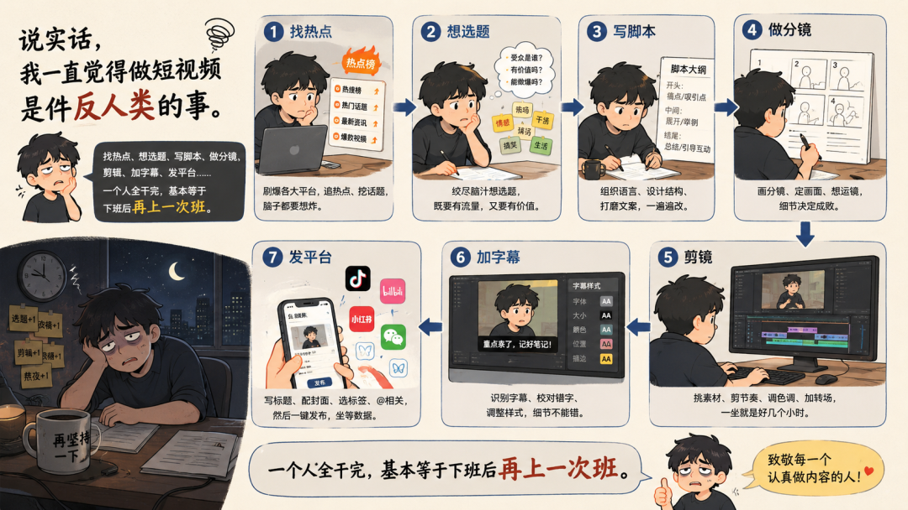


| 團隊 | 負責什麼 | 適合什麼任務 |
|-|-|-|
| **影片生成團隊** | 從主題出發，完成熱點採集、選題篩選、指令碼、分鏡、配音、渲染、字幕和釋出。 | AI 週報、產品更新、知識科普、行業分析、產品評測。 |
| **爆款影片拆解團隊** | 從影片連結出發，下載影片、提取音訊、轉寫文案、分析鏡頭語言，生成拆解報告和仿拍建議。 | 學習爆款結構、覆盤競品影片、沉澱拍攝手冊、給生成團隊提供參考。 |

這兩個團隊並不是互相替代的關係。影片生成團隊解決“今天怎麼做一條出來”，爆款拆解團隊解決“為什麼別人那條能火，我能學到什麼”。一個負責生產，一個負責學習，組合起來才有持續迭代的可能。

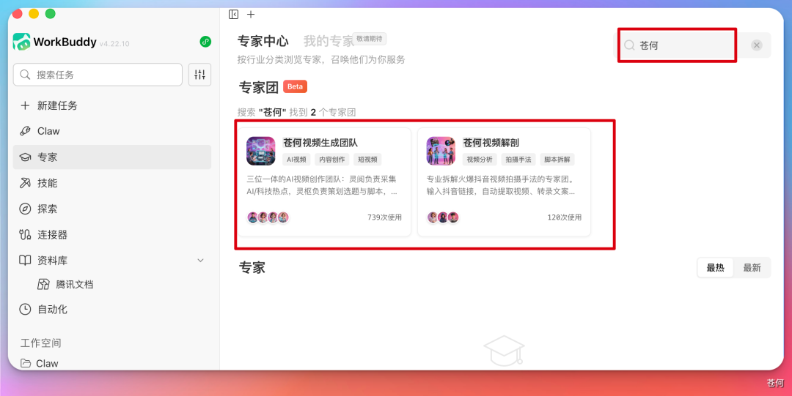

## 如何召喚：從一句話開始，但不要停在一句話


```text
召喚影片生成團隊，製作一條 46 秒 AI 週報短影片。
```

## 第一支團隊：影片生成團隊

影片生成團隊裡有四個核心角色：影片生成團隊主理人凌導、資訊採集員靈閱、內容策劃師靈樞、影片製作師靈映。它們不是四個換名字的聊天視窗，而是一條有上下游交接關係的影片生產線。

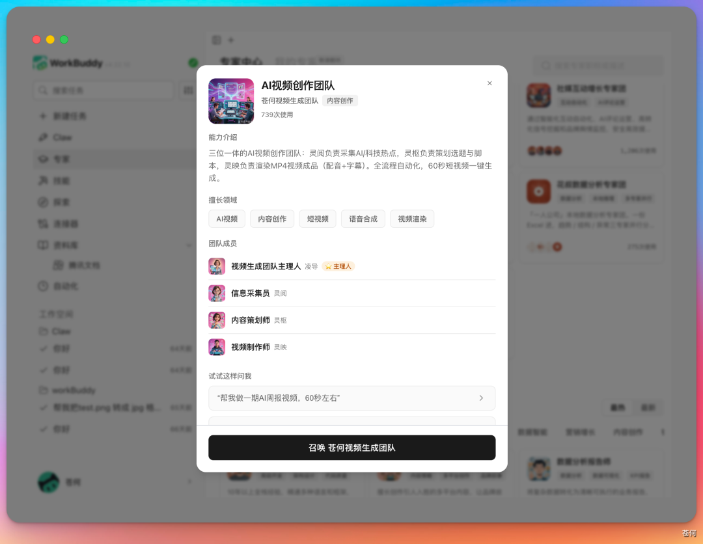

| 角色 | 定位 | 交付物 |
|-|-|-|
| 凌導 | 主理人 / 團長 | 拆解任務、安排並行與序列流程、彙總產物、處理檢查點。 |
| 靈閱 | 資訊採集員 | 熱點池、來源表、去重後的結構化摘要、選題候選。 |
| 靈樞 | 內容策劃師 | 選題判斷、指令碼、分鏡、旁白、轉場、素材清單、BGM 和字幕節奏。 |
| 靈映 | 影片製作師 | HTML 影片工程、配音、字幕對齊、轉場動畫、素材拼接、渲染成片。 |

這才是多 Agent 的關鍵：不是角色越多越好，而是每個角色都有清晰輸入和輸出。資訊採集員不直接寫成片指令碼，策劃師不重新編造熱點，製作師不重寫事實，團長負責讓流程不斷檔。


### 底層生產引擎：HyperFrames

文章提到，這條影片流水線基於 HyperFrames 搭建。它的核心思路是用 HTML 渲染影片，天然適合 Agent 生成結構化工程，再交給渲染工具輸出 MP4。它還帶有 CLI 工具鏈、TTS、字幕、去背景和影片元件模板。

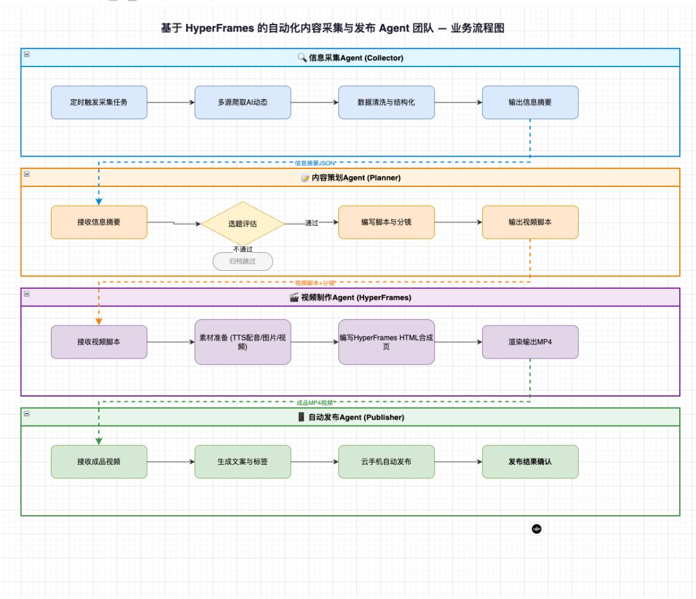

### 生成流程一：資訊採集員先讓熱點有來源

做影片最耗時間的往往不是剪輯，而是“今天到底拍什麼”。所以影片生成團隊先讓資訊採集員靈閱抓 RSS、搜新聞、掃社媒、聚合 AI 熱點，並去重輸出結構化摘要。

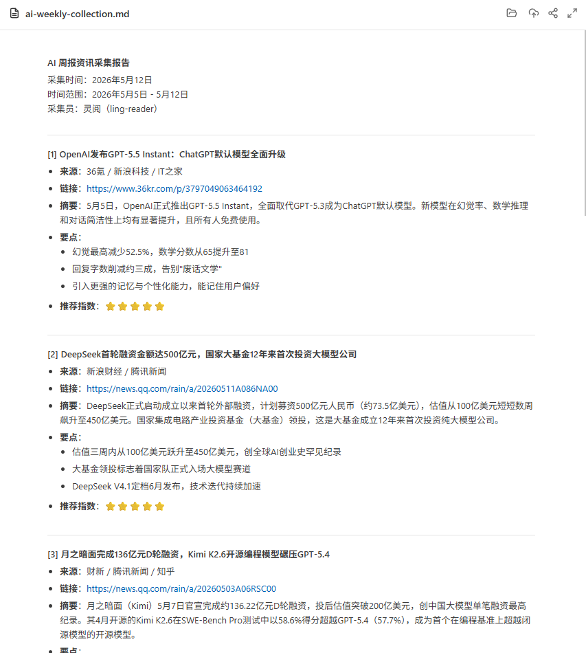

這個階段的產物至少應該包含：標題、來源、釋出時間、事件發生時間、原始連結、熱度線索、為什麼值得關注。熱度只能幫助排序，不能替代事實核驗。

### 生成流程二：內容策劃師把主題變成鏡頭

選題有了之後，真正費腦子的是“這條影片怎麼講”。內容策劃師靈樞負責選題評估、指令碼寫作、分鏡設計、旁白文案、鏡頭節奏，以及轉場建議、素材清單、BGM 節奏、字幕停頓和情緒節點。


這裡建議設定第一次人工檢查：開頭 3 秒是否有鉤子，46 秒是否塞入過多資訊，旁白是否準確，畫面是否真的支撐觀點。指令碼不過關時，不要進入配音和渲染。

### 生成流程三：影片製作師把分鏡變成成片

靈映會把確認後的指令碼轉成 HTML，再呼叫 HyperFrames 渲染 MP4。文章裡提到，系統會自動完成 Azure TTS 配音、Whisper 字幕對齊、動畫與轉場生成、素材拼接、字幕疊加和影片渲染。


成片驗收不要只看“能不能播放”。至少檢查旁白與字幕是否一致、鏡頭時長是否匹配、文字是否遮擋主體、BGM 是否可用、素材是否有版權風險、畫面是否適合目標平臺安全區。

### 生成流程四：釋出可以自動化，但預設要人工確認

釋出 Agent 自動生成標題、自動打標籤、自動上傳封面，並通過雲手機發布到抖音、影片號和 B 站。這是很強的自動化能力，但藍皮書建議預設不要直接自動釋出，除非賬號、素材、標題和合規邊界都已經過人工確認。


## 第二支團隊：爆款影片拆解團隊

光會生成還不夠。

內容創作者真正需要的是理解“為什麼別人能爆”，把一條爆款影片拆成可以參考的操作手冊：提取影片、轉錄文案、分析景別運鏡、剪輯節奏、色調風格，並給出仿拍建議。

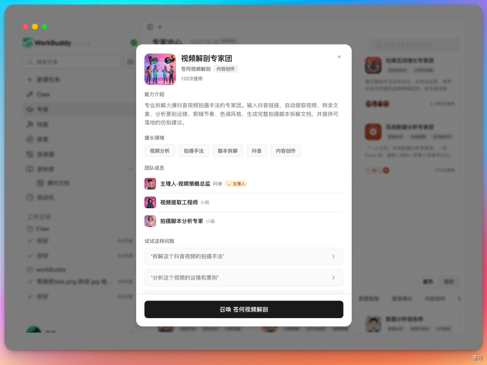

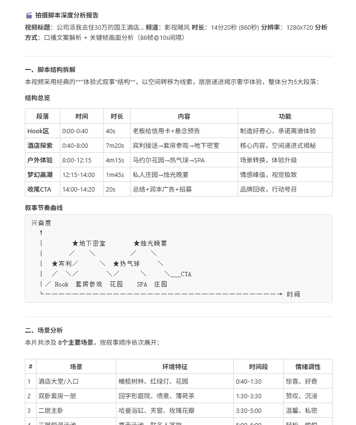

| 角色 | 職責 | 工具 / 技術 |
|-|-|-|
| 阿爆 | 團長 / 拆解總控 | 任務排程、流程編排、結果彙總。 |
| 小凱 | 音訊處理與轉錄 | ffmpeg、ASR，把影片音訊轉成完整口播文案。 |
| 小淼 | 影片理解與鏡頭裁切 | 影片理解 API、ffmpeg，分析鏡頭語言並裁切片段。 |

### 拆解流程一：影片下載要有降級策略

爆款拆解的第一步是拿到影片。文章裡專門提到，最複雜的是影片下載，所以設計了一套三層降級策略：官方 API、Playwright、yt-dlp。只要有一層成功，流程就繼續。

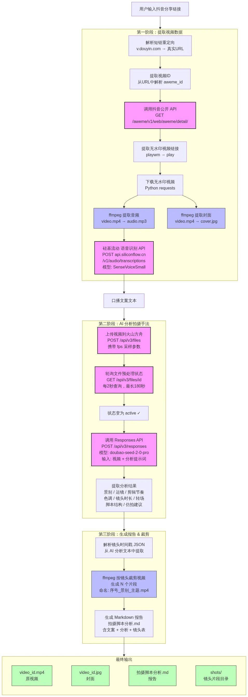

這裡必須加上邊界：影片下載和分析要遵守平臺條款、版權授權和合理使用範圍。拆解的目的應該是學習結構和方法，不是搬運原影片。

### 拆解流程二：音訊提取與文案轉寫

影片下載完成後，小凱用 ffmpeg 提取音訊，把 video.mp4 轉成 audio.mp3，再呼叫語音識別 API 自動轉錄完整口播文案。以前一句句聽、一句句敲的工作，現在可以被穩定自動化。

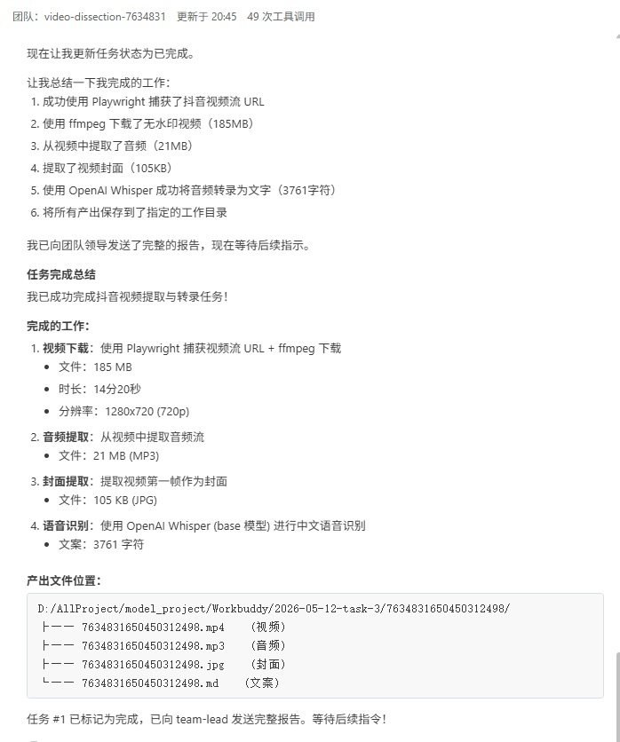


### 拆解流程三：影片理解與鏡頭語言分析

接下來是最有意思的一步：影片理解。小淼會分析整條影片的景別、運鏡、轉場、剪輯節奏、色調、鏡頭時長。很多看起來“有感覺”的爆款影片，背後其實有穩定的鏡頭規律。

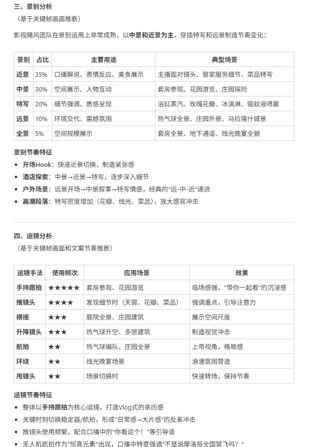


## 兩支團隊如何形成閉環

兩個專家團可以合作。先用爆款拆解團隊學習鏡頭語言和節奏，再讓影片生成團隊生產新影片，釋出之後繼續分析資料，再反過來最佳化下一版內容。

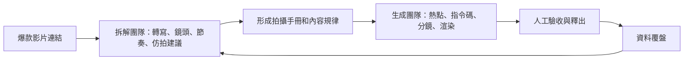

這就是專家團比單個工具更有意義的地方。它不只是幫你做一條影片，而是讓“學習、生產、釋出、覆盤”變成一個可以重複運轉的系統。