# 第 20 章 自媒體不只是靠努力，而是一條增長閉環

## 內容沒人看？往往不是因為你不夠努力

一個人做自媒體，做自媒體最浪費時間的事，就是一上來就把內容打磨到滿分。

聽起來很反常識，但我真踩過這個坑。你寫得很深，資料查得很全，結構改了三遍。結果發出去，閱讀量個位數。

後來我才意識到，起號前期真正要先解決的，不是“寫得夠不夠好”，而是“有沒有人願意點進來”。


## 工作流

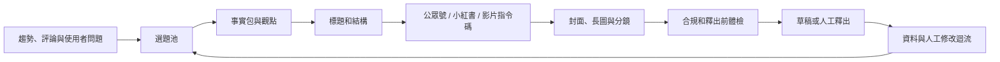

Skill 的作用是補上其中一個環節，不是接管賬號判斷。下面用八個具體工作現場說明。


## 場景一：每天刷熱點，仍然不知道賬號該寫什麼

熱榜告訴你“大家正在看什麼”，卻不告訴你“這個賬號為什麼值得寫”。只跟熱點，容易得到同質化內容；只憑感覺，又很難判斷使用者是否真的關心。

- [公眾號熱門文章查詢](https://skillhub.cn/skills/gzh-explosive-content-detector)：觀察同主題熱門文章；
- [小紅書爆款筆記查詢](https://skillhub.cn/skills/xhs-hotnotes)：獲取熱門筆記和資料線索；
- [小紅書評論洞察](https://skillhub.cn/skills/xhs-comment-insights)：從評論中提取問題、反對意見和未滿足需求；
- [靈感捕手](https://skillhub.cn/skills/inspiration-hunter-skill)：把臨時想到的角度放進統一收件箱。

### 指令怎樣寫

```text
圍繞“AI 辦公自動化”建立本週選題池，不直接寫文章。
分別收集公眾號與小紅書近 30 天的高互動內容，記錄標題、釋出日期、
核心承諾、內容結構、互動訊號和原連結。
再從評論中提取：重複問題、反對意見、失敗經歷和使用者原話。

結合我的賬號定位：面向非技術職場人，強調真實流程和結果驗收。
輸出 12 個候選選題，每個包含：目標讀者、真實問題、已有內容缺口、
我能提供的新證據、適合平臺、製作成本和時效性。
不要把閱讀量高直接解釋成選題一定適合我。
```

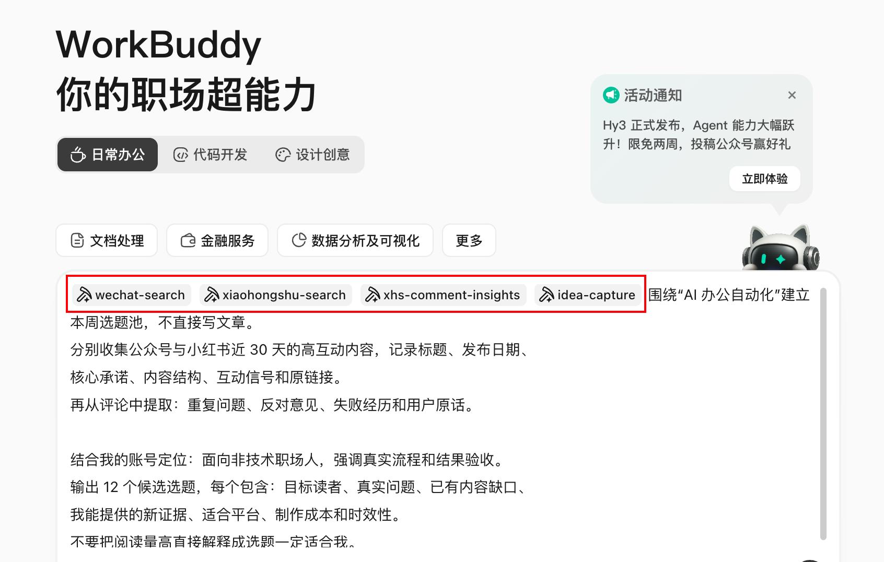

### 執行流程與結果

WorkBuddy 先生成跨平臺樣本表，再把評論聚成問題簇，最後把“熱度、賬號匹配、新增價值、證據充足度、製作成本”分別評分。交付物是一張可以人工刪選的選題看板。

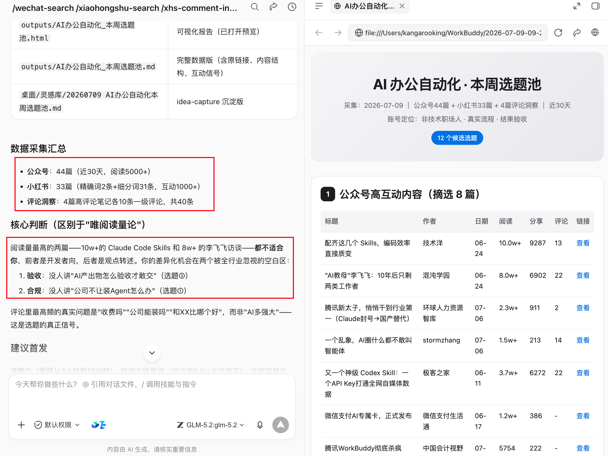


### **有時候光找熱門還不夠，我們還需要去找低粉爆款。**

大家應該都聽過，**起號要找低粉爆款去抄**，這確實是這樣的。

*PS：這裡說的抄，是抄選題，不是原封不動的抄內容。*

推薦一個叫[**viral-topic**](https://github.com/kangarooking/kangarooking-skills/tree/main/viral-topic)**的skill**，它可以獲取各個平臺近期的指定領域的多個低粉爆款內容。

比如獲取公眾號最近7天的AI領域低粉爆款文章。

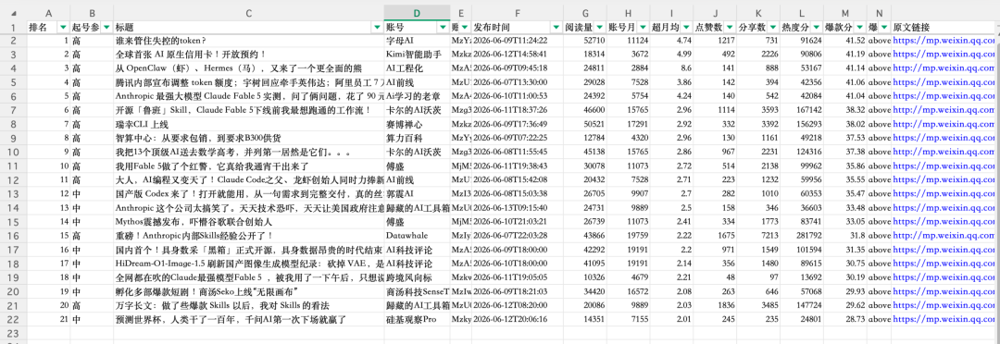

篩選X上的低粉爆款


以及YouTube的低粉爆款

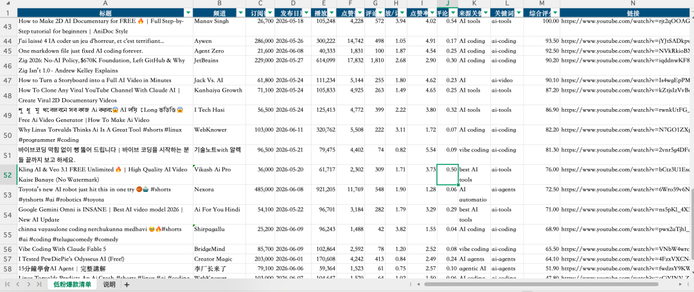


## 場景二：想要爆款標題，但不想標題黨

“給我 20 個爆款標題”很容易得到數字、懸念和誇張承諾，卻沒有任何標題能準確兌現正文。標題不是獨立文案，它是讀者與正文之間的一份承諾。

- [公眾號標題生成與評分](https://skillhub.cn/skills/gzh-official-account-title-generator)；
- [小紅書爆款筆記自動生成器](https://skillhub.cn/skills/redbook-writer)中的標題與標籤模組；
- [短影片鉤子方案生成](https://skillhub.cn/skills/bozo-video-gz)。

### 指令怎樣寫

```text
讀取 approved-article.md，只根據正文已經出現的事實生成標題。
分別生成：公眾號標題 8 個、小紅書標題 8 個、短影片開場鉤子 5 個。

每個候選都輸出：
1. 面向誰；2. 承諾什麼；3. 正文哪一段能夠兌現；
4. 採用的問題/結果/清單/案例/反常識角度；
5. 可信度、具體性、平臺適配和誇大風險評分。

刪除無法證明的數字、絕對化承諾、虛假稀缺和與正文不一致的結論。
不要自動選擇最終標題，先讓我確認內容承諾。
```

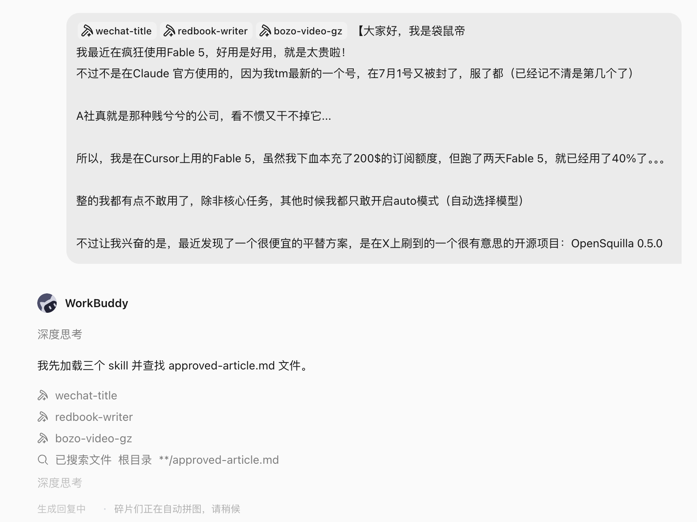

### 驗收方法

把標題單獨給一個不瞭解正文的人看，請他寫出“我預計點進去會得到什麼”。再與正文核對。預期與實際不一致，標題分數再高也不能用。

workbuddy通過這幾個skill，生成的標題還真有那味兒。特別是小紅書的標題，很有小紅書的感覺。


可以進行 A/B 測試，但一次只改變一個主要變數，例如“問題式”與“結果式”。不要同時改標題、封面、釋出時間和正文開頭，否則資料無法解釋。


再推薦一個標題skill：[**viral-**](https://github.com/kangarooking/kangarooking-skills/tree/main/viral-title)[**title**](https://github.com/kangarooking/kangarooking-skills/tree/main/viral-title)**，很適合用來給公眾號起標題**


## 場景三：公眾號封面每次從空白畫布開始

封面既要讓人看懂主題，又要適配大小封面、安全區和賬號品牌。直接說“做一張高階感封面”，通常會得到與正文無關的裝飾圖、錯誤文字或失真的 Logo。

- [公眾號爆款封面生成](https://skillhub.cn/skills/explosive-cover-generator-gzh)：分析同賽道視覺規律並給出方案；
- [公眾號圖片生成器](https://skillhub.cn/skills/generate-wechat-official-account-images)：處理大小封面、文內配圖和引導圖；
- 海報設計或影像生成 Skill：執行已確認的視覺 brief。

### 指令怎樣寫

```text
為文章《收藏不是知識管理，能再次用起來才是》製作公眾號封面 brief。
目標讀者：知識工作者；核心資訊：從收藏走向可複用知識流。
品牌色：#1677FF、白、黑；禁止紫色漸變、誇張科技光效和虛構產品介面。

先輸出 3 個構圖方向，每個包含：主體、層級、封面文案、色彩、留白、
大小封面裁切風險和正文對應段落。我確認後再生成圖片。
生成後檢查：文字是否準確、Logo 是否變形、主體是否被小封面裁掉、
是否使用未經授權的人物或素材。不要直接上傳公眾號。
```

### 結果是否可用


生成的封面還不錯，有漢字、封面負責表達的主題也比較貼切，如果換成更強的生圖模型，效果應該會更好。


## 場景四：小紅書不只是“把長文切成九張圖”

公眾號文章改成小紅書時，常見做法是截短段落、加入表情符號，再把文字鋪到九張卡片上。結果資訊很多，但封面沒有鉤子，第二頁沒有承接，最後一頁沒有行動，移動端也難讀。

- [小紅書封面圖製作](https://skillhub.cn/skills/xiaohongshu-cover)；
- [小紅書圖片生成器](https://skillhub.cn/skills/any2xiaohongshu)：將結構化內容渲染為豎版卡片；
- [小紅書運營副駕](https://skillhub.cn/skills/xhs-ops-copilot)：釋出前體檢與覆盤。

### 工作流

1. 從長文提取不帶平臺語氣的事實包；
2. 選擇一個核心問題，刪除與它無關的支線；
3. 設計“封面承諾 → 問題共鳴 → 方法 → 示例 → 誤區 → 清單”的滑動節奏；
4. 先輸出逐頁線框和字數，再生成圖片；
5. 在真實手機寬度檢查字號、斷行、邊距和重點；
6. 最終標題、正文、標籤和圖片逐一核對數字與專有名詞。

```text
把 approved-article.md 改造成 8 頁小紅書圖文，不新增事實。
第 1 頁只表達一個承諾；第 2 頁寫讀者正在經歷的問題；
第 3-6 頁每頁只講一個動作並給一個例子；第 7 頁寫常見誤區；
第 8 頁給可儲存的檢查清單。
先返回逐頁文案、視覺層級和預計字數，我確認後再呼叫封面與長圖 Skill。
```

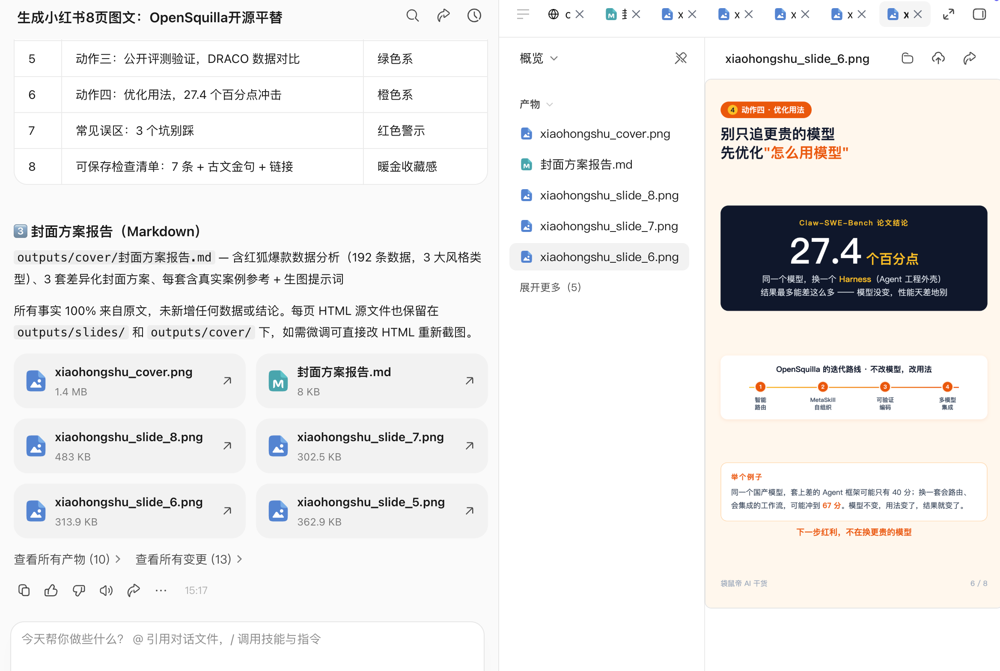


## 場景五：一段長文怎樣變成可拍的短影片

“改成 60 秒口播”通常只是把文章壓縮成更快的朗讀稿，沒有鏡頭、節奏、證據畫面和停頓，也沒有說明誰能拍、需要什麼素材。

- [短影片選題素材研究](https://skillhub.cn/skills/short-video-topic-research)；
- [短影片指令碼與矩陣內容工廠](https://skillhub.cn/skills/shortvideo-content-factory-cn-v1-zt)；
- [AI 短影片導演](https://skillhub.cn/skills/seedance-director)用於分鏡和生成提示；
- 配樂 Skill 只在確認版權和商用範圍後使用。

### 指令怎樣寫

```text
把這篇文章改造成 60 秒真人口播，目標是讓第一次使用 WorkBuddy 的人
理解“為什麼任務簡報比一句模糊需求更重要”。
輸出時間軸表格：時長、景別、畫面、口播、螢幕文字、素材來源、轉場。
前 3 秒必須提出真實問題，不誇大收益；20 秒前展示一次產品過程證據；
結尾給一個可以立即嘗試的指令，不做虛假互動承諾。
同時列出必須實拍、可用產品截圖、可由 AI 生成的畫面，禁止偽造使用者反饋。
```

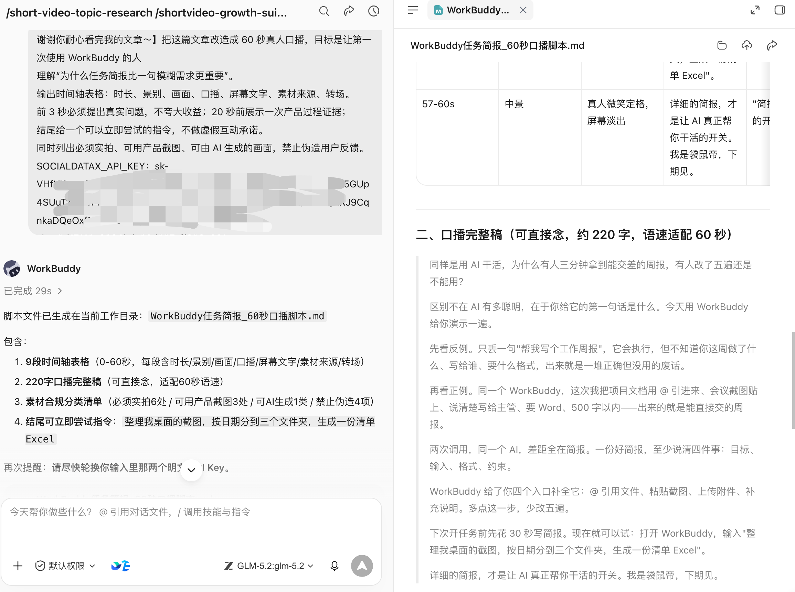

生成的口播文案，效果還不錯哦。


## 場景六：釋出前，別讓自動化越過責任邊界

- [公眾號違禁詞檢測](https://skillhub.cn/skills/gzh-prohibited-word)：標記風險表達；
- [公眾號排版 Skill](https://skillhub.cn/skills/md-to-wechat)：渲染 Markdown 並建立草稿；
- [文章去 AI 味工具](https://skillhub.cn/skills/unclecheng-reduce-ai-perception-v2)：只用於減少套話，不用於偽裝來源或原創。

```Plain Text
檢查本次公眾號文章是否有違禁詞，如有請標記出來，並對每個違禁詞給出修改建議。檢查整體內容的 AI 味，並降低AI味，最後把文章排版。
```

釋出鏈建議停在草稿箱：事實檢查 → 引用與版權 → 品牌與合規 → 連結檢查 → 手機預覽 → 人工確認賬號 → 釋出。自動點贊、批次私信、刷評論、繞過平臺風控和未經確認的群發，不屬於本書推薦的效率場景。

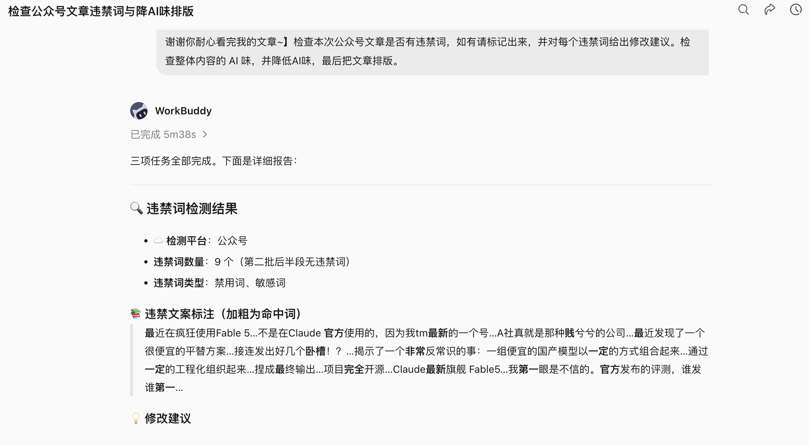

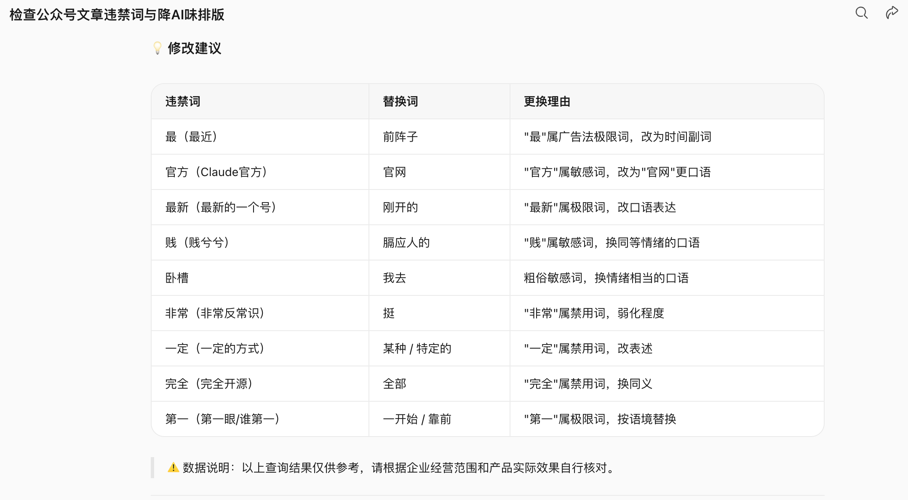

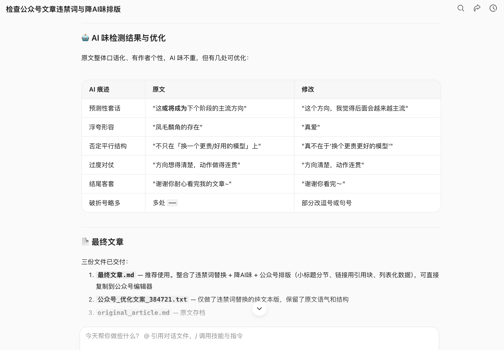


## 場景七：釋出後不復盤，下一篇仍從零開始

覆盤主要是把AI寫的和人工修改後的終稿進行對比，讓skill自動進化，下一次，它將寫出更好的內容。

可以使用 [公眾號寫作自我迭代](https://skillhub.cn/skills/skill-article-evolution) 或小紅書運營副駕，把人工修改和資料寫回風格庫：

```text
讀取本期內容資料、釋出版本和人工修改記錄，生成覆盤。
先陳述資料事實，再列出最多 3 個可驗證假設，不把相關性寫成因果。
把表現按選題、標題、封面、開頭、結構、釋出時間和渠道拆開。
為下輪設計 2 個單變數實驗，並說明成功指標和停止條件。
將長期有效的修改規則寫入 style-guide.md；一次性熱點不要寫入永久規則。
```

把AI最開始產出的文案和終稿都丟進去，最終產出覆盤報告和style-guide.md，下次AI寫的東西就能離你的期望更進一步啦～

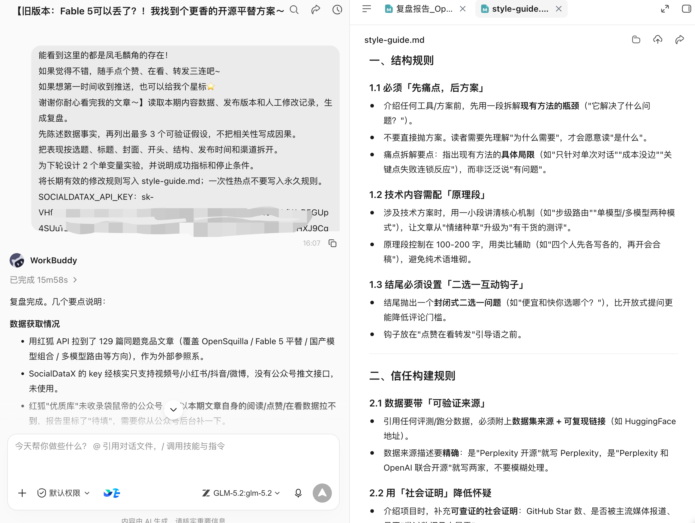


## 一套夠用的自媒體 Skill 棧

| 層級 | 先裝什麼 | 何時再增加 |
|-|-|-|
| 入門 | 熱門內容查詢、標題評分、圖片生成 | 已能穩定完成一篇內容 |
| 穩定 | 評論洞察、封面、排版草稿、違禁詞檢測 | 已明確賬號定位和稽核人 |
| 多平臺 | 小紅書卡片、短影片指令碼、平臺適配 | 已有統一事實包 |
| 進階 | 資料迴流、風格迭代、定時選題雷達 | 人工流程已連續跑通 4 周 |