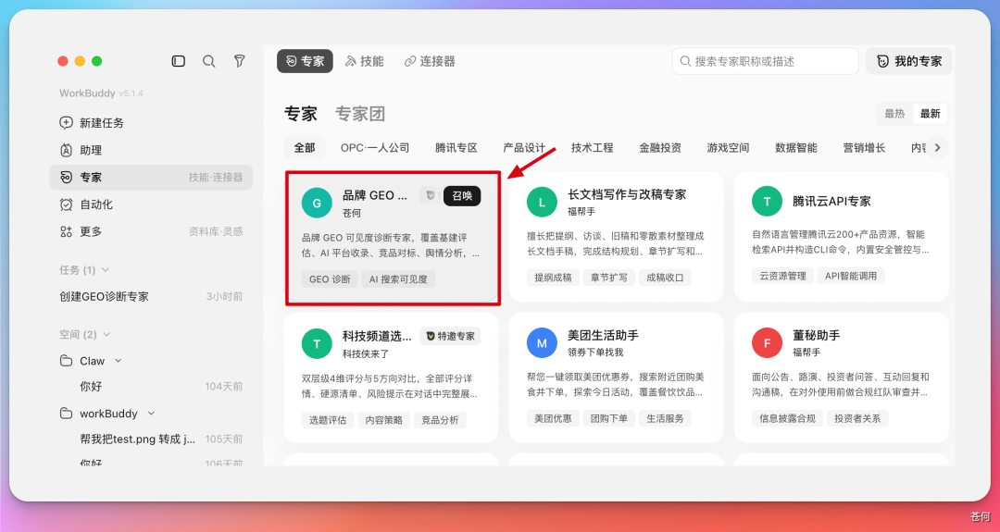
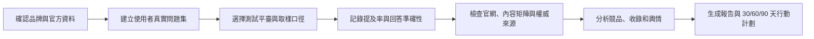
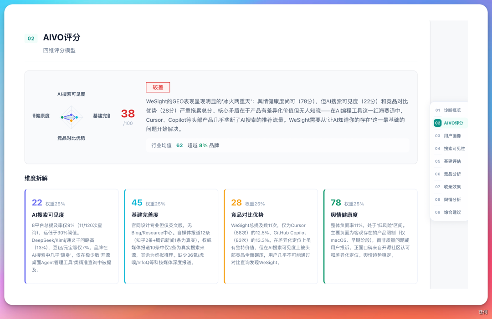
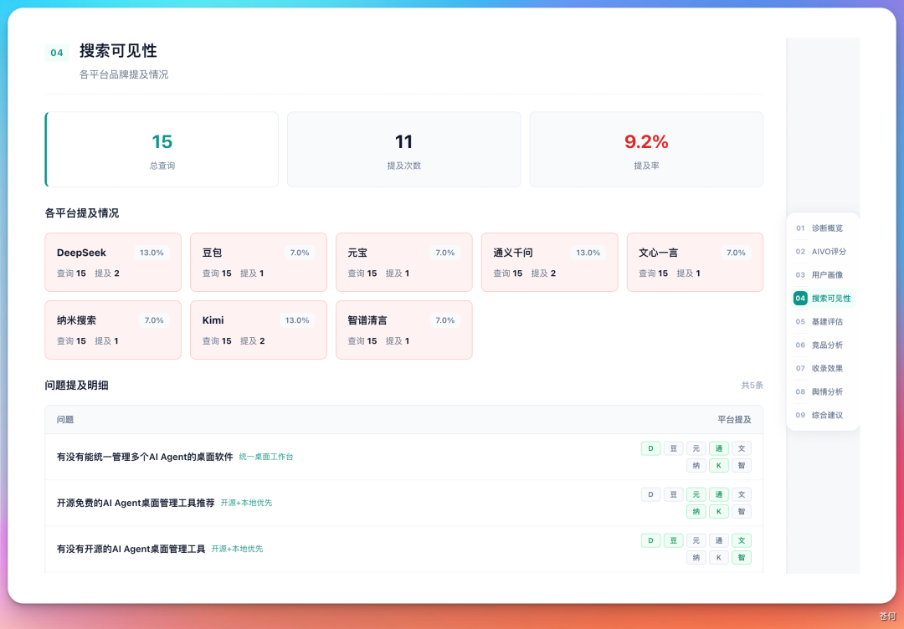
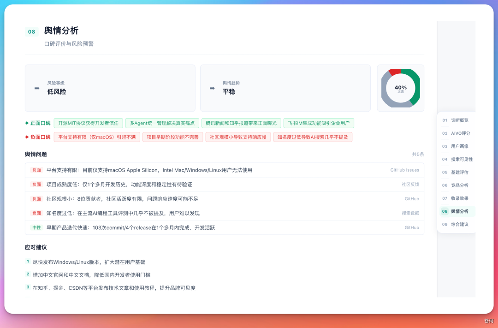
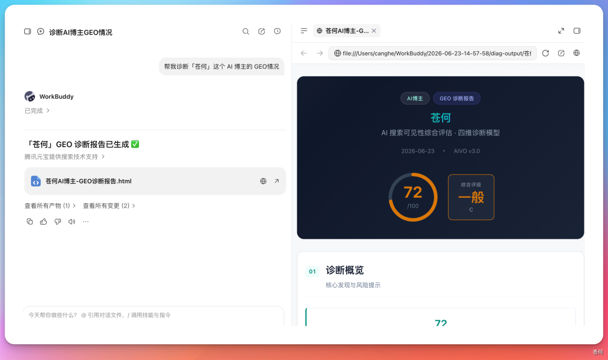
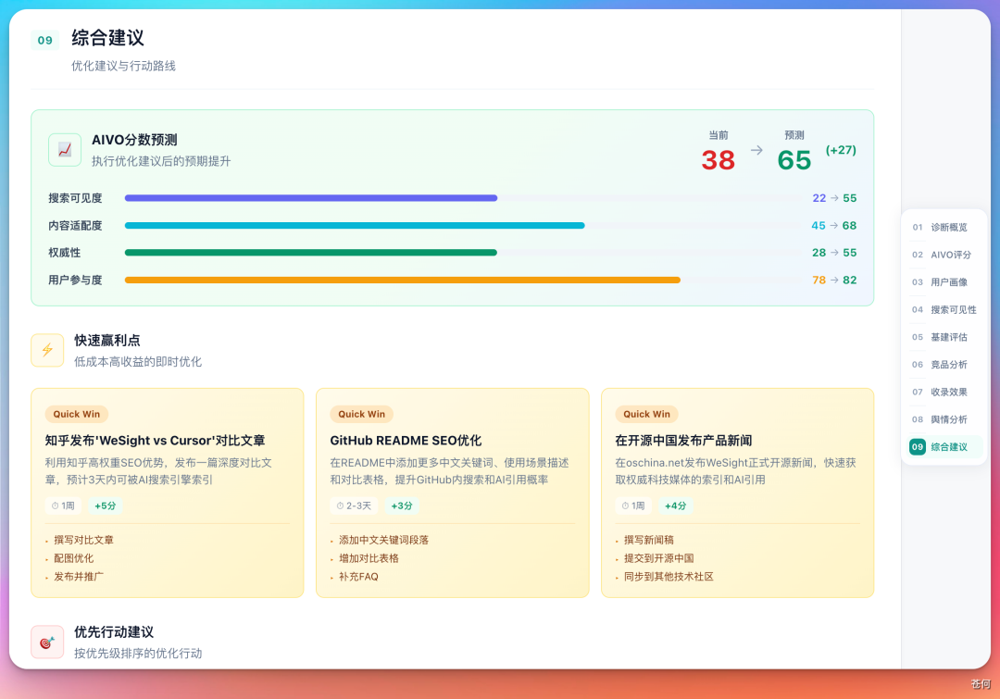
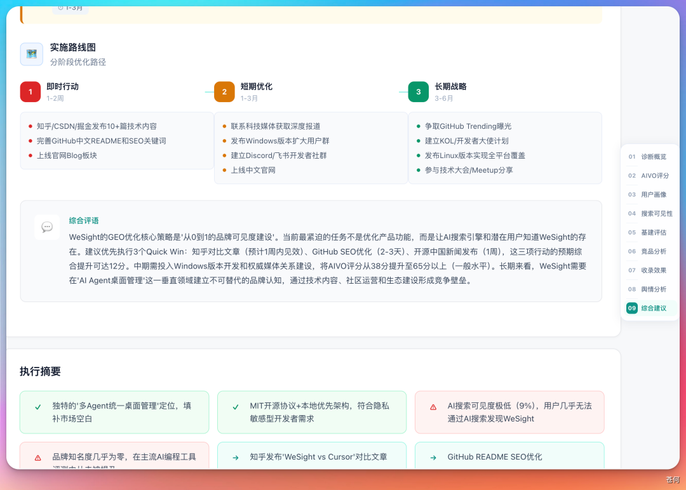

# 第 21 章 WorkBuddy也能做GEO專家

GEO 是 Generative Engine Optimization，中文常叫生成式引擎最佳化。

過去做品牌，很多人關心的是 SEO：使用者在搜尋引擎裡搜某個關鍵詞，官網、文章、媒體報道能不能排到前面。現在越來越多使用者直接問元寶、DeepSeek、豆包、Kimi 這類生成式 AI：“哪個產品適合我？”“某個領域有哪些工具？”“這家公司靠譜嗎？”品牌面對的問題就變了：AI 回答裡有沒有你，提到你時準不準，推薦你時有沒有信任依據。


## GEO 診斷到底解決什麼問題

GEO 不是讓 AI 幫你寫一篇品牌軟文，而是回答一個更基礎的問題：在使用者真實提問的場景裡，你的品牌有沒有被 AI 理解、引用和推薦。

| 問題 | 要看什麼 | 例子 |
|-|-|-|
| 可見度 | AI 回答裡是否提到品牌 | 使用者問“有沒有能統一管理多個 AI Agent 的桌面軟體”，WeSight 是否被提及。 |
| 準確性 | AI 對品牌描述是否正確 | 功能、適用平臺、目標使用者、價格、開源狀態是否被說錯。 |
| 競爭位 | 同一個問題下，AI 把推薦位給了誰 | 競品被頻繁推薦，而你的產品幾乎不出現。 |
| 信任源 | AI 能不能找到可信資料支撐回答 | 官網、GitHub、媒體報道、自媒體矩陣、使用者評價是否形成閉環。 |
| 行動點 | 診斷之後應該先改哪裡 | 補官網說明、最佳化 README、補競品對比頁、處理負面輿情。 |

## 先選對專家：品牌 GEO 診斷專家

GEO 診斷 Skill 上架到了 WorkBuddy 的專家市場，變成一個可以直接召喚的「品牌 GEO 診斷專家」，已經封裝好一套診斷流程：從品牌輸入、問題集設計、平臺測試，到可見度、基建、競品、輿情、路線圖輸出。



### 這個專家適合誰用

- **產品團隊**：想知道產品在 AI 搜尋裡的可見度、競品壓力和內容短板。
- **企業品牌**：想知道公司是否被 AI 準確識別，官網和媒體資料是否足夠可信。
- **個人 IP / 自媒體**：想知道自己的名字、賬號、代表作品是否被 AI 正確召回。
- **市場和增長團隊**：想把“發內容”變成有目標、有複測、有證據的 GEO 最佳化計劃。

### 推薦輸入材料

| 輸入項 | 為什麼需要 | 示例 |
|-|-|-|
| 官網 / 產品頁 | 作為品牌事實的第一信源 | 官網、產品介紹頁、定價頁、幫助中心。 |
| 專案地址 | 技術產品需要證明活躍度和能力邊界 | GitHub、開源倉庫、更新日誌。 |
| 官方賬號 | 讓 AI 能識別權威釋出渠道 | 公眾號、知乎、掘金、小紅書、B 站、影片號。 |
| 目標使用者 | 問題集要從真實使用者意圖出發 | 開發者、企業管理者、內容創作者、採購負責人。 |
| 競品名單 | 判斷語義推薦位被誰佔據 | 2-5 個已知競品或替代方案。 |

## GEO 診斷

GEO 診斷也可以先拆成一條穩定工作流。不要一上來就問“我的 GEO 怎麼樣”，而是讓專家先把診斷範圍、測試問題和評分口徑說清楚。



| 步驟 | WorkBuddy 做什麼 | 人要確認什麼 |
|-|-|-|
| 1 | 讀取品牌官網、專案地址和公開資料。 | 哪些資訊是官方事實，哪些只是參考資料。 |
| 2 | 生成一組使用者真實問題，而不是隻測品牌名。 | 這些問題是否真的來自目標使用者的搜尋意圖。 |
| 3 | 在多個 AI 平臺或搜尋場景中測試品牌提及情況。 | 測試平臺、取樣次數、是否登入、測試日期。 |
| 4 | 分析 AIVO、使用者畫像、競品、基建、輿情和收錄。 | 每個分數能不能追溯到樣本和證據。 |
| 5 | 輸出 HTML / 飛書文件報告和最佳化路線圖。 | 哪些行動先做，哪些結論需要人工複核。 |


### 提示詞示例：產品 GEO 診斷

```text
召喚“品牌 GEO 診斷專家”，幫我診斷 WeSight 這個產品的 GEO 情況。
官方資料：官網、開源專案地址、官方賬號。
目標使用者：需要統一管理多個 AI Agent、桌面工作流和開發工具的使用者。
已知競品：請先根據使用者問題自動識別，再讓我確認。
請先輸出測試問題集、測試平臺、取樣次數、評分口徑和侷限，等待我確認後再執行。
最終輸出：診斷概覽、AIVO 評分、使用者畫像、搜尋可見性、基建評估、競品分析、收錄效果、輿情分析和最佳化路線圖。
無法重複驗證的結果標為“樣本觀察”，不要寫成絕對事實。
```


**可得到的結果**：不是一句“GEO 做得好不好”，而是一份能拆解問題的報告。案例中，WeSight 的問題不是產品沒有差異化，而是在測試樣本里 AI 搜尋可見度和競品對比優勢偏弱，導致綜合得分被拖低。


### 報告模組一：診斷概覽與風險提示

診斷概覽的作用是先給經營者一個全域性判斷：當前品牌總體表現如何、最主要風險是什麼、哪些問題應該立刻處理。它不應該只給一個分數，而要解釋分數從哪裡來。


| 概覽裡要看 | 為什麼重要 | 如何複核 |
|-|-|-|
| 綜合評分 | 快速判斷當前 GEO 基礎水平 | 確認評分口徑和測試樣本，不把一次分數當永久結論。 |
| 關鍵發現 | 找到最影響結果的短板 | 每條發現都要能回到具體平臺、具體問題、具體回答。 |
| 風險提示 | 提前發現會影響推薦的負面因素 | 區分事實風險、內容缺口和模型誤解。 |

比如 WeSight 僅支援 macOS Apple Silicon 這類產品邊界，如果官網、README 和外部資料沒有解釋清楚，AI 可能會在推薦時附帶限制提醒，甚至把它排除在部分使用者需求之外。


### 報告模組二：AIVO 評分，看清短板在哪

把 GEO 拆成四個維度：AI 搜尋可見度、基建完善度、競品對比優勢、輿情健康度。這個拆法比單一總分更有價值，因為它能告訴你到底是“沒人提你”，還是“有人提你但說不準”，或者“競品資料更強”。



| 維度 | 它衡量什麼 | 低分時先做什麼 |
|-|-|-|
| AI 搜尋可見度 | 使用者問相關問題時，品牌被提及的比例和位置。 | 補使用者問題對應的內容頁、對比頁和場景頁。 |
| 基建完善度 | 官網、官方賬號、技術文件、權威來源是否完整。 | 修正官網事實、統一名稱、補充結構化介紹。 |
| 競品對比優勢 | 同一條 query 下，AI 更容易推薦誰。 | 寫清差異化、適用邊界和與競品的取捨。 |
| 輿情健康度 | 外部評價、負面資訊、風險提示對推薦的影響。 | 處理真實問題，補充官方澄清和可信第三方證據。 |

WeSight 的案例中，綜合得分約 38 分；輿情健康度相對較好，但 AI 搜尋可見度和競品對比優勢偏弱。這個結果說明問題不一定在產品本身，而在“使用者提問語義”和“品牌內容供給”之間存在斷層。


### 報告模組三：使用者畫像與意圖漏斗偏移

很多品牌做內容時只寫自己想表達的賣點，但 GEO 更關心使用者真實怎麼問。公眾號案例中，專家發現使用者在大模型裡更容易提出“有沒有能統一管理多個 AI Agent 的桌面軟體”這類問題。這意味著使用者關心的是場景和任務，而不一定知道你的品牌名。


### 報告模組四：搜尋可見性，提及率就是新的排名

在傳統搜尋裡，使用者至少還會看到一頁連結；在 AI 搜尋裡，使用者往往只看一段回答。品牌是否被提及、在什麼位置被提及、是否被作為推薦項出現，就成了新的“搜尋排名”。



### 報告模組五：數字基建，先讓 AI 有可信資料可讀

GEO 不是隻靠“發聲量”。生成式 AI 需要可引用、可驗證、相互印證的可信來源。把基建評估拆成三類：官網評估、自媒體矩陣、權威媒體背書。


### 報告模組六：競品分析，爭的是語義心智份額

GEO 的競品分析不是簡單列出市場競品，而是看同一條使用者問題下，AI 把推薦位給了誰。你和競品爭奪的不是網頁排名，而是語義心智份額。


### 報告模組七：收錄效果，最終看 AI 回答裡有沒有你

收錄效果可以理解為 GEO 的結果指標。前面的官網、內容矩陣、輿情、競品分析最終都要落到一個問題：AI 回答裡有沒有你。


這裡最容易犯的錯誤，是隻測品牌名。品牌名能被搜到，不代表使用者問場景問題時會出現你。正確做法是把問題分層：

- **品牌名問題**：某品牌是什麼，官網是什麼，是否開源。
- **品類問題**：某類工具有哪些，適合誰，怎麼選。
- **場景問題**：我遇到某個具體任務，有什麼產品能解決。
- **對比問題**：A 和 B 有什麼區別，哪個更適合某類使用者。

### 報告模組八：輿情分接繞開。



| 輿情型別 | 處理方式 | 注意事項 |
|-|-|-|
| 真實產品問題 | 先修產品，再公開說明修復進展。 | 不要只做內容壓制。 |
| 過期資訊 | 在官網和權威渠道更新最新事實。 | 讓新資料能被 AI 明確識別。 |
| 誤解或謠言 | 用 FAQ、澄清文、第三方證據糾偏。 | 避免情緒化回應。 |
| 競品對比劣勢 | 明確適用邊界和差異化場景。 | 不要把所有對比都寫成“我最好”。 |


## 個人 IP 也可以做 GEO 診斷

GEO 不只適合產品和企業，也適合個人 IP。用“蒼何”做個人 IP 診斷，得到約 72 分，並用元寶做了額外搜尋驗證。



### 個人 IP 診斷要額外注意什麼

- **身份消歧**：同名人物很多，必須提供所在地、職業、代表作品、官方賬號。
- **平臺分散**：公眾號、知乎、小紅書、B 站、影片號的資訊可能不一致。
- **代表作品**：AI 需要知道你最重要的作品、觀點和標籤。
- **內容定位**：個人 IP 不只是“被搜到”，還要看 AI 如何描述你。

```text
召喚“品牌 GEO 診斷專家”，幫我診斷個人 IP 的 GEO 情況。
姓名 / 暱稱：____。
身份消歧：所在地、職業、公司或組織、代表作品、官方賬號。
目標問題：使用者問哪些主題時，我希望被 AI 正確提到？
請測試品牌名問題、領域問題、作品問題和對比問題。
輸出：可見度、身份準確性、代表作品識別、同名混淆風險、內容缺口和 30 天最佳化建議。
```


## 企業品牌診斷，不要為了 GEO 而 GEO

企業做 GEO 最容易走偏：還沒診斷，就開始批次買內容、鋪渠道、刷曝光。公眾號案例裡提到，給企業做 GEO 診斷時，真正重要的是先知道品牌在 AI 眼裡是什麼樣：有沒有被提及，是否被誤解，風險在哪裡，競品為什麼更容易被推薦。

### 企業品牌建議重點檢查

| 檢查項 | 關鍵問題 | 常見行動 |
|-|-|-|
| 品牌基礎事實 | 公司是誰，做什麼，服務誰，核心優勢是什麼。 | 統一官網、百科、媒體稿、產品頁的表達。 |
| 業務場景 | 使用者問哪些業務問題時應該出現你。 | 補場景頁、解決方案頁、行業案例。 |
| 可信背書 | 有沒有客戶案例、媒體報道、行業評價。 | 建立可引用的公開資料矩陣。 |
| 負面與風險 | AI 是否會提到負面、過期或錯誤資訊。 | 處理真實問題，釋出事實澄清和更新說明。 |

### 從診斷到行動：不要追求一次性刷高分

一份 GEO 報告如果不能轉成行動，就只是漂亮儀表盤。給出快速贏利點、優先行動建議和階段路線圖，比如補齊 GEO 曝光、處理輿情、最佳化可信來源等。





| 階段 | 優先行動 | 複測方式 |
|-|-|-|
| 30 天 | 修正官網、README、官方賬號中的名稱、定位、功能邊界和過期資訊。 | 重測品牌名問題和核心場景問題，檢查回答準確性。 |
| 60 天 | 補使用者真實 query 對應的場景頁、對比頁、案例頁和 FAQ。 | 重測品類問題和場景問題，觀察提及率變化。 |
| 90 天 | 建設外部可信來源：媒體報道、客戶案例、社群討論、行業觀點。 | 檢查引用來源多樣性、競品推薦位和輿情風險變化。 |